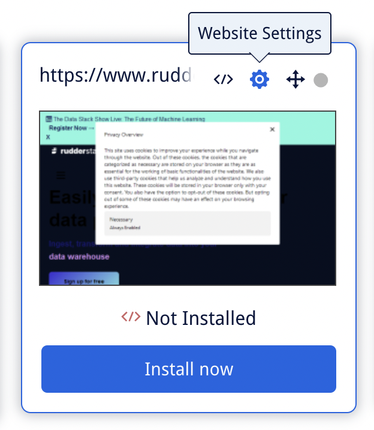

[Mouseflow](https://mouseflow.com/) is a behavior analytics platform that gives you deeper insights into your users' product journey.

RudderStack supports Mouseflow as a destination where you can send your event data seamlessly.

## Getting started

Before configuring Mouseflow as a destination in RudderStack, verify if the source platform is supported by Mouseflow by referring to the table below:

| **Connection Mode** | **Web**       | **Mobile**    | **Server**    |
| :------------------ | :------------ | :------------ | :------------ |
| **Device mode**     |  **Supported**             | -             | -             |
| **Cloud mode**      |- | - | - |

<div class="infoBlock">
To know more about the difference between cloud mode and device mode in RudderStack, refer to the <Link to="/destinations/rudderstack-connection-modes/">RudderStack Connection Modes</Link> guide.
</div>

Once you have confirmed that the source platform supports sending events to Mouseflow, follow these steps:

1. From your [RudderStack dashboard](https://app.rudderstack.com/), add the source. Then, from the list of destinations, select **Mouseflow**.
2. Assign a name to the destination and click **Continue**.

## Connection settings

To successfully configure Mouseflow as a destination, you need to configure the following settings:


- **Website ID**: Enter your Mouseflow website ID.

<div class="infoBlock">
For more information on obtaining your Mouseflow website ID, refer to the <Link to="">FAQ</Link> section below.
</div>

- **Client-side Events Filtering**: This setting lets you specify which events should be blocked or allowed to flow through to Mouseflow.

<div class="infoBlock">
For more information on this setting, refer to the <Link to="https://www.rudderstack.com/docs/sources/sdks/event-filtering/">Client-side Events Filtering</Link> guide.
</div>

- **Use device mode to send events**: As this is a <Link to="/destinations/rudderstack-connection-modes/#device-mode">device mode</Link>-only destination, this setting is enabled by default and cannot be disabled.
- **OneTrust Cookie Categories**: This setting lets you map <Link to="/sources/sdks/rudderstack-javascript-sdk/consent-managers/onetrust/">OneTrust cookie</Link>/consent groups to RudderStack's consent purposes.

## Identify

The <Link to="/event-spec/standard-events/identify/">`identify`</Link> call lets you identify a visiting user and associate them to their actions. It also lets you record their traits like name, email address, etc. and send this information to Mouseflow.

A sample `identify` call is shown below:

```javascript
rudderanalytics.identify("1hKOmRA4GRlm", {
  "email": "alex@example.com",
  "city": "New Orleans",
  "favouriteColor": "Red"
})
```

### Supported mappings

RudderStack maps the following user traits to the corresponding Mouseflow properties:

| RudderStack property          | Mouseflow property | Presence |
| :-------------------- | :---------------------- | :-------------|
| `userId` / `traits.email` / `anonymousId` | `_userName` |  Required |
| `traits` | `setVariable` | Optional |

### Identifying a user

RudderStack sends the `userId` / `email` / `anonymousId` to Mouseflow as `_userName` via the <a href="https://js-api-docs.mouseflow.com/#identifying-a-user"><code class="inline-code">identifying a user</code></a> method, as shown:

```javascript
mouseflow.identify(_userName)
```

### Setting custom variables

You can also send the user details present in the `traits` as key-value pair to Mouseflow. RudderStack passes them as <a href="https://js-api-docs.mouseflow.com/#identifying-a-user:~:text=include%20%22product%2Dadded%22%2C%20...-,Setting%20a%20custom%20variable,-_mfq.push">custom variables</a> to Mouseflow, as shown:

```javascript
_mfq.push(["setVariable", _key, _value])
```

<div class="warningBlock">
The values in the key-value pairs passed as custom variables should be either strings or numbers. RudderStack will not pass the values with any other data type, for example, Boolean.
</div>

<div class="infoBlock">
You can also set custom variables by passing them via the event's <code class="inline-code">integrations</code> object. Refer to the <Link to="#setting-custom-variables-via-the-integrations-object">Setting custom variables via the <code class="inline-code">integrations</code> object</Link> section below for more information.
</div>

The following snippets highlight how the data in the sample `identify` call above is sent to Mouseflow:

```javascript
// Sending userId
mouseflow.identify("1hKOmRA4GRlm");

// Sending user traits as custom variables
_mfq.push(["setVariable", "city", "New Orleans"]);
_mfq.push(["setVariable", "email", "alex@example.com"]);
_mfq.push(["setVariable", "favouriteColor", "Red"]);
```

## Track

You can use the RudderStack <Link to="/event-spec/standard-events/track/">`track`</Link> call to [set tags or custom variables](https://js-api-docs.mouseflow.com/#adding-custom-data) in Mouseflow.

A sample `track` call is as shown:

```javascript
rudderanalytics.track("Product Clicked",{
	"price": 100,
	"quantity": 10,
})
```

### Setting custom tags

RudderStack lets you set a custom tag to a user recording by using Mouseflow's <a href="https://js-api-docs.mouseflow.com/#tagging-a-recording">Tagging a recording</a> method. 

<div class="infoBlock">
RudderStack automatically sets the <code class="inline-code">track</code> event name as the custom tag.
</div>

The below table highlights the property mapping:

| RudderStack property          | Mouseflow property | Presence |
| :-------------------- | :---------------------- | :-------------|
| `event` | `_tag` |  Required |

<div class="warningBlock">
A Mouseflow tag must always be of the String data type.
</div>

In the sample `track` call above, RudderStack sets `Product Clicked` as the custom tag by passing it to Mouseflow in the following way:

```javascript
_mfq.push(["tag", "Product Clicked"]);
```

### Setting custom variables

RudderStack also lets you pass the `track` event properties as custom variables to Mouseflow in the form of key-value pairs.

<div class="warningBlock">
The values in the key-value pairs should be either strings or numbers. RudderStack will not pass the values with any other data type, for example, Boolean.
</div>

In the sample `track` call above, RudderStack sets `price` and `quantity` as the custom variables, as shown:

```javascript
_mfq.push(["setVariable", "price", "100"]);
_mfq.push(["setVariable", "quantity", "10"]);
```

<div class="infoBlock">
You can also set custom variables by passing them via the event's <code class="inline-code">integrations</code> object. Refer to the <Link to="#setting-custom-variables-via-the-integrations-object">Setting custom variables via the <code class="inline-code">integrations</code> object</Link> section below for more information.
</div> 

## Page

The <Link to="/event-spec/standard-events/page/">`page`</Link> call lets you send the path of the web page viewed by the user to Mouseflow.

A sample `page` call is shown below:

```javascript
rudderanalytics.page({
  path: "/test_browser.html",
});
```

RudderStack sends the page-related information like the path or the page URL to Mouseflow using the <a href="https://js-api-docs.mouseflow.com/#virtual-paths-and-pageviews:~:text=%2C%20_virtualPath%5D)%3B-,Adding%20a%20virtual%20pageview,-_mfq.push">Adding a virtual pageview</a> method, as shown:

```javascript
_mfq.push(["newPageView", _virtualPath]);
```
### Supported mappings

You can customize the page-related details sent to Mouseflow by passing the values in the `properties.path` field. RudderStack then maps these details to the `_virtualPath` parameter before sending them to Mouseflow, as highlighted in the below table:

| RudderStack property          | Mouseflow property | Presence |
| :-------------------- | :---------------------- | :-------------|
| `properties.path` / `context.path` | `_virtualPath` |  Required |

The following snippet highlights how RudderStack sends the data in the sample `page` call above to Mouseflow:

```javascript
_mfq.push(["newPageView", "/test_browser.html"]);
```

## Setting custom variables via the `integrations` object

RudderStack enables you to send custom variables to Mouseflow via the `identify` and `track` calls by passing them via the <Link to="/sources/sdks/rudderstack-javascript-sdk/#the-options-parameter">`integrations`</Link> object.

A sample `identify` call highlighting this feature is shown below:

```javascript
rudderanalytics.identify(
  "1hKOmRA4GRlm", {
    name: "Test User",
    gender: "Male",
  }, {
    integrations: {
      All: true,
      Mouseflow: {
        customVariables: {
          conversionRate: 100,
          total: 4,
        },
      },
    },
  }
);
```

The corresponding Mouseflow dashboard view containing these custom variables is shown below:


<div class="infoBlock">
RudderStack uses Mouseflow's <a href="https://js-api-docs.mouseflow.com/#identifying-a-user:~:text=include%20%22product%2Dadded%22%2C%20...-,Setting%20a%20custom%20variable,-_mfq.push">Setting a custom variable</a> method to send the tags.
</div>

## FAQ

### Where can I find the website ID in Mouseflow?

To get the website ID in Mouseflow, follow these steps:

1. Log into your <a href="https://app.mouseflow.com/sign-in">Mouseflow dashboard</a>.
2. Click the **Website Settings** icon, as shown:



3. You will find your website ID listed here.


#### Alternate method

You can also fetch the website ID by clicking on the **Installation** icon present in your website's card, as shown:


Then, choose your installation method from **Google Tag Manager**, **Wordpress**, and **HTML**.

- If you choose **Google Tag Manager** as your installation method, you can find the website ID as seen below:


- If you choose **Wordpress**, you can find the website ID in the following line of the code snippet:

```javascript
mf.src = "//cdn.mouseflow.com/projects/<website_id>.js"
```


- If you choose **HTML**, you can find the website ID in the in the following line of the tracking code:

```javascript
mf.src = "//cdn.mouseflow.com/projects/<website_id>.js"
```

