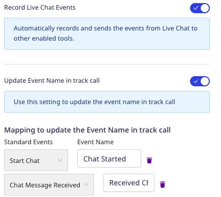
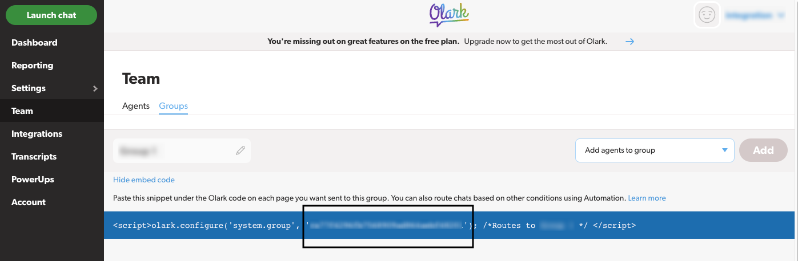

[Olark](https://www.olark.com/) is a cloud-based live chat platform to connect with your customers in an effective and timely manner. It provides various features like automated messages, team management, real-time reporting, searchable transcripts, and more.

Find the open source code for this destination in the <a href="https://github.com/rudderlabs/rudder-sdk-js/tree/production-staging/src/integrations/Olark">GitHub repository</a>.

## Getting started

RudderStack supports sending events to Olark via the following <a href="https://rudderstack.com/docs/rudderstack-cloud/rudderstack-connection-modes/">connection modes</a>:

| **Connection Mode** | **Web** | **Mobile** | **Server** |
| :--- | :--- | :--- | :--- |
| **Device mode** | **Supported**  | - | - |
| **Cloud mode** | -  | - | - |

Once you have confirmed that the source platform supports sending events to Olark, follow these steps:

1. From your [RudderStack dashboard](https://app.rudderstack.com/), add a source. Then, from the list of destinations, select **Olark**.
2. Assign a name to the destination and click **Continue**.

## Connection settings

To successfully configure Olark as a destination, you will need to configure the following settings:

- **Site ID**: Enter your Olark site ID. RudderStack uses it to initialize the native web SDK.
- **Group ID**: Enter your Olark group ID. For more information on getting this ID, refer to the <Link to="#faq">FAQ</Link> section below.
- **Record Live Chat Events**: Enable this setting to allow RudderStack to automatically record your Olark Live Chat events as `track` events.
  - **Update Event Name in track call**: Use this setting to update your `track` event name.
    - **Mapping to update the event name in track call**: Use this setting to map the standard Olark Live Chat events with your custom `track` event names.
- **Client-side Events Filtering**: This setting lets you specify which events should be blocked or allowed to flow through to Olark. For more information, refer to the <Link to="https://www.rudderstack.com/docs/sources/event-streams/sdks/event-filtering/">Client-side Events Filtering</Link> guide.
- **Use device mode to send events**: As this is a <Link to="/destinations/rudderstack-connection-modes/#device-mode">web device mode</Link>-only destination, this setting is enabled by default and cannot be disabled.
- **OneTrust Cookie Categories**: This setting lets you associate the <Link to="/sources/sdks/rudderstack-javascript-sdk/consent-managers/onetrust/">OneTrust</Link> cookie consent groups to Olark.

## Identify

You can use the <Link to="/event-spec/standard-events/identify">`identify`</Link> call to update the user information in Olark. This includes the user's name, email address, phone number, and custom fields like customer ID.

A sample `identify` call is shown below:

```javascript
rudderanalytics.identify("1hKOmRA4GRlm", {
  name: "Alex Keener",
  email: "alex@example.com"
  age: 25
})
```

### Supported mappings

RudderStack maps the following **optional** user traits to the corresponding Olark properties:

| RudderStack property          | Mouseflow property |  Data type |
| :-------------------- | :---------------------- |  :-----| 
| `email` | `emailAddress` | String |
| `traits` | custom fields | Object |
| `name` <br /> `firstName` + `lastName` | `fullName` | String |
| `phone` | `phoneNumber` | String |

## Track

If you enable the **Record Live Chat Events** dashboard setting, RudderStack records the Olark Live Chat events based on the user's interactions and sends them as <Link to="/event-spec/standard-events/track/">`track`</Link> events. You can then view and analyze these events using other tools (connected to the same source in RudderStack).

You can also set custom names for your `track` events and map them to the Olark standard events by enabling the **Update event name in track call** setting.



RudderStack supports the following Olark standard Live Chat events:

- Start Chat
- Chat Message Sent
- Chat Message Received

## FAQ

### Where can I find the Olark group ID?

1. Log in to your [Olark dashboard]().
2. From the left sidebar, go to **Team** > **Groups** and click the relevant group for which you want the ID.
3. Click **Show embed code**. Your group ID will be listed here, as shown:



<br />