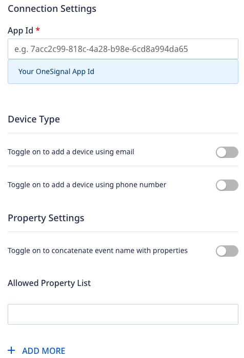
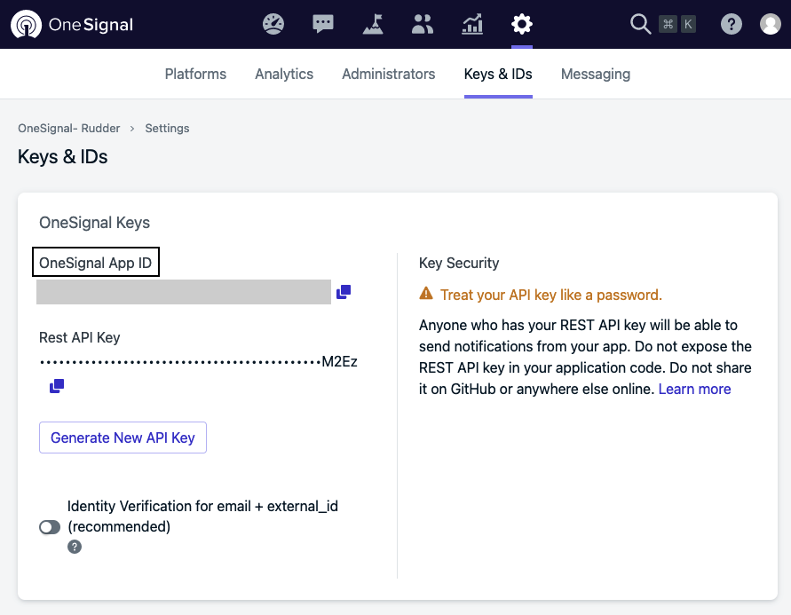

[OneSignal](https://onesignal.com/) is a popular service that helps you drive customer engagement with multi-channel messaging across web and mobile push notifications, in-app messages, SMS, and email subscribers.

RudderStack supports OneSignal as a destination where you can send your event data seamlessly.

<div class="infoBlock">
Find the open source transformer code for this destination in the <a href="https://github.com/rudderlabs/rudder-transformer/blob/master/v0/destinations/">GitHub repository</a>.
</div>

## Getting started

Before configuring OneSignal as a destination in RudderStack, verify if the source platform is supported by OneSignal by referring to the table below:

| **Connection Mode** | **Web** | **Mobile** | **Server** |
| :--- | :--- | :--- | :--- |
| **Device mode** | - | - | - |
| **Cloud mode** | **Supported**  | **Supported** | **Supported** |

<div class="infoBlock">
To know more about the difference between cloud mode and device mode in RudderStack, refer to the <Link to="/destinations/rudderstack-connection-modes/">RudderStack Connection Modes</Link> guide.
</div>

Once you have confirmed that the source platform supports sending events to OneSignal, follow these steps:

1. From your [RudderStack dashboard](https://app.rudderstack.com/), add a source. Then, from the list of destinations, select **OneSignal**.
2. Assign a name to the destination and click **Continue**.

### Connection settings

To successfully configure OneSignal as a destination, you will need to configure the following settings:



- **App Id**: Enter your OneSignal App Id.

<div class="infoBlock">
For more information on finding the OneSignal App Id, refer to the <Link to="#faq">FAQ</Link> section below.
</div>

- **Toggle on to add a device using email**: Enable this setting to add a new device to your OneSignal app using email.
- **Toggle on to add a device using phone number**: Enable this setting to add a new device to your OneSignal app using phone number. 
- **Toggle on to concatenate event name with properties**: Enable this setting to concatenate the event names with properties. for example, if `add_to_cart` is an event and `brand` is a property, the event will be sent as `add_to_cart_brand` tag.
- **Allowed Property List**: Enter the properties you want to add as the device <Link to="https://documentation.onesignal.com/docs/add-user-data-tags">tags</Link>, if present in the payload. 

<div class="warningBlock">
RudderStack considers the properties mentioned under <strong>Allowed Property List</strong> only for the <code class="inline-code">track</code> and <code class="inline-code">group</code> calls.
</div>

## Identify 

You can make an <Link to="/event-spec/standard-events/identify">`identify`</Link> call to <Link to="https://documentation.onesignal.com/reference/add-a-device">add a new device</Link> to your OneSignal App. However, if a device is already registered with the specified identifier, then it will update the existing device's records.

A sample `identify` call is shown below: 

```javascript
rudderanalytics.identify('1hKOmRA4el9Zt1WSfVJIVo4GRlm', {
    firstName: 'Alex',
    lastName: 'Keener',
    email: "alex@example.com"
}, {
    externalId: [
        {
            type: "playerId",
            id: "Df344sdFgdDsS4"
        }
    ],
    integrations: {
        oneSignal: {
            deviceType: "6",
            identifier: "9b1deb4d-3b7d-4bad-9bdd-2b0d7b3dcb6d"
        }
    }
);
```

In the above snippet, the `playerId` is a unique ID for a device. If `playerId` is provided in `externalId`, the device having that `playerId` will be updated. The `externalId` is case-sensitive and is expected to be in the above format for correct mapping.

<div class="infoBlock">
RudderStack adds the <code class="inline-code">anonymousId</code> as a tag with the key as <code class="inline-code">anonymousId</code> along with the corresponding value.
</div>

### Add multiple devices

You can add multiple devices in a single `identify` call. RudderStack maps the following browser and mobile device types by default:

```javascript
deviceTypeMapping = {
    android: 1,
    ios: 0,
    chrome: 5,
    safari: 7,
    firefox: 8
}
```

You can override the above-mentioned device type mappings or set any other device type by providing the `deviceType` and `identifier` in the `integrations` object, as shown:

```javascript
"integrations": {
    "one_signal": {
        "deviceType": "Sample device",
        "identifier": "9b1deb4d-3b7d-4bad-9bdd-2b0d7b3dcb6d"
    }
}
```

- For browser, Rudderstack checks the browser name in `deviceTypeMapping` as mentioned in the above code snippet and maps it to OneSignal's `device_type` property. It also sets the `anonymousId` as an `identifier` depending upon the browser name. 

- For iOS and Android, RudderStack collects the `context.device.type` field and maps it to OneSignal's `device_type` property. It also sets the `context.device.token`/`context.device.id` as an `identifier`.

<div class="infoBlock">
It is recommended to send <code class="inline-code">device.token</code> for push notifications.
</div>

- For email and SMS, enable the **Toggle on to add a device using email** and **Toggle on to add a device using phone number** settings in the RudderStack dashboard and send their data (`email` or `phone`) in the event payload.


### Property mapping

The following table details the mappings between the **optional** RudderStack and OneSignal properties:

| RudderStack property | OneSignal property |
| :-------| :--------| 
| `context.device.model`  | `device_model` | 
| `context.os.version` | `device_os` | 
| `context.timezone` | `timezone` | 
| `userId` | `external_user_id` | 
| `context.locale` | `language` |
| `traits.createdAt`/`context.traits.createdAt`/`timestamp`/`originalTimestamp` | `created_at`/`last_active` | 
| `traits.country`/`context.traits.country`/`traits.address.country`/`context.traits.address.country` | `country` | 
| `integrations.one_signal.deviceType` | `device_type` | 
| `integrations.one_signal.identifier` | `identifier` |

<div class="infoBlock">
All the <code class="inline-code">string</code> key-value pairs from <code class="inline-code">traits</code> are mapped inside the <code class="inline-code">tags</code> object as it is.
</div>

## Track

You can use the <Link to="/event-spec/standard-events/track">`track`</Link> to update an existing device's tags in your OneSignal apps using the `external_user_id` parameter. All devices containing the particular `external_user_id` are updated simultaneously.

While updating a device tag, you can delete any key inside a tag by providing the key value as an empty string.

A sample `track` call is shown below:

```javascript
rudderanalytics.track('Add to cart', {
    purchased_item: "Shirt",
    brand: "Zara"
});
```

### Property mapping

The following table details the mappings between RudderStack and OneSignal properties:

| RudderStack property | OneSignal property | Presence | 
| :-------| :--------| :------|
| `userId`  | `external_user_id` | Required | 

<div class="infoBlock">
RudderStack maps all the properties added in the <strong>Allowed Property List</strong> setting in the RudderStack dashboard to the <code class="inline-code">tags</code> object if they are present in the payload. However, note that the key-value pair should be of the String data type only.
</div>

## Group

You can use the <Link to="/event-spec/standard-events/group">`group`</Link> call to group the devices with the device tags having the same `groupId`.

A sample `group` call is as shown:

```javascript
rudderanalytics.group('1hKOmRA4el9Zt1WSfVJIVo4GRlm', {
  name: "Apple Inc.",
  location: "USA",
});
```

### Property mapping

The following table details the mappings between RudderStack and OneSignal properties:

| RudderStack property | OneSignal property | Presence | 
| :-------| :--------| :------|
| `groupId` | `groupId` | Required | 

<div class="infoBlock">
RudderStack maps all the properties added in the <strong>Allowed Property List</strong> setting in the RudderStack dashboard to the <code class="inline-code">tags</code> object if they are present in the payload. However, note that the key-value pair should be of the String data type only.
</div>

## FAQ

### Where can I find the OneSignal App Id?

To get your OneSignal App Id, follow these steps:

1. Log into your [OneSignal dashboard](https://dashboard.OneSignal.com/).
2. Go to your app's **Settings** > **Keys & IDs**.
3. You will find the OneSignal App Id, as shown:


