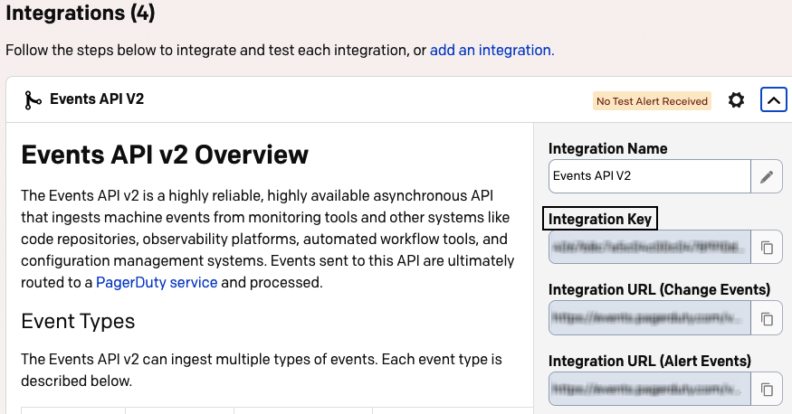

[PagerDuty](https://www.pagerduty.com/) is a SaaS-based platform that helps prevent and resolve business-impacting incidents, thereby improving the customer experience.

<div class="infoBlock">
Find the open source transformer code for this destination in the <a href="https://github.com/rudderlabs/rudder-transformer/tree/master/src/v0/destinations/pagerduty">GitHub repository</a>.
</div>

## Getting started

RudderStack supports sending events to PagerDuty via the following <a href="https://rudderstack.com/docs/rudderstack-cloud/rudderstack-connection-modes/">connection modes</a>:

| **Connection Mode** | **Web** | **Mobile** | **Server** |
| :--- | :--- | :--- | :--- |
| **Device mode** | -  | - | - |
| **Cloud mode** | **Supported**  | **Supported** | **Supported** |

Once you have confirmed that the source platform supports sending events to PagerDuty, follow these steps:

1. From your [RudderStack dashboard](https://app.rudderstack.com/), add a source. Then, from the list of destinations, select **PagerDuty**.
2. Assign a name to the destination and click **Continue**.

## Connection settings

To successfully configure PagerDuty as a destination, you will need to configure the following settings:

- **PagerDuty Routing Key**: Enter the integration key from PagerDuty service. Refer to the <a href="#faq">FAQ</a> section for more information on how to obtain it.
- **dedup_key Field Identifier**: dedup_key is an id of an event. You can provide this key. Otherwise, PagerDuty generates a dedup_key and assigns it to an event. This key is used to update, resolve, or acknowledge an event.

## Track

You can send a <Link to="/event-spec/standard-events/track">`track`</Link> call to PagerDuty to ingest the [Alert events](https://developer.pagerduty.com/docs/ZG9jOjExMDI5NTgx-send-an-alert-event) or [Change events](https://developer.pagerduty.com/docs/ZG9jOjExMDI5NTgy-send-a-change-event).

By default, the `track` call sends an alert event. However, you can specify the event type in the `integrations` object, as shown:

```javascript
integrations: {
  pagerduty: {
    type: changeEvent / alertEvent
  }
}
```

### Alert events

You can [send an alert event](https://developer.pagerduty.com/docs/ZG9jOjExMDI5NTgx-send-an-alert-event) to report a new problem, or update an ongoing problem, depending on the event type.

A sample `track` call for sending an alert event is shown below:

```javascript
rudderanalytics.track("apiSecret is not present", {
  action: "trigger",
  dedupKey: "9116b734-7e6b-4497-ab51-c16744d4487e",
  severity: "critical",
  component: "ui",
  source: "rudder-webapp",
  group: "destination",
  class: "connection settings",
  customDetails: {
    "ping time": "1500ms",
    "load avg": 0.75,
  },
  imageURLs: [{
      src: "https://static.s4be.cochrane.org/app/uploads/2017/04/shutterstock_531145954.jpg",
      alt: "first image",
    },
    {
      src: "https://chart.googleapis.com/chart?chs=600x400&chd=t:6,2,9,5,2,5,7,4,8,2,1&cht=lc&chds=a&chxt=y&chm=D,0033FF,0,0,5,1",
      alt: "second image",
    },
  ],
  linkURLs: [{
      href: "https://developer.mozilla.org/en-US/docs/Web/JavaScript/Reference/Global_Objects/Error",
      text: "Js Object Error",
    },
    {
      href: "https://www.techtarget.com/whatis/definition/stack-overflow#:~:text=A%20stack%20overflow%20is%20a,been%20allocated%20to%20that%20stack",
      text: "Stack Overflow Error",
    },
  ],
});
```

#### Property mappings

The following table lists the mappings between RudderStack and PagerDuty properties for alert events:

| RudderStack property | PagerDuty property | 
| :----------------- | :--------------- |
| `event` <br/> <span style="color: #4D4DFF;font-size:12px;">Required</span>     | `payload.summary`      |
| `properties.severity`  <br/> <span style="color: #4D4DFF;font-size:12px;">Required</span>  | `payload.severity`     | 
| `properties.source`  <br/> <span style="color: #4D4DFF;font-size:12px;">Required</span>    | `payload.source`      | 
| `properties.action`  <br/> <span style="color: #4D4DFF;font-size:12px;">Required</span>    | `event_action`      | 
| `properties.linkURLs`     | `links`      | 
| `properties.imageURLs`   | `images`     | 
| `originalTimeStamp`     | `payload.timestamp`      | 
| `properties.group`   | `payload.group`     | 
| `properties.class`     | `payload.class`      | 
| `properties.component`   | `payload.component`     | 
| `properties.client`   | `client`     | 
| `properties.clientUrl`     | `client_url`      | 
| `properties.customDetails`   | `payload.custom_details`     | 

### Change events

You can [send a change event](https://developer.pagerduty.com/docs/ZG9jOjExMDI5NTgy-send-a-change-event) to send information about the recent changes, such as code deployment, and system configuration changes from any system that can make an outbound HTTP connection.

A sample `track` call for sending a change event is shown below:

```javascript
rudderanalytics.track(
  "Github CI/CD Triggered", {
    source: "rudder-webapp",
    customDetails: {
      "ping time": "1500ms",
      "load avg": 0.75,
    },
    imageURLs: [{
        src: "https://static.s4be.cochrane.org/app/uploads/2017/04/shutterstock_531145954.jpg",
        alt: "first image",
      },
      {
        src: "https://chart.googleapis.com/chart?chs=600x400&chd=t:6,2,9,5,2,5,7,4,8,2,1&cht=lc&chds=a&chxt=y&chm=D,0033FF,0,0,5,1",
        alt: "second image",
      },
    ],
    linkURLs: [{
        href: "https://developer.mozilla.org/en-US/docs/Web/JavaScript/Reference/Global_Objects/Error",
        text: "Js Object Error",
      },
      {
        href: "https://www.techtarget.com/whatis/definition/stack-overflow#:~:text=A%20stack%20overflow%20is%20a,been%20allocated%20to%20that%20stack",
        text: "Stack Overflow Error",
      },
    ],
  }, {
    integrations: {
      pagerduty: {
        type: "changeEvent",
      },
    },
  }
);
```

#### Property mappings

The following table lists the mappings between RudderStack and PagerDuty properties for change events:

| RudderStack property | PagerDuty property | 
| :----------------- | :--------------- |
| `event` <br/> <span style="color: #4D4DFF;font-size:12px;">Required</span>    | `payload.summary`      |
| `properties.severity`   | `payload.severity`     | 
| `properties.linkURLs`     | `links`      | 
| `properties.imageURLs`   | `images`     | 
| `originalTimeStamp`     | `payload.timestamp`      | 
| `properties.customDetails`   | `payload.custom_details`     |

## FAQ

### Where can I find the PagerDuty Routing Key?

1. Log in to the [PagerDuty dashboard](https://app.pagerduty.com/).
2. Go to **Services** > **Service Directory**.
3. Select your desired service and click **Integrations** tab.
4. Click **Add integration** and select any desired integration platform. Here, you can find the integration/routing key as shown:

