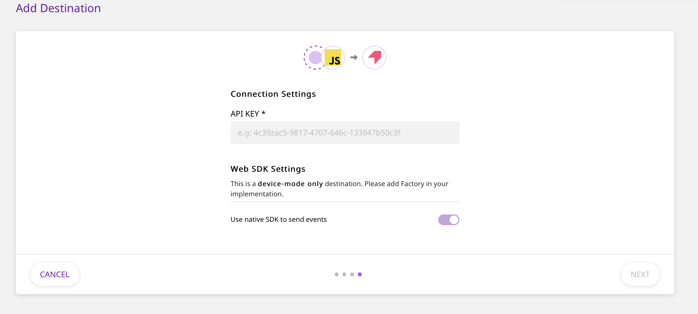

[Pendo](https://www.pendo.io/) is a popular product analytics platform that allows you to better understand your customers, and deliver personalized, guided product journeys for them.

RudderStack allows you to configure Pendo as a destination to which you can send your event data seamlessly, for delivering personalized user experiences.

## Getting started

RudderStack supports sending event data to Pendo via the following <a href="https://rudderstack.com/docs/rudderstack-cloud/rudderstack-connection-modes/">connection modes</a>:

| **Connection Mode** | **Web**       | **Mobile** | **Server** |
| :------------------ | :------------ | :--------- | :--------- |
| **Device Mode**     | **Supported** | **-**      | **-**      |
| **Cloud Mode**      | **-**         | **-**      | **-**      |

<div class="infoBlock">
In the web device mode integration, that is, using <Link to="/sources/event-streams/sdks/rudderstack-javascript-sdk">JavaScript SDK</Link> as a source, the Pendo native SDK is loaded from <code class="inline-code">https://cdn.pendo.io/</code> domain. Based on your website's content security policy, you might need to <Link to="/sources/event-streams/sdks/rudderstack-javascript-sdk/load-js-sdk/#allowlist-destination-domain">allowlist this domain</Link> to load the Pendo SDK successfully.
</div>

Once you have ascertained that the platform is supported by Pendo, please follow these steps:

- Choose a source to which you would like to add Pendo as a destination.
- Select the destination as **Pendo** to your source. Give your destination a name and then click **Next**.
- On the **Connection Settings** page, fill all the fields with the relevant information and click **Next**.

<span class="imageTitle">Pendo Connection Settings in RudderStack</span>

<div class="infoBlock">

To get the Pendo **API Key**, follow these steps:
  <ul>
    <li>Login to Pendo dashboard.</li>
    <li>Go to the <strong>Settings</strong> on the left sidebar and click <strong>Subscription Settings.</strong></li>
    <li>You will see an option called <strong>Apps</strong> and under that hover on the square box and click <strong>view app details</strong>.</li>
    <li>Here you will find your <strong>API Key</strong> in <strong>App Details</strong> section.
    </li>
  </ul>
</div>

## Identify

To identify a user to Pendo, you need to call the `identify` API. When you send an `identify` call, RudderStack will pass that user’s information to Pendo with `userId` as Pendo’s visitor ID. The user traits that you pass are mapped to visitor metadata in Pendo.

A sample `identify` call is as shown:

```javascript
rudderanalytics.identify("name123", {
  name: "Name Surname",
  first_name: "Name",
  last_name: "Surname",
  email: "name@surname.com",
  createdAt: "Thu Mar 24 2020 17:46:45 GMT+0000 (UTC)",
})
```

## Group

You can use the `group` call to create or update an account in Pendo. When you send a Group call, RudderStack sends the `groupId` to Pendo as account ID. The group traits are mapped to account metadata in Pendo.

<div class="infoBlock">

If you are using your Pendo account data, the group calls (with fields <code class="inline-code">groupId</code> & <code class="inline-code">traits</code>) are required.

</div>

Here is a sample `group` call:

```javascript
rudderanalytics.group("groupId", {
    "name": "Company",
    "industry": "Industry",
    "employees": 123,
    "email": abc@xyz.com
  }
);
```

## Track

The `track` call allows you to capture any action that the user might perform, along with the properties that are associated with that action. Each action is considered to be an event.

Here is a sample `track` call:

```javascript
rudderanalytics.track("test track event", {
  revenue: 30,
  currency: "USD",
  userId: "12345",
})
```

## FAQs

### Where do I find the Pendo API Key?

- Login to Pendo dashboard.
- Go to the **Settings** on the left sidebar and click **Subscription Settings.**
- You will see an option called **Apps** and under that hover on the square box and click **view app details**.
- Here you will find your **API Key** in **App Details** section.


