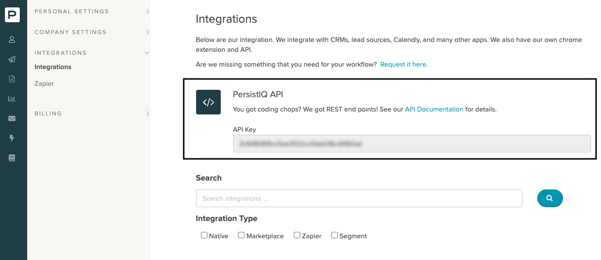
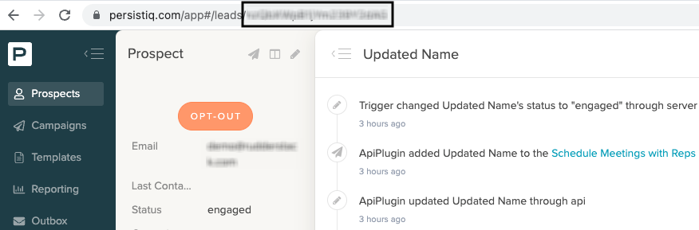
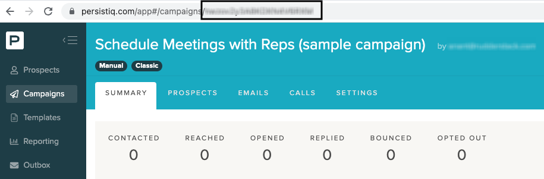

[PersistIQ](https://www.persistiq.com/) is an outbound sales automation and customer discovery platform. It helps you find new customers, onboard them, and organize your outreach strategies effectively. 

## Getting started

RudderStack supports sending event data to PersistIQ via the following <a href="https://rudderstack.com/docs/rudderstack-cloud/rudderstack-connection-modes/">connection modes</a>:

| Connection Mode | Web | Mobile | Server |
| :--- | :--- | :--- | :--- |
| Device mode | - | - | - |
| Cloud mode | Supported  | Supported | Supported |

Once you have confirmed that the source platform supports sending events to PersistIQ, follow these steps:

1. From your [RudderStack dashboard](https://app.rudderstack.com/), add a source. Then, from the list of destinations, select **PersistIQ**.
2. Assign a name to the destination and click **Continue**.

## Connection settings

To successfully configure PersistIQ as a destination, you will need to configure the following settings:

- **PersistIQ REST API Key**: Enter your PersistIQ API key. For more information on obtaining the API key, refer to the <Link to="#faq">FAQ</Link> section below.
- **Map RudderStack user attributes to PersistIQ Lead attributes**: Use this setting to map your RudderStack event properties to the custom or non-standard PersistIQ lead attributes.

## Identify

You can use RudderStack's <Link to="/event-spec/standard-events/identify/">`identify`</Link> call to create or update a lead (prospect) in PersistIQ. RudderStack sends the user information to PersistIQ via their `/leads` endpoint.

### Creating a new lead

A sample `identify` call that creates a new lead in PersistIQ is shown below:

```javascript
rudderanalytics.identify("1hKOmRA4GRlm", {
  name: "Alex Keener",
  address: "99 Blue Gum Street",
  email: "alex@example.com"
})
```

RudderStack automatically maps all the common attributes like name, email, city, etc. to the PersistIQ lead attributes. To map specific event properties to the custom PersistIQ lead attributes, use the **Map RudderStack user attributes to PersistIQ Lead attributes** dashboard setting to specify the mapping.

#### Supported mappings

The following table lists the mappings between the RudderStack properties and PersistIQ attributes:

| RudderStack property | PersistIQ property | Data type |
| :--- | :--- | :--- |
| `traits.dup` | `dup` | String | 
| `traits.creator_id` | `creator_id` | String | 
| `context.traits.email` <br /> `traits.email`  | ` lead[0].email` | String  |
| `context.traits.country` <br /> `traits.country`  | ` lead[0].country` | String |
| `context.traits.city` <br />`traits.city` | `lead[0].city` | String |
| `context.traits.gender` <br />`traits.gender` | `lead[0].gender` | String |
| `context.traits.company` <br />`traits.company` | `lead[0].company_name` | String |
| `context.traits.phone` <br />`traits.phone` | `lead[0].phone` | Phone number |
| `context.traits.facebookUrl` <br />`traits.facebookUrl` | `lead[0].facebookUrl` | URL |
| `context.traits.twitterUrl` <br />`traits.twitterUrl` | `lead[0].twitterUrl` | URL |
| `context.traits.linkedinUrl` <br />`traits.linkedinUrl` | `lead[0].linkedinUrl` | URL |
| `traits.firstName` <br /> `traits.firstname` <br />`traits.first_name` <br /> `context.traits.firstName` <br />`context.traits.firstname` <br /> `context.traits.first_name` |  `lead[0].first_name` | String  |
| `traits.lastName` <br /> `traits.lastname` <br />`traits.last_name` <br /> `context.traits.lastName` <br />`context.traits.lastname` <br /> `context.traits.last_name` |  `lead[0].last_name` | String  |
| `traits.{x}` <br /> `context.traits.{x}`  |  `lead[0].{x}` | -  |

<div class="warningBlock">
RudderStack does not batch events before sending them to PersistIQ. Hence, the index inside the <code class="inline-code">lead</code> array is always <code class="inline-code">0</code>.
</div>


### Updating an existing lead

RudderStack automatically updates a lead if the `identify` call contains the `persistIqLeadId` field in the `externalId` object. Otherwise, it creates a new lead.

A sample `identify` call that updates an existing PersistIQ lead is shown below:

```javascript
rudderanalytics.identify("1hKOmRA4GRlm", {
  name: "Alex Keener",
  address: "99 Blue Gum Street",
  email: "alex@example.com"
}, {
  "externalId": [{
    "type": "persistIqLeadId",
    "id": "abc12345"
  }]
})
```

<div class="infoBlock">
For more information on getting your PersistIQ lead ID, refer to the <Link to="#faq">FAQ</Link> section below.
</div>

#### Supported mappings

The following table list the mappings between the RudderStack properties and PersistIQ attributes:

| RudderStack property | PersistIQ property | Data type |
| :--- | :--- | :--- |
| `externalId.persistIqLeadId` <br/> <span style="color: #4D4DFF;font-size:12px;">Required</span> | `leadId` | String |
| `traits.status` <br /> `context.traits.status`  |  `status` | String  |
| `context.traits.email` <br /> `traits.email`  | `data.email` | String  |
| `context.traits.country` <br /> `traits.country`  | `data.country` | String |
| `context.traits.city` <br/>`traits.city` | `data.city` | String |
| `context.traits.gender` <br/> `traits.gender` | `data.gender` | String |
| `context.traits.company` <br/> `traits.company` | `data.company_name` | String |
| `context.traits.phone` <br/> `traits.phone` | `data.phone` | String |
| `context.traits.facebookUrl` <br /> `traits.facebookUrl` | `data.facebookUrl` | URL |
| `context.traits.twitterUrl` <br /> `traits.twitterUrl` | `data.twitterUrl` | URL |
| `context.traits.linkedinUrl` <br /> `traits.linkedinUrl` | `data.linkedinUrl` | URL |
| `traits.firstName` <br /> `traits.firstname` <br />`traits.first_name` <br /> `context.traits.firstName` <br />`context.traits.firstname` <br /> `context.traits.first_name` |  `data.first_name` | String  |
| `traits.lastName` <br /> `traits.lastname` <br />`traits.last_name` <br /> `context.traits.lastName` <br />`context.traits.lastname` <br /> `context.traits.last_name` |  `data.last_name` | String  |
| `traits.{x}` <br /> `context.traits.{x}`  |  `data.{x}` | -  |

<div class="infoBlock">
The lead status passed in the <code class="inline-code">traits.status</code>/<code class="inline-code">context.traits.status</code> must already be configured in your PersistIQ dashboard.
</div>

## Group

You can use the <Link to="/event-spec/standard-events/group/">`group`</Link> events to add or remove a lead from a group in PersistIQ. RudderStack uses the `/campaigns` endpoint to send this information to PersistIQ.

A sample `group` call is shown below:

```javascript
rudderanalytics.group("group01", {
  mailbox_id: "mbid123",
  operation: "add" // set to remove to remove user from a group
}, {
  "externalId": [{
    "type": "persistIqLeadId",
    "id": "abc12345"
  }]
})
```

<div class="infoBlock">
If not explicitly specified, RudderStack automatically sets the <code class="inline-code">traits.operation</code> parameter to <code class="inline-code">add</code>. To remove a user from the group, set this parameter to <code class="inline-code">remove</code>.
</div>

### Supported mappings

The following table list the mappings between the RudderStack properties and PersistIQ attributes:

| RudderStack property | PersistIQ property | 
| :--- | :--- | 
| `groupId` <br/> <span style="color: #4D4DFF;font-size:12px;">Required</span> | `campaign_id` |
| `externalId.persistIqLeadId` <br/> <span style="color: #4D4DFF;font-size:12px;">Required</span> | `leadId` | 
| `traits.mailbox_id` <br/>  `context.traits.mailbox_id` | `mailbox_id` |

## FAQ

### Where can I find the PersistIQ API key?

To get your PersistIQ API key, follow these steps:

1. Log in to your [PersistIQ dashboard](https://persistiq.com/app/). 
2. From the bottom left corner, click your profile button and go to **Settings and Billing** > **Integrations**. Your API key will be listed here, as shown:



### How do I get the PersistIQ lead ID and campaign ID?

To get a prospect's lead ID in the [PersistIQ dashboard](https://persistiq.com/app/), click the specific prospect. You can find the ID in the resulting URL, as shown:



Similarly, to get a campaign ID, go to **Campaigns** in your dashboard and click the required campaign. The ID should be visible in the resulting URL.



<br />
