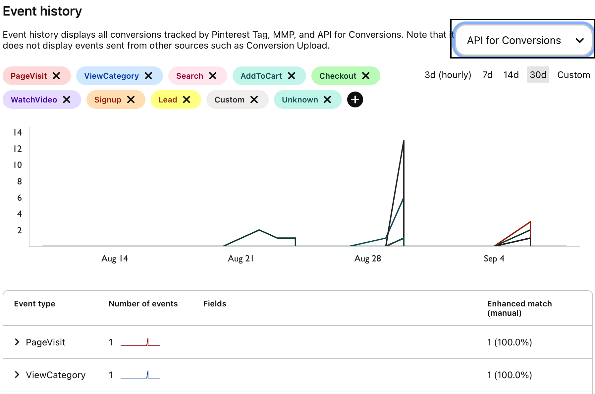

RudderStack lets you send your event data to [Pinterest Conversions API](https://s.pinimg.com/ct/docs/conversions_api/dist/v3.html) via the <Link to="/destinations/rudderstack-connection-modes/#cloud-mode">cloud mode</Link>. It sends the event calls in a <Link to="/docs/api/http-api/#12-batch">batch</Link> where each batch can contain upto 1000 events.

<GhBadge
  label={'Stability'}
  message={'Beta'}
  color={'blueviolet'}
/>

<div class="warningBlock">
To use Pinterest Tag's cloud mode (Pinterest conversions API), you need to contact <a href="https://help.pinterest.com/en/contact">Pinterest Support</a> to enable the beta access.
</div>


<div class="infoBlock">
Find the open source JavaScript SDK code for this destination in the <a href="https://github.com/rudderlabs/rudder-transformer/tree/master/v0/destinations/pinterest_tag">GitHub repository</a>.
</div>

## Track

The <Link to="/event-spec/standard-events/track">`track`</Link> call allows you to capture the users' conversion events.

RudderStack maps the `track` events as specified in the **Map Your Events To Pinterest Events** connection setting in the dashboard.

A sample `track` call is shown below:

```javascript
rudderanalytics.track("Order Completed", {
  event_id: 'eventIDordercompleted',
  order_id: "transactionId",
  value: 35.00,
  revenue: 31.98,
  currency: 'USD',
  products: [{
    product_id: '123454387',
    price: 3.00,
    quantity: 2,
    currency: 'USD',
    position: 1,
    value: 6.00,
  }]
}, {
  traits: {
    email: "alex@example.com",
    lastname: "Keener",
    firstname: "Alex",
    action_source: "offline" // or app_ios / app_android / web
  }
});
```

### E-commerce conversion tracking

RudderStack supports e-commerce conversion tracking for Pinterest. You can use the <Link to="/event-spec/ecommerce-events-spec/">E-commerce Events Specification</Link> guide for sending the events while instrumenting your site with the RudderStack SDK.

The following table mentions how the specific Rudderstack `track` Ecommerce events are mapped to standard Pinterest Conversion Events:

| RudderStack event | Pinterest event  |
| :--------------------- | :------------------- |
| Order Completed        | `Checkout`           |
| Product Added          | `AddToCart`          |
| Products Searched      | `Search`             |
| Product List Filtered    | `Search`           |

You can also track a custom event that you want to include in the conversion reporting. It will be mapped to a custom Pinterest event, for example:

```javascript
rudderanalytics.track("custom event")
```

### Standard Pinterest events

Pinterest supports the following nine standard events that can be mapped and tracked for reporting. Any event apart from these is treated as a user-defined event.

- `Checkout`
- `AddToCart`
- `PageVisit`
- `SignUp`
- `WatchVideo`
- `Lead`
- `Search`
- `ViewCategory`
- `Custom`

## Page

The <Link to="/event-spec/standard-events/page">`page`</Link> call lets you record your website's page views with any additional relevant information about the viewed page.

- **`view_category`**: RudderStack sends this event if both the `name` and `category` fields are present. The below sample event contains both the fields and is mapped to the Pinterest's `view_category` event:

```javascript
rudderanalytics.page("Best Seller", "Games", {
  path: "/best-seller/games/1",
  url: "https://www.estore.com/best-seller/games/1",
  title: "Best selling games offered by EStore",
  search: "estore bestseller games",
  referrer: "https://www.google.com/search?q=estore+bestseller",
  testDimension: "true",
})
```
- **`page_visit`**: RudderStack sends this event if only `name` field is present and drops any additional properties. The below sample event contains only `name` and is mapped to the Pinterest's `page_visit` event:

```javascript
rudderanalytics.page("Best Seller", {
  path: "/best-seller/1",
})
```

## Common field mappings

The following table lists the mappings specific for Pinterest Conversion API and are relevant for both the `track` and `page` calls:

| RudderStack property | Pinterest Tag property | Presence | Description | 
|:---------------------|:-------------|:--------------|:--------------|
| `message.event` | `event_name` | Required | Type of the user event. |
| `context.traits.action_source`/`properties.action_source`/`message.channel` | `action_source` |Required | Source indicating the occurence of conversion event. |
| `timestamp` | `event_time` | Required | Unix timestamp (in UTC) in seconds indicating when the user conversion event occurred. |
| `destination.Config.advertiserId` | `advertiser_id` | Required | Pinterest Advertiser ID. |
|  Integrations Object `messageId` | `event_id` | Optional | Deduplication key from the dashboard setting or `messageId`. The dashboard setting is given higher priority. |
| `pageUrl` | `event_source_url` | Optional | URL of the web conversion event. |
| `context.device.adTrackingEnabled` | `opt_out` | Optional | When <code class="inline-code">action_source</code> is **web** or **offline**, it defines whether the user has opted out of tracking for web conversion events. When <code class="inline-code">action_source</code> is **app_android** or **app_ios**, it defines whether the user has enabled **Limit Ad Tracking** on their iOS device or opted out of **Ads Personalization** on their Android device.|
| `destination.Config.appId` | `app_id` | Optional | App store's App ID. |
| `context.app.name`/`properties.appName` | `app_name` |Optional | Name of the app. |
| `context.app.version`/`properties.appVersion` | `app_version` | Optional |Version of the app. |
| `context.device.manufacturer`/`properties.manufacturer` | `device_brand` |Optional | Brand of the user device. |
|  `context.device.model`/`properties.deviceModel` | `device_model` | Optional | Model of the user device. |
| `context.device.type`/`properties.deviceType` | `device_type` | Optional | Type of the user device. |
|  `context.os.version` | `os_version` | Optional | Version of the device's operating system. |
| `context.locale` | `language` | Optional | Two-character ISO-639-1 language code indicating the user's language. | 


<div class="infoBlock">
For mobile sources, if <code class="inline-code">context.device.adTrackingEnabled</code> is <code class="inline-code">true</code>, <code class="inline-code">opt_out</code> will be set as <code class="inline-code">false</code> and vice-versa.
</div>

## User field mappings

The following table lists the mappings for fields carrying the user information for `track` and `page` calls:

| RudderStack property | Pinterest Tag property | Data Type | 
|:---------------------|:-------------|:--------------|
| `email` | `em` | Array of strings with SHA-256 encoding |
| `phone` | `ph` | Array of strings with SHA-256 encoding |
| `context.traits.gender` | `ge` | Array of strings with SHA-256 encoding |
| `birthday` | `db` (yyyymmdd format) |  Array of strings with SHA-256 encoding |
|  `lastName` | `ln` | Array of strings with SHA-256 encoding | 
| `firstName` | `fn` | Array of strings with SHA-256 encoding |
| `context.traits.city`/`context.traits.address.city` | `ct` | Array of strings with SHA-256 encoding|
| `context.traits.state`/`context.traits.address.state` | `st` (Two-letter code) | Array of strings with SHA-256 encoding |
| `context.traits.zip`/`context.traits.address.zip` | `zp` | Array of strings with SHA-256 encoding |
|  `context.traits.country`/`context.traits.address.country` | `country` (Two-character ISO-3166 country code) |Array of strings with SHA-256 encoding | 
| `context.device.advertisingId` | `hashed_maids` | Array of strings with SHA-256 encoding |
| `context.ip`/`context.requestIP`/`properties.ip`/`properties.clientIpAddress` | `client_ip_address` | String|
| `context.userAgent` | `client_user_agent` | String |


<div class="warningBlock">
To send the <code class="inline-code">track</code> or <code class="inline-code">page</code> events successfully, you need to include <strong>at least one</strong> of the following user properties:
<ul>
<li> <code class="inline-code">em</code></li>
<li><code class="inline-code">hashed_maids</code></li>
<li>Combination of <code class="inline-code">client_ip_address</code> and <code class="inline-code">client_user_agent</code></li>
</ul>
</div>

## Custom field mappings

The following table lists the custom fields mappings for `track` and `page` calls:

| RudderStack property | Pinterest Tag property | Data Type | 
|:---------------------|:-------------|:--------------|
| `properties.currency` | `currency` | String |
| `properties.value`/`properties.total`/`properties.revenue` | `value` | String |
| `properties.product_id`/`properties.product_sku`/`properties.products[index].product_id`/`properties.products[index].product_sku` | `content_ids` | Array of strings |
| `properties.price`/`properties.products[index].price` | `contents.[index].item_price` | Array of strings |
|  `properties.quantity`/`properties.products[index].quantity` | `contents.[index].quantity` | Integer | 
| `properties.numOfItems` (if not present, sum of quantity) | `num_items` | Integer |
| `properties.order_id` | `order_id` | String|
| `properties.query` | `search_string` | String |

## FAQ

### How can I verify if my events are being sent to Pinterest Conversions API?

Follow these steps to see your events in Pinterest Conversions API:

1. Login to your [Pinterest ads manager](https://ads.pinterest.com/) account.
2. Click the **Ads** tab and select **Conversions** from the dropdown.
3. Select **API for conversions** from the dropdown to see your events, as shown: 

<div class="infoBlock">
To see <strong>API for conversions</strong> option in the dropdown, you need to set up your Pinterest dashboard using the Pinterest Tag. For more information on using the Pinterest Tag, refer to the <Link to="/destinations/streaming-destinations/pinterest-ads/pinterest-ads-device-mode/">Pinterest Tag Device Mode</Link> documentation.
</div>

