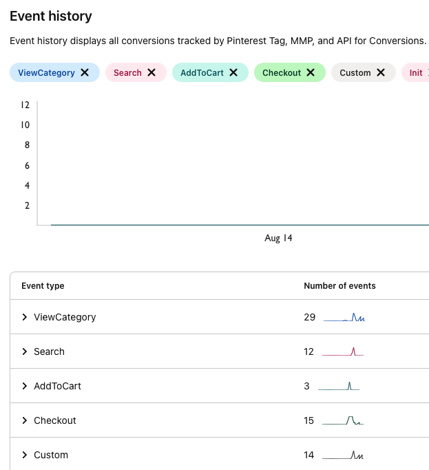

RudderStack lets you send your event data to Pinterest Tag using Pinterest's `pintrk` conversion tag via the <Link to="/destinations/rudderstack-connection-modes/#device-mode">device mode</Link>.

Find the open source JavaScript SDK code for this destination in the <a href="https://github.com/rudderlabs/rudder-sdk-js/tree/production/src/integrations/PinterestTag">GitHub repository</a>.

## Identify

The <Link to="/event-spec/standard-events/identify">`identify`</Link> call lets you create new or update existing customers and record the traits about them like their name, email address, etc. 

When you make an `identify` call with a user’s email address and traits, RudderStack triggers the Pinterest `set()` method. This saves the identification parameters to be sent with the next events, so it is recommended to set the values as early as possible. 

If you make an `identify` call without `email`, the identification parameter will not be set.

A sample `identify` call is shown below:

```javascript
rudderanalytics.identify("1hKOmRA4el9Zt1WSfVJIVo4GRlm", {
  name: "Alex Keener",
  email: "alex@example.com",
})
```

In the above example, the identification parameter will be set to `alex@example.com` and the successive calls will be an Enhanced Match.

<div class="infoBlock">
After an <code class="inline-code">identify</code> call is made, nothing appears in the network tab in your browser or in the tag helper extension. However, a hashed value for an <code class="inline-code">em</code> parameter is added in the next event call, in a JSON object encoded in the URL.
</div>

## Track

The <Link to="/event-spec/standard-events/track">`track`</Link> call allows you to capture user actions along with the properties associated with these actions.

A sample `track` call is shown below:

```javascript
rudderanalytics.track("Order Completed", {
    checkout_id: "C324532",
    order_id: "T1230",
    value: 15.98,
    revenue: 16.98,
    currency: "INR"
})
```

RudderStack SDK sends the `track` event and any properties as custom properties to Pinterest.

### Ecommerce conversion tracking

RudderStack supports ecommerce conversion tracking for Pinterest. You can use the <Link to="/event-spec/ecommerce-events-spec/">Ecommerce Events Specification</Link> guide for sending the events while instrumenting your site with the RudderStack SDK.

The following table mentions some sample `track` events mapped to the Pinterest events:

| RudderStack event | Pinterest event  |
| :--------------------- | :------------------- |
| Order Completed        | `Checkout`           |
| Product Added          | `AddToCart`          |
| Products Searched      | `Search`             |
| Product List Filtered    | `Search`           |

You can also track a custom event that you want to include in the conversion reporting. It will be mapped to a custom Pinterest event, for example:

```javascript
rudderanalytics.track("custom event")
```

<div class="infoBlock">
You can map your event to a specific Pinterest event by adding it in the <strong>Map Your Events To Pinterest Events</strong> section while configuring the Pinterest destination in RudderStack.
</div>

### Standard Pinterest events

Pinterest supports the following nine standard events that can be mapped and tracked for reporting. Any event apart from these is treated as a user-defined event.

- `Checkout`
- `AddToCart`
- `PageVisit`
- `SignUp`
- `WatchVideo`
- `Lead`
- `Search`
- `ViewCategory`
- `Custom`

### Property mapping

RudderStack maps the following properties to the Pinterest properties:

| RudderStack property | Pinterest property |
| :------------------------ | :---------------------- |
| query                     | `search_query`          |
| value                     | `value`                 |
| order_quantity            | `order_quantity`        |
| currency                  | `currency`              |
| order_id                  | `order_id`              |
| promo_code                | `promo_code`            |
| property                  | `property`              |
| video_title               | `video_title`           |
| lead_type                 | `lead_type`             |
| coupon                    | `coupon`                |

The following properties are nested within the ecommerce `products` array:

| RudderStack property  | Pinterest property  |
| :------------------------ | :---------------------- |
| product_id                | `product_id`            |
| sku                       | `product_id`            |
| name                      | `product_name`          |
| price                     | `product_price`         |
| category                  | `product_category`      |
| variant                   | `product_variant`       |
| quantity                  | `product_quantity`      |
| brand                     | `product_brand`         |

### Custom properties

You can send the custom properties to Pinterest by adding them in the **Custom Properties** section while configuring the Pinterest destination in RudderStack.

A sample snippet with custom properties is shown below:

```javascript
rudderanalytics.track("Event", {
  customProperty: {
    customValue: 2,
  },
  someRandomMailId: "user@gmail.com",
})
```

For the above snippet, the following properties must be added in the **Custom Properties** section:
- `customProperty.customValue`
- `someRandomMailId`

## Page

The <Link to="/event-spec/standard-events/page">`page`</Link> call lets you record your website's page views with any additional relevant information about the viewed page.

Pinterest's `pintrk` conversion tag sends any one of the following events when you make a `page` call:

- **`ViewCategory`**: RudderStack sends this event if both the `name` and `category` fields are present. The below sample event contains both the fields and is mapped to the Pinterest's `ViewCategory` event:

```javascript
rudderanalytics.page("Best Seller", "Games", {
  path: "/best-seller/games/1",
  url: "https://www.estore.com/best-seller/games/1",
  title: "Best selling games offered by EStore",
  search: "estore bestseller games",
  referrer: "https://www.google.com/search?q=estore+bestseller",
  testDimension: "true",
})
```
- **`PageVisit`**: RudderStack sends this event if only `name` field is present and drops any additional properties. The below sample event contains only `name` and is mapped to the Pinterest's `PageVisit` event:

```javascript
rudderanalytics.page("Best Seller", {
  path: "/best-seller/1",
})
```

## Limited Data Processing (LDP)

Starting January 1, 2023, you can use Pinterest's [Limited Data Processing (LDP)](https://developers.pinterest.com/docs/conversions/conversion-management/#Understanding%20Limited%20Data%20Processing) flag to limit how Pinterest uses certain data to help the advertisers comply with the users' privacy settings in accordance with the CCPA (California Consumer Privacy Act).

To enable the LDP feature, add the following script before your events' code:

```javascript
<script> pintrk('set', {opt_out_type: 'LDP',st:st, country:country});</script>
```

The following table lists the event properties **required to enable Limited Data Processing** and their mappings with the Pinterest fields:

| RudderStack property | Pinterest property | Data type | Description |
| :----------------------| :------------------| :----------| :-----------|
| `context.traits.optOutType` <br /> `properties.optOutType` |  `custom_data.opt_out_type` | String | Set this field to `LDP`. |
| `context.traits.state` <br /> `context.traits.State` <br /> `context.traits.address.state` <br /> `context.traits.address.State` | `st` | Array of strings with SHA-256 encoding | Should be a two-letter code |
|  `context.traits.country` <br /> `context.traits.Country` <br /> `context.traits.address.country` <br /> `context.traits.address.Country` | `country` | Array of strings with SHA-256 encoding |  Should be a two-character ISO-3166 country code |

## FAQ

### How can I verify if my events are being sent to Pinterest Tag?

Follow these steps to see your events in Pinterest Tag:

1. Login to your [Pinterest ads manager](https://ads.pinterest.com/) account.
2. Click the **Ads** tab and select **Conversions** from the dropdown to see your events, as shown:



<br />