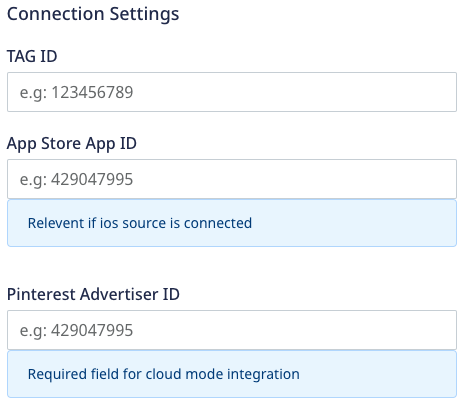
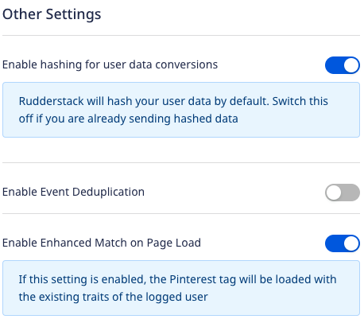
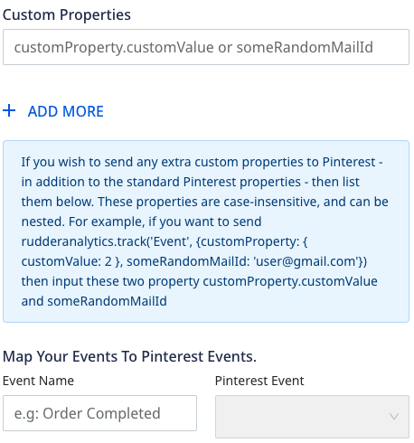
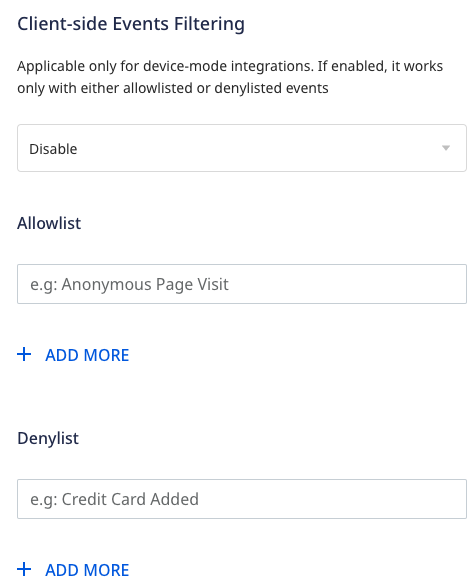

Before configuring Pinterest Tag as a destination in RudderStack, verify if the source platform is supported by Pinterest Tag by referring to the table below:

| **Connection Mode** | **Web** | **Mobile** | **Server** |
| :------------------ | :------------ | :----- | :----- |
| **Device Mode**     | **Supported** | **-**  | **-**  |
| **Cloud Mode**      | **Supported**         | **Supported**  | **Supported** |

<div class="infoBlock">
To know more about the difference between cloud mode and device mode in RudderStack, refer to the <Link to="/destinations/rudderstack-connection-modes/">RudderStack Connection Modes</Link> guide.
</div>

Once you have confirmed that the source platform supports sending events to Pinterest Tag, follow these steps:

1. From your [RudderStack dashboard](https://app.rudderstack.com/), add a source. Then, from the list of destinations, select **Pinterest Tag**.
2. Assign a name to the destination and click **Continue**.

## Connection settings

To successfully configure Pinterest Tag as a destination, you will need to configure the following settings:



- **Tag ID**: Enter your Pinterest Tag ID.
- **App Store App ID**: Enter your Pinterest Tag ID.
- **Pinterest Advertiser ID**: Enter your Pinterest Tag ID.

<div class="infoBlock">
For more information on finding the Pinterest Tag ID, refer to the <a href="#faq">FAQ</a> section below.
</div>

### Other settings




- **Enable hashing for user data conversions**:
- **Enable Event Deduplication**:
- **Custom Properties**: Use this field to add any custom properties which should be sent to Pinterest.

<div class="infoBlock">

For more information on using the custom properties, refer to the <a href="#custom-properties">Custom properties</a> section below.
</div>

- **Map Your Events To Pinterest Events**: Use this field to map your event to a specific Pinterest event.

- **Enable Enhanced Match on Page Load**: This setting is enabled by default and attaches the hashed email address on the initial page load. Any further calls made to Pinterest will be an Enhanced Match.

  When disabled, all the visits made to your site become anonymous. However, you can still identify any user by making the `identify()` call.

  **Enhanced Match**

  Rudderstack supports [Pinterest Enhanced Match](https://help.pinterest.com/en/business/article/enhanced-match) when the following conditions are met:

- A user is identified every time they visit your site.
- A user visits your site anonymously but is identified at a later stage by making an `identify()` call.

If you use Rudderstack's `identify()` method to enable Pinterest’s Enhanced Match, you can only collect this information for successive events. Pinterest does not retroactively update the values for the past events.

### Client-side events filtering



This setting is applicable only if you are sending events to AppsFlyer via the device mode. 

<div class="infoBlock">
  
Refer to the <Link to="/sources/event-streams/sdks/event-filtering/">Client-side Event Filtering</Link> guide for more information on this setting.
</div>

## Identify

The <Link to="/event-spec/standard-events/identify">`identify`</Link> call lets you create new or update existing customers and record the traits about them like their name, email address, etc. 

When you make an `identify` call with a user’s email address and traits, RudderStack triggers the Pinterest `set()` method. This saves the identification parameters to be sent with the next events, so it is recommended to set the values as early as possible. 

If you make an `identify` call without `email`, the identification parameter will not be set.

A sample `identify` call is shown below:

```javascript
rudderanalytics.identify("1hKOmRA4el9Zt1WSfVJIVo4GRlm", {
  name: "Alex Keener",
  email: "alex@example.com",
})
```

In the above example, the identification parameter will be set to `alex@example.com` and the successive calls will be an Enhanced Match.

<div class="infoBlock">

After an <code class="inline-code">identify</code> call is made, nothing appears in the network tab in your browser or in the tag helper extension. However, a hashed value for an <code class="inline-code">em</code> parameter is added in the next event call, in a JSON object encoded in the URL.

</div>

## Track

The <Link to="/event-spec/standard-events/track">`track`</Link> call allows you to capture user actions along with the properties associated with these actions.

A sample `track` call is shown below:

```javascript
rudderanalytics.track("Order Completed", {
    checkout_id: "C324532",
    order_id: "T1230",
    value: 15.98,
    revenue: 16.98,
    currency: "INR"
})
```

RudderStack SDK sends the `track` event and any properties as custom properties to Pinterest.

## Page

The <Link to="/event-spec/standard-events/page">`page`</Link> call lets you record your website's page views with any additional relevant information about the viewed page.

Pinterest's `pintrk` conversion tag sends any one of the following events when you make a `page` call:

- **`ViewCategory`**: RudderStack sends this event if both the `name` and `category` fields are present. The below sample event contains both and is mapped to the Pinterest's `ViewCategory` event:

```javascript
rudderanalytics.page("Best Seller", "Games", {
  path: "/best-seller/games/1",
  url: "https://www.estore.com/best-seller/games/1",
  title: "Best selling games offered by EStore",
  search: "estore bestseller games",
  referrer: "https://www.google.com/search?q=estore+bestseller",
  testDimension: "true",
})
```
- **`PageVisit`**: RudderStack sends this event if only `name` field is present and drops any additional properties. The below sample event contains only `name` and is mapped to the Pinterest's `PageVisit` event:

```javascript
rudderanalytics.page("Best Seller", {
  path: "/best-seller/1",
})
```

## E-Commerce

RudderStack supports e-commerce conversion tracking for Pinterest. You can use the <Link to="/event-spec/ecommerce-events-spec/">E-commerce Events Specification</Link> guide for sending the events while instrumenting your site with the RudderStack SDK.

The following table mentions some sample `track` events mapped to the Pinterest events:

| RudderStack event | Pinterest event  |
| :--------------------- | :------------------- |
| Order Completed        | `Checkout`           |
| Product Added          | `AddToCart`          |
| Products Searched      | `Search`             |
| Product List Filtered    | `Search`           |

You can also track a custom event that you want to include in the conversion reporting. It will be mapped to a custom Pinterest event, for example:

```javascript
rudderanalytics.track("custom event")
```

<div class="infoBlock">
  
You can map your event to a specific Pinterest event by adding it in the <strong>Map Your Events To Pinterest Events</strong> section while configuring the Pinterest destination in RudderStack.
</div>

### Standard Pinterest events

Pinterest supports the following nine standard events that can be mapped and tracked for reporting. Any event apart from these is treated as a user-defined event.

- `Checkout`
- `AddToCart`
- `PageVisit`
- `SignUp`
- `WatchVideo`
- `Lead`
- `Search`
- `ViewCategory`
- `Custom`

<div class="infoBlock">

These events aren’t available for conversion reporting.
</div>

### Property mapping

Rudderstack maps the following properties to the Pinterest properties:

| RudderStack property | Pinterest property |
| :------------------------ | :---------------------- |
| query                     | `search_query`          |
| value                     | `value`                 |
| order_quantity            | `order_quantity`        |
| currency                  | `currency`              |
| order_id                  | `order_id`              |
| promo_code                | `promo_code`            |
| property                  | `property`              |
| video_title               | `video_title`           |
| lead_type                 | `lead_type`             |
| coupon                    | `coupon`                |

The following properties are nested within the e-commerce `products` array:

| RudderStack property  | Pinterest property  |
| :------------------------ | :---------------------- |
| product_id                | `product_id`            |
| sku                       | `product_id`            |
| name                      | `product_name`          |
| price                     | `product_price`         |
| category                  | `product_category`      |
| variant                   | `product_variant`       |
| quantity                  | `product_quantity`      |
| brand                     | `product_brand`         |

### Custom properties

You can send the custom properties to Pinterest by adding them in the **Custom Properties** section while configuring the Pinterest destination in RudderStack.

A sample snippet with custom properties is shown below:

```javascript
rudderanalytics.track("Event", {
  customProperty: {
    customValue: 2,
  },
  someRandomMailId: "user@gmail.com",
})
```

For the above snippet, the following properties must be added in the **Custom Properties** section:
- `customProperty.customValue`
- `someRandomMailId`


## FAQ

### How do I get the Pinterest Tag ID?

1. Login to your [Pinterest Ads dashboard](https://ads.pinterest.com/).
2. Click on the **Ads** dropdown and go to **Conversions**. It will open the Pinterest Tag Manager.
3. Click on **Get Started** and you will see your Tag ID, as shown:

