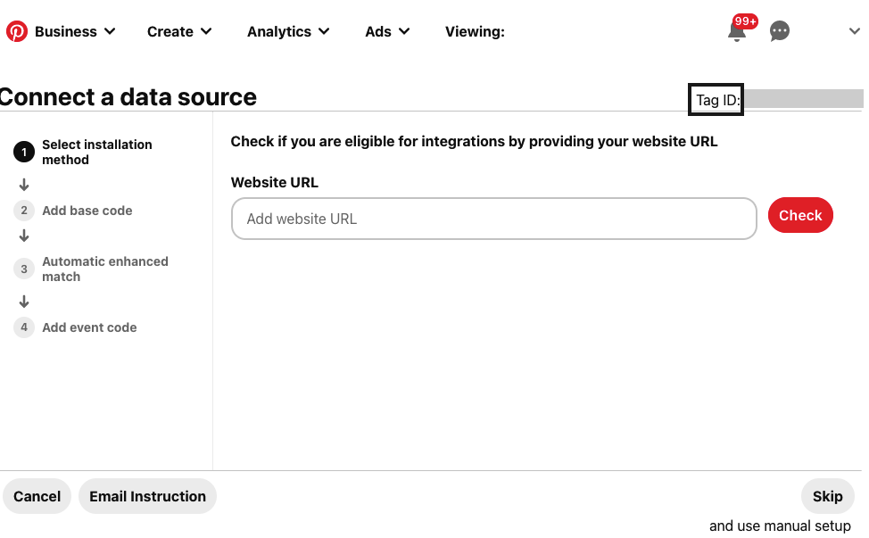

Before configuring Pinterest Tag as a destination in RudderStack, verify if the source platform is supported by Pinterest Tag by referring to the table below:

| **Connection Mode** | **Web** | **Mobile** | **Server** |
| :------------------ | :------------ | :----- | :----- |
| **Device Mode**     | **Supported** | **-**  | **-**  |
| **Cloud Mode**      | **Supported**         | **Supported**  | **Supported** |

To know more about the difference between cloud mode and device mode in RudderStack, refer to the <Link to="/destinations/rudderstack-connection-modes/">RudderStack Connection Modes</Link> guide.

Once you have confirmed that the source platform supports sending events to Pinterest Tag, follow these steps:

1. From your [RudderStack dashboard](https://app.rudderstack.com/), add a source. Then, from the list of destinations, select **Pinterest Tag**.
2. Assign a name to the destination and click **Continue**.

## Connection settings

To successfully configure Pinterest Tag as a destination, you will need to configure the following settings:

- **Tag ID**: Enter your Pinterest Tag ID. This field is **required only** for sending events to Pinterest Tag via <Link to="/destinations/rudderstack-connection-modes/#device-mode">device mode</Link>.

For more information on obtaining the Pinterest Tag ID, refer to the <a href="#faq">FAQ</a> section below.

- **App Store App ID**: Enter the App Id from your App Store. This field is **required only** if you are using an iOS source to send the events.
- **Pinterest Advertiser ID**: Enter the Advertiser ID of your Pinterest account. This field is **required only** for sending events to Pinterest Tag via <Link to="/destinations/rudderstack-connection-modes/#cloud-mode">cloud mode</Link>.

### Other settings

- **Enable hashing for user data conversions**: This setting is enabled by default and hashes your user data using SHA256 encoding.
- **Enable Event Deduplication**: Enable this setting to deduplicate the events. If enabled, you need to enter the following:
  - **Deduplication key**: Enter the key using which Pinterest Tag should use to deduplicate the events.

- **Custom Properties**: Enter any custom properties which should be sent to Pinterest. This field is **applicable only** for sending events to Pinterest Tag via <Link to="/destinations/rudderstack-connection-modes/#device-mode">device mode</Link>.

For more information on using the custom properties, refer to the <Link to="/destinations/streaming-destinations/pinterest-ads/pinterest-ads-device-mode/#custom-properties">Custom properties</Link> section.

- **Map Your Events To Pinterest Events**: Use this field to map RudderStack events to Pinterest Standard Conversion Events.

<ul>
<li> The event mapping specified in the above connection setting is given the highest priority.</li>
<li> If not specified, the <Link to="/destinations/streaming-destinations/pinterest-ads/pinterest-ads-device-mode/#e-commerce-conversion-tracking">standard e-commerce event mapping</Link> is considered.</li>
<li> If none of the above qualifies, RudderStack sends the event name as is, and it is shown as an <code class="inline-code">unknown</code> event in the Pinterest dashboard.</li>
</ul>

- **Enable Enhanced Match on Page Load**: This setting is enabled by default and attaches the hashed email address on the initial page load. Any further calls made to Pinterest will be an Enhanced Match.

  When disabled, all the visits made to your site become anonymous. However, you can still identify any user by making the `identify()` call.

  RudderStack supports [Pinterest Enhanced Match](https://help.pinterest.com/en/business/article/enhanced-match) when the following conditions are met:

  - A user is identified every time they visit your site.
  - A user visits your site anonymously but is identified at a later stage by making an `identify()` call.

  If you use RudderStack's `identify()` method to enable Pinterest’s Enhanced Match, you can only collect this information for successive events. Pinterest does not retroactively update the values for the past events.

### Client-side events filtering

This setting is applicable only if you are sending events to Pinterest Tag via the <Link to="/destinations/rudderstack-connection-modes/#device-mode">device mode</Link>. 

Refer to the <Link to="/sources/event-streams/sdks/event-filtering/">Client-side Event Filtering</Link> guide for more information on this setting.

## FAQ

### How do I get the Pinterest Tag ID?

To get your Pinterest Tag ID, follow these steps:

1. Login to your [Pinterest Ads dashboard](https://ads.pinterest.com/).
2. Click the **Ads** dropdown and go to **Conversions**. It will open the Pinterest Tag Manager.
3. Click **Get Started** and you will see your Tag ID, as shown:

