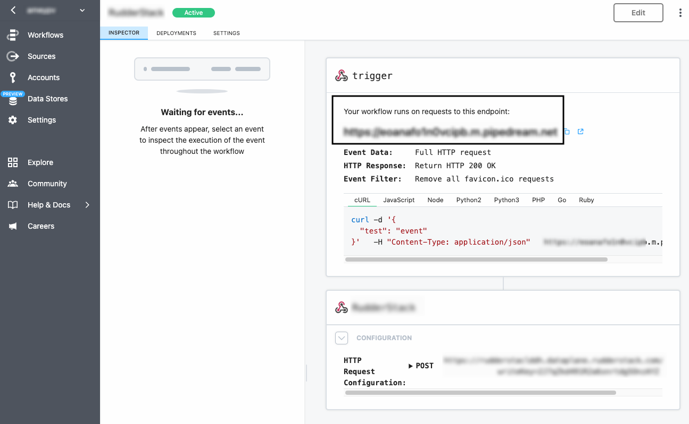

[Pipedream](https://pipedream.com/) lets you build and automate processes that connect APIs. It supports open source triggers and actions for hundreds of integrations.

Find the open source transformer code for this destination in the <a href="https://github.com/rudderlabs/rudder-transformer/tree/master/src/v0/destinations/pipedream">GitHub repository</a>.

## Getting started

RudderStack supports sending event data to this destination via the following <a href="https://rudderstack.com/docs/rudderstack-cloud/rudderstack-connection-modes/">connection modes</a>:

| **Connection Mode** | **Web**       | **Mobile**    | **Server**    |
| :------------------ | :------------ | :------------ | :------------ |
| **Device mode**     |  -            | -             | -             |
| **Cloud mode**      | **Supported** | **Supported** | **Supported** |

Once you have confirmed that the source platform supports sending events to Pipedream, follow these steps:

1. From your [RudderStack dashboard](https://app.rudderstack.com/), add a source. Then, from the list of destinations, select **Pipedream**.
2. Assign a name to the destination and click **Continue**.

## Connection settings

To successfully configure Pipedream as a destination, you will need to configure the following settings:

- **Pipedream URL**: Enter the URL associated with your Pipedream workflow. This is the endpoint where RudderStack sends the events. 

RudderStack supports both <code class="inline-code">HTTP</code> and <code class="inline-code">HTTPS</code> URLs. For <code class="inline-code">HTTPS</code>, make sure that you have a valid TLS certificate for successful event delivery.

- **URL Method**: Choose the request method from the dropdown. RudderStack uses this method to send the HTTP requests to the configured endpoint. By default, it is set to **POST**.
- **Headers**: Use this setting to add custom headers for your events while sending requests to your webhook. By default, RudderStack automatically adds the following headers for the **POST** and **PUT** requests:

| Key            | Value              |
| :------------- | :----------------- |
| `User-Agent`   | `RudderStack`       |
| `Content-Type` | `application/json` |

<ul>
  <li>To add a dynamic header to your events, you can use RudderStack's <Link to="/features/transformations/">Transformations</Link> feature. For more information, refer to the <Link to="/destinations/webhooks/#dynamic-header-support">Dynamic header support</Link> section or this <a href="https://github.com/rudderlabs/sample-user-transformers#dynamic-header">sample transformation</a>.</li>
  <li>You can also add a dynamic path to your base URL. For more information, refer to the <Link to="/destinations/webhooks/#dynamically-appending-to-the-endpoint-url">Dynamically changing the endpoint URL</Link> section or this <a href="https://github.com/rudderlabs/sample-user-transformers#dynamic-path">sample transformation</a>.</li>
</ul>

## Supported events

This destination supports all the event types listed in the <Link to="/event-spec/standard-events/">RudderStack Event Specification</Link> guide.

## FAQ 

### Where can I find the Pipedream URL?

1. Log in to your [Pipedream dashboard]().
2. From the left sidebar, go to **Workflows** and select your workflow. Your Pipedream URL will be listed here, as shown:

