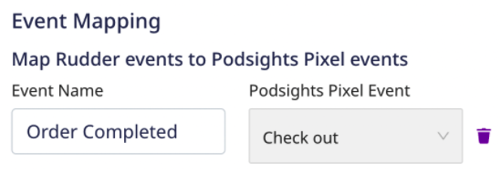
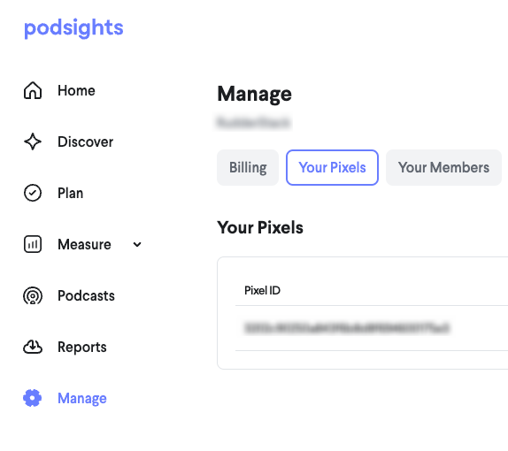
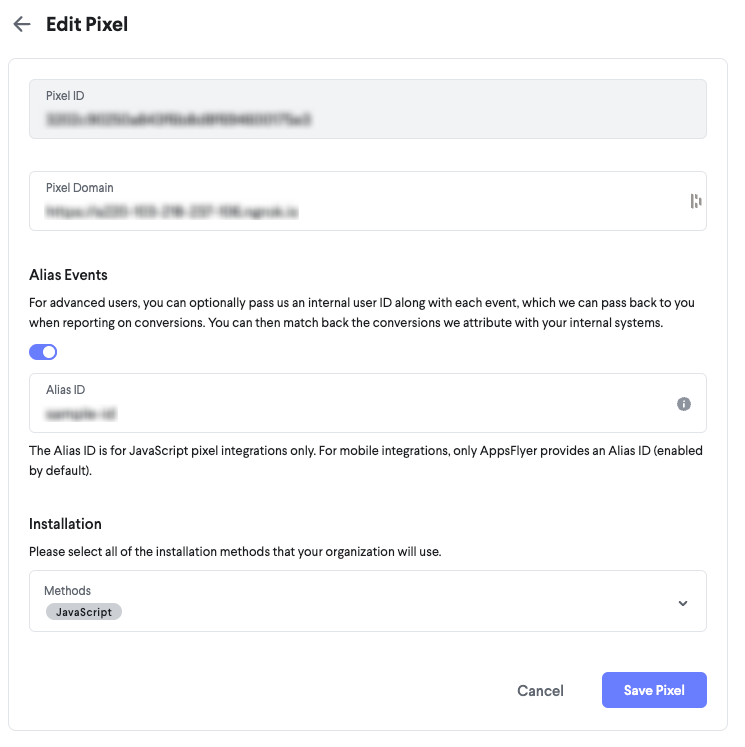

[Podsights](https://podsights.com/) is a podcast advertising and attribution platform. It lets you plan your advertising campaigns and measure the effectiveness of your podcasts through audience insights and real-time impression reporting.

## Getting started

RudderStack supports sending events to Podsights via the following <Link to="/destinations/rudderstack-connection-modes/">connection modes</Link>:

| **Connection Mode** | **Web**       | **Mobile**    | **Server**    |
| :------------------ | :------------ | :------------ | :------------ |
| **Device mode**     |        **Supported**       |               |               |
| **Cloud mode**      |        -       |  -   |   -            |

Once you have confirmed that the source platform supports sending events to Podsights, follow these steps:

1. From your [RudderStack dashboard](https://app.rudderstack.com/), add the source. Then, from the list of destinations, select **Podsights**.
2. Assign a name to your destination and click **Continue**.

## Connection settings

To successfully configure Podsights as a destination, you will need to configure the following settings:

- **Pixel ID**: Enter your Podsights Pixel ID. For more information on obtaining your Podsights Pixel ID, refer to the <Link to="#faq">FAQ</Link> section below.
- **Map Rudder events to Podsights Pixel events**: Use this setting to map your RudderStack events with specific Podsights Pixel events selected from the dropdown.

<div class="infoBlock">
You can map multiple Podsights Pixel events to a single RudderStack event and vice versa.
</div>

- **Pass Internal ID**: Enable this setting to pass a hashed internal ID in the case of the `alias` events. For more information on obtaining the internal ID, refer to the <Link to="#faq">FAQ</Link> section below.
- **Client-side Events Filtering**: This setting lets you specify which events should be blocked or allowed to flow through to Podsights.

<div class="infoBlock">
For more information on this setting, refer to the <Link to="/sources/sdks/event-filtering/">Client-side Events Filtering</Link> guide.
</div>

- **Use device mode to send events**: As this is a <Link to="https://www.rudderstack.com/docs/destinations/rudderstack-connection-modes/#device-mode">web device mode</Link>-only destination, this setting is enabled by default and cannot be disabled.
- **OneTrust Cookie Categories**: This setting lets you associate the <Link to="/sources/sdks/rudderstack-javascript-sdk/consent-managers/onetrust/">OneTrust</Link> cookie consent groups to Podsights.

## Track

You can use the RudderStack <Link to="/event-spec/standard-events/track">`track`</Link> API to track your user activities and send them to Podsights. 

RudderStack supports the following standard Podsights Pixel events:

| Podsights Pixel event | Event name | Description |
| :-----| :-----------|
| <a href="https://podsights.com/docs#lead">Lead</a> | `lead` | When a user completes an action like form submission, signup for free trial, button click, etc. |
| <a href="https://podsights.com/docs#product">Product</a> | `product` | When a user views a product. |
| <a href="https://podsights.com/docs#add-to-cart">Add to Cart</a> | `addtocart` | When a user adds a product to the cart. |
| <a href="https://podsights.com/docs#check-out">Check out</a> | `checkout` | When a user initiates a checkout. |
| <a href="https://podsights.com/docs#purchase">Purchase</a> |  `purchase` | When a user purchases a product. | 

You can map your RudderStack events to the above Podsights events in the RudderStack dashboard using the **Map Rudder events to Podsights Pixel Events** setting, as shown:



In the above example, RudderStack maps the event `Order Completed` with the Podsights `checkout` Pixel event.

By default, RudderStack maps the following events to the Podsights Pixel events:

| RudderStack event | Podsights Pixel event name | 
| :-----| :-----------|
| `Signed Up` | `lead` |
| `Product Viewed` | `product` |
| `Product Added` | `addtocart` | 
| `Checkout Started` | `checkout` |
| `Order Completed` | `purchase` |

<div class="warningBlock">
RudderStack prioritizes the custom event mappings set in the dashboard over the above standard mappings.
</div>

### Lead

A sample `track` call mapped to a <a href="https://podsights.com/docs#lead">`lead`</a> event is shown below:

```javascript
rudderanalytics.track("Signed Up", {
  value: 500,
  currency: "USD",
  type: "paper",
  category: "Clothes",
});
```

The following table lists the mapping between the **optional** RudderStack event properties and the Podsight attributes:

| RudderStack property | Podsights property |
| :-----| :------| 
| `properties.value` | `value` | 
| `properties.currency` | `currency` |
| `properties.type` | `type` |
| `properties.category` | `category` |

### Product

A sample `track` call mapped to a <a href="https://podsights.com/docs#product">`product`</a> event is shown below:

```javascript
rudderanalytics.track("product", {
  value: 1300,
  currency: "USD",
  productId: "1234000",
  productName: "goldenTest",
  productType: "Card",
  productVendor: "testVendor",
});
```

The following table lists the mapping between the **optional** RudderStack event properties and the Podsight attributes:

| RudderStack property | Podsights property |
| :-----| :------| 
| `properties.value` | `value` | 
| `properties.currency` | `currency` |
| `properties.productId` | `product_id` |
| `properties.productName` | `product_name` |
| `properties.productType` | `product_type` |
| `properties.productVendor` | `product_vendor` |

#### Sending multiple product details

If you send the product details as an array in the `track` event, RudderStack fetches the details from each product item and calls the Podsights `product` event for each item. For example, consider the following `track` event:

```javascript
rudderanalytics.track("Product", {
  value: 10.0,
  currency: "INR",
  quantity: 2,
  products: [{
      productId: "S1100",
      productName: "Product 1",
      productType: "Card",
      productVendor: "Some Vendor",
    },
    {
      productId: "S1200",
      productName: "Product 2",
      productType: "Card",
      productVendor: "Some Vendor 2",
    },
  ],
});
```

In this case, RudderStack makes two `track` calls to Podsights with the individual product details, as shown:

```javascript
// Call 1

rudderanalytics.track("Product", {
  value: 10.0,
  quantity: 2,
  currency: "INR",
  productId: "S1100",
  productName: "Product 1",
  productType: "Card",
  productVendor: "Some Vendor",
});

// Call 2

rudderanalytics.track("Add to Cart", {
  value: 10.0,
  quantity: 2,
  currency: "USD",
  productId: "S1200",
  productName: "Product 2",
  productType: "Card",
  productVendor: "Some Vendor 2",
});
```

### Add to Cart

A sample `track` call mapped to a <a href="https://podsights.com/docs#add-to-cart">`addtocart`</a> event is shown below:

```javascript
rudderanalytics.track("Add to Cart", {
  value: 23.2, 
  currency: "USD",
  productId: "1234000",
  productName: "goldenTest",
  productType: "Card",
  productVendor: "testVendor",
});
```

The following table lists the mapping between the **optional** RudderStack event properties and the Podsight attributes:

| RudderStack property | Podsights property |
| :-----| :------| 
| `properties.value` | `value` | 
| `properties.currency` | `currency` |
| `properties.productId` | `product_id` |
| `properties.productName` | `product_name` |
| `properties.productType` | `product_type` |
| `properties.productVendor` | `product_vendor` |
| `properties.quantity` | `quantity` |
| `properties.variantId` | `variant_id` |
| `properties.variantName` | `variant_name` |

Similar to <Link to="#sending-multiple-product-details">Product</Link> event, if you send the product details as an array in the `track` event, RudderStack fetches the details from each product item and calls the Podsights `addtocart` event for each item.

### Check out

A sample `track` call mapped to a <a href="https://podsights.com/docs#check-out">`checkout`</a> event is shown below:

```javascript
rudderanalytics.track("checkout", {
  value: 30.0,
  currency: "USD",
  discountCode: "PODCAST_CODE_TEST",
  quantity: 3,
  lineItems: [{
    value: 21.2,
    quantity: 1,
    product_id: "1234000",
    product_name: "goldenTest",
    product_type: "Card",
    product_vendor: "testVendor",
    variant_id: "11112",
    variant_name: "Test",
  }],
});
```

The following table lists the mapping between the **optional** RudderStack event properties and the Podsight attributes:

| RudderStack property | Podsights property |
| :-----| :------| 
| `properties.value` | `value` | 
| `properties.currency` | `currency` |
| `properties.quantity` | `quantity` |
| `properties.variantId` | `variant_id` |
| `properties.discountCode` | `discount_code` |
| `properties.lineItems` | `line_items` |

<div class="infoBlock">
If you do not pass the <code class="inline-code">lineItems</code> object, then RudderStack fetches the <code class="inline-code">lineItems</code> from the event's properties and maps them to Podsight's <code class="inline-code">line_items</code> field.
</div>

#### Passing multiple product items

If you pass multiple product items as an array, then RudderStack fetches the individual product details and internally builds the `lineItems` object before passing it on to Podsights via the `checkout` event, as demonstrated in the following example:

Consider the following `track` event:

```javascript
rudderanalytics.track("Checkout", {
  value: 10.0,
  currency: "USD",
  quantity: 2,
  discount_code: 'POD_CODE',
  products: [{
      value: 21.6,
      quantity: 12,
      productId: "SKU123",
      productName: "Card Game",
      productType: "Card",
      productVendor: "Some Vendor",
      variantId: 'test123',
      variantName: 'Test 123',
    },
    {
      value: 42.4,
      quantity: 2,
      productId: "SKU124",
      productName: "Floppy Disk",
      productType: "Card123",
      productVendor: "Some Vendor",
      variantId: 'test124',
      variantName: 'Test 124',
    },
  ],
});
```

RudderStack internally collates all the product information and builds the `lineItems` array before sending it to Podsights, as shown:

```javascript
pdst('checkout', {
  value: 10.0,
  currency: 'USD',
  discount_code: 'POD_CODE',
  quantity: 2,
  line_items: [{
      value: 21.6,
      quantity: 12,
      product_id: 'SKU123',
      product_name: 'Card Game',
      product_type: 'Card',
      product_vendor: 'Some Vendor',
      variant_id: 'test123',
      variant_name: 'Test 123',
    },
    {
      value: 42.4,
      quantity: 2,
      product_id: 'SKU124',
      product_name: 'Floppy Disk',
      product_type: 'Card123',
      product_vendor: 'Some Vendor',
      variant_id: 'test124',
      variant_name: 'Test 124',
    },
  ],
});
```

### Purchase

A sample `track` call mapped to a <a href="https://podsights.com/docs#purchase">`purchase`</a> event is shown below:

```javascript
rudderanalytics.track("purchase", {
  value: 1000,
  currency: "rupee",
  discountCode: "PODCAST_CODE",
  orderId: "12322323232",
  isNewCustomer: true,
  quantity: 3,
  line_items: [{
    value: 21.2,
    quantity: 1,
    product_id: "1234000",
    product_name: "goldenTest",
    product_type: "Card",
    product_vendor: "testVendor",
    variant_id: "11112222",
    variant_name: "testTest",
  }],
});
```

The following table lists the mapping between the **optional** RudderStack event properties and the Podsight attributes:

| RudderStack property | Podsights property |
| :-----| :------| 
| `properties.value` | `value` | 
| `properties.currency` | `currency` |
| `properties.discountCode` | `discount_code` |
| `properties.lineItems` | `line_items` |
| `properties.orderId` | `order_id` |
| `properties.isNewCustomer` | `is_new_customer` |
| `properties.quantity` | `quantity` |

Similar to the <Link to="#passing-multiple-product-items">Check out</Link> event, if you pass multiple product items as an array, then RudderStack fetches the individual product details and internally builds the `lineItems` object before passing it on to Podsights via the `purchase` event.

## Alias


## Page

You can use the <Link to="/event-spec/standard-events/page">`page`</Link> call to record your website's page views with any additional information about the viewed page.

<div class="infoBlock">
You can also set custom attributes inside the <code class="inline-code">page</code> event properties.
</div>

RudderStack sends the `page` calls to Podsights as a `view` event.

A sample `page` call is as shown:

```javascript
rudderanalytics.page("Home", "Clothes", {
  path: "/best-seller/1",
  referrer: "https://www.google.com/search?q=estore+bestseller",
  url: "https://www.estore.com/best-seller/1"
});
```

### Supported property mappings

RudderStack maps the following **optional** properties with the Podsights properties:

| RudderStack property | Podsights property | 
| :----------------- | :--------------- |
| `context.page.referrer` | `referrer` |
| `context.page.url` | `url` |

## FAQ

### Where can I find the Podsights Pixel ID?

To get your Podsights Pixel ID, follow these steps:

1. Log into your <a href="https://dash.podsights.com/">Podsights dashboard</a>.
2. From the left sidebar, go to **Manage** > **Your Pixels**. You can find your Pixel ID under **Your Pixels**, as shown:



### Where can I find the Podsights alias ID for the `alias` events?

To get your Podsights Pixel ID, follow these steps:

1. Log into your <a href="https://dash.podsights.com/">Podsights dashboard</a>.
2. From the left sidebar, go to **Manage** > **Your Pixels**. 
3. Click the edit button next to your Podsight pixel. You will find the **Alias ID** under **Alias Events**, as shown:



### Where can I view the events sent to Podsights?

To view the events sent to Podsights, follow these steps:

1. Log into your <a href="https://dash.podsights.com/">Podsights dashboard</a>.
2. From the left sidebar, go to **Manage** > **Your Pixels**. 
3. Click your pixel and go to the **Debugger** tab. 

<div class="infoBlock">
You can filter the events by name or platform, as per your requirement.
</div>