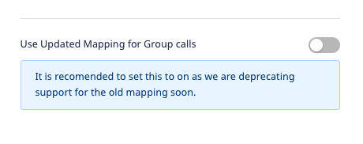

RudderStack lets you send your event data to PostHog via the <Link to="/destinations/rudderstack-connection-modes/#cloud-mode">cloud mode</Link>.

<div class="infoBlock">
Find the open source code for this destination in the <a href="https://github.com/rudderlabs/rudder-transformer/tree/master/src/v0/destinations/posthog">GitHub repository</a>.
</div>

## Identify

You can use RudderStack's <Link to="/event-spec/standard-events/identify">`identify`</Link> call to identify a user in PostHog.

A sample `identify` call is as shown below:

```javascript
rudderanalytics.identify("1hKOmRA4GRlm", {
  name: "Alex Keener",
  first_name: "Alex",
  last_name: "Keener",
  email: "alex@example.com",
  createdAt: "2019-07-23T23:45:56.000Z",
})
```

RudderStack passes the user traits within the `identify` call to PostHog under the `$set` key according to the <a href="https://posthog.com/docs/api/post-only-endpoints#identify">PostHog Identify API</a>.

## Track

RudderStack's <Link to="/event-spec/standard-events/track">`track`</Link> call lets you capture the user events along with their associated properties and send this data to PostHog.

A sample `track` call is shown below:

```javascript
rudderanalytics.track("Order Completed", {
  checkout_id: "C324532",
  order_id: "T1230",
  revenue: 16.98,
  shipping: 3.0,
  coupon: "FY21",
  currency: "INR",
  products: [
    {
      product_id: "product-mixedfruit-jam",
      sku: "sku-1",
      category: "Food",
      currency: "INR",
      value: 6.0,
      typeOfProduct: "Food",
      url: "https://www.example.com/product/bacon-jam",
      image_url: "https://www.example.com/product/bacon-jam.jpg",
    },
  ],
})
```

PostHog supports the RudderStack `track` call as type `capture.` and sends the user action as an event to PostHog according to the <a href="https://posthog.com/docs/api/post-only-endpoints#capture">PostHog Capture API</a>.

## Page

The <Link to="/event-spec/standard-events/page">`page`</Link> call lets you record your app's page views with any additional relevant information about the viewed page.

A sample `page` call is shown below:

```javascript
rudderanalytics.page({
  path: "/best-seller/1",
  url: "https://www.estore.com/best-seller/1",
  title: "EStore Bestsellers",
  search: "estore bestseller",
  referrer: "https://www.google.com/search?q=estore+bestseller",
})
```

In the above example, RudderStack captures information related to the viewed page such as its path, URL, referrer, etc.

For the `page` call, RudderStack sends `$pageview` as an event to PostHog according to the <a href="https://posthog.com/docs/api/post-only-endpoints#page">PostHog Page API</a>.

## Screen

The <Link to="/event-spec/standard-events/screen">`screen`</Link> call lets you record whenever your user views their mobile screen with any additional relevant information about the screen.

A sample `screen` call using RudderStack's iOS SDK is shown below:

```javascript
[[RudderClient sharedInstance] screen:@"Home Screen"
            properties:@{@"category" : @"launcher"}];
```

In the above snippet, RudderStack captures information related to the viewed screen such as its name and category.

For the `screen` call, RudderStack sends `$screen` as an event to PostHog according to the <a href="https://posthog.com/docs/api/post-only-endpoints#screen">PostHog Screen API</a>.

## Group

You can use the <Link to="/event-spec/standard-events/group">`group`</Link> call to associate an identified user with a group, such as a company, organization, or an account.

<div class="infoBlock">
It is highly recommended to include <code class="inline-code">groupId</code> and <code class="inline-code">groupType</code> in your <code class="inline-code">group</code> calls to create or update the group details.
</div>

A sample `group` call is shown below:

```javascript
rudderanalytics.group("group01", {
  groupType: "Lead",
  name: "Sample Group",
  total: 100
});
```

<div class="infoBlock">
If you pass the <code class="inline-code">name</code> in the group <code class="inline-code">traits</code>, then the group is created in PostHog with that <code class="inline-code">name</code>. Otherwise, it is created by the <code class="inline-code">groupId</code> (if present).
</div>

For the `group` call, RudderStack sends `$groupidentify` as an event to PostHog according to the <a href="https://posthog.com/docs/api/post-only-endpoints#group">PostHog Group API</a>.

### Updated group mapping

RudderStack lets you use the updated mapping feature for the `group` calls where it maps the group traits as event properties before sending them to PostHog. To use this feature, enable the **Use Updated Mapping for Group calls** setting in the RudderStack dashboard, as shown:



By default, the **Use Updated Mapping for Group calls**  setting is disabled in the dashboard. In this case, RudderStack sends the group traits to PostHog as received without any modification, as shown in the following snippet:

```json
{
  "version": "1",
  "type": "REST",
  "method": "POST",
  "endpoint": "https://app.posthog.com/batch",
  "headers": {
    "Content-Type": "application/json"
  },
  "params": {},
  "body": {
    "JSON": {
      "groupId": "groupId27",
      "distinct_id": "sampleusrRudder7",
      "traits": {
        "groupType": "company",
        "KEY_3": {
          "CHILD_KEY_92": "value_95",
          "CHILD_KEY_102": "value_103"
        },
        "name_trait": "Company",
        "value_trait": "Company-ABC"
      },
      "messageId": "e5034df0-a404-47b4-a463-76df99934fea",
      "event": "$group",
      "api_key": "LNDs0JGdwbknNGolFc4HdoAE",
      "type": "group"
    },
  },
}
```

When **Use Updated Mapping for Group calls**  is enabled in the dashboard, RudderStack sends the group traits as event properties to PostHog, as shown:

```json
{
  "version": "1",
  "type": "REST",
  "method": "POST",
  "endpoint": "https://app.posthog.com/batch",
  "headers": {
    "Content-Type": "application/json"
  },
  "params": {},
  "body": {
    "JSON": {
      "distinct_id": "sampleusrRudder7",
      "messageId": "e5034df0-a404-47b4-a463-76df99934fea",
      "properties": {
        "$group_key": "groupId27",
        "$group_type": "company",
        "$group_set": {
          "KEY_3": {
            "CHILD_KEY_92": "value_95",
            "CHILD_KEY_102": "value_103"
          },
          "name_trait": "Company",
          "value_trait": "Comapny-ABC"
        },
      },
      "event": "$group",
      "api_key": "LNDs0JGdwbknNGolFc4HdoAE",
      "type": "group"
    },
  },
}
```

The mapping is summarized in the following table:

| RudderStack group trait | Updated group mapping disabled | Updated group mapping enabled |
| :---------| :------| :--------|
| `groupId` | `groupId` | `$group_key` |
| `groupType` | `groupType`| `$group_type` |
| `traits` | `traits` | `$group_set` |

## Alias

Calling <Link to="/event-spec/standard-events/alias">`alias`</Link> passes `userId` and `previousId` to the PostHog queue.

A sample `alias` call in RudderStack is as shown:

```javascript
rudderanalytics.alias("user01", "previous01")
```

In the above example, `previous01` gets mapped to `distinct id` in PostHog, while `user01` gets mapped to `alias` in PostHog.

For the `alias` call, RudderStack sends `$create_alias` as an event to PostHog according to <a href="https://posthog.com/docs/api/post-only-endpoints#alias">PostHog Alias API</a>.

## Property mappings

RudderStack also maps the following properties to the PostHog standard contextual properties:

| RudderStack field           | PostHog field |
| :------------------------------ | :--------------------- |
| `context.os.name`               | `$os`                  |
| `context.page.url`              | `$current_url`         |
| `url`                           | `$host`                |
| `context.page.path`             | `$pathname`            |
| `context.screen.height`         | `$screen_height`       |
| `context.screen.width`          | `$screen_width`        |
| `context.library.name`          | `$lib`                 |
| `context.library.version`       | `$lib_version`         |
| `originalTimestamp`,`timestamp` | `$time`                |
| `context.device.id`             | `$device_id`           |
| `request_ip`,`context.ip`       | `$ip`                  |
| `timestamp`,`originalTimestamp` | `$timestamp`           |
| `anonymousId`                   | `$anon_distinct_id`    |
| `userId`,`anonymousId`          | `distinct_id`          |
| `context.screen.density`        | `$screen_density`      |
| `context.device.manufacturer`   | `$device_manufacturer` |
| `context.os.version`            | `$os_version`          |
| `context.timezone`              | `$timezone`            |
| `context.locale`                | `$locale`              |
| `context.userAgent`             | `$useragent`          |
| `context.app.version`           | `$app_version`         |
| `context.device.name`           | `$device_name`         |
| `context.network.carrier`       | `$network_carrier`     |
| `context.app.name`              | `$app_name`            |
| `context.device.model`          | `$device_model`        |
| `context.app.namespace`         | `$app_namespace`       |
| `context.app.build`             | `$app_build`           |
| `properties.viewport_height` | `$viewport_height` |
| `properties.viewport_width` | `$viewport_width` |
| `context.page.loaded` | `$performance_page_loaded` |
| `context.campaign.source` | `utm_source` |
| `context.campaign.medium` | `utm_medium` |
| `context.campaign.name` | `utm_campaign` |
| `context.campaign.content` | `utm_content` |
| `context.campaign.term` | `utm_term` |