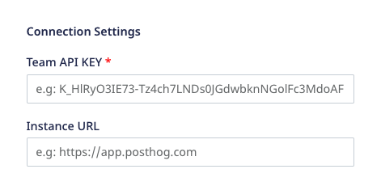
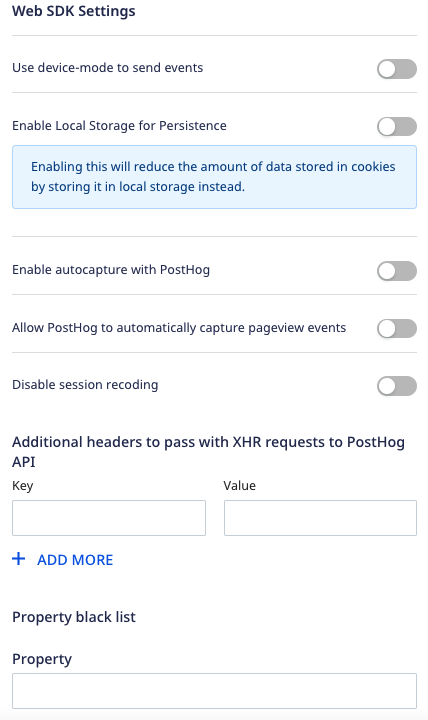

RudderStack supports sending events to PostHog via the following <Link to="/destinations/rudderstack-connection-modes/">connection modes</Link>:

| **Connection Mode** | **Web**           | **Mobile**        | **Server**        |
| :------------------ | :------------ | :------------ | :------------ |
| **Device Mode**     | **Supported** | **-**         | **-**         |
| **Cloud Mode**      | **Supported** | **Supported** | **Supported** |

In the web device mode integration, that is, using <Link to="/sources/event-streams/sdks/rudderstack-javascript-sdk">JavaScript SDK</Link> as a source, the PostHog native SDK is either loaded from the <code class="inline-code">https://app.posthog.com</code> domain or your instance URL. Based on your website's content security policy, you might need to <Link to="/sources/event-streams/sdks/rudderstack-javascript-sdk/load-js-sdk/#allowlist-destination-domain">allowlist the required domain</Link> to load the PostHog SDK successfully.

Once you have confirmed that the source platform supports sending events to PostHog, follow these steps:

1. From your [RudderStack dashboard](https://app.rudderstack.com/), add the source. Then, from the list of destinations, select **PostHog**.
2. Assign a name to your destination and click **Continue**.

## Connection settings

To successfully configure PostHog as a destination, you will need to configure the following settings:

- **Team API Key**: Enter your PostHog team API key. This is a mandatory field. For more information on obtaining your PostHog Team API Key, refer to the <Link to="#faq">FAQ</Link> section below.
- **Instance URL**: Enter your PostHog instance URL.

If you are hosting your own PostHog instance, add the URL of your instance without the trailing slash. So, the URL will look something like <code class="inline-code">https://[your-instance].com</code>.

- **Client-side Events Filtering**: This setting lets you specify which events should be blocked or allowed to flow through to PostHog. For more information on this setting, refer to the <Link to="/sources/sdks/event-filtering/">Client-side Events Filtering</Link> guide.
- **Use updated mapping for Group calls**: Enable this setting to send the `group` traits as event properties to PostHog. It is strongly recommended to enable this setting to send all your `group` events to PostHog correctly.

<strong>This setting is applicable only when sending events via cloud mode</strong>. RudderStack uses the updated group mappings in the device mode by default. For more information on this setting, refer to the <Link to="/destinations/streaming-destinations/posthog/posthog-cloud-mode/#updated-group-mapping">Updated group mapping</Link> section.

### Web device mode settings

This section lists some of the other configurable settings when sending events to PostHog via the <Link to="/destinations/rudderstack-connection-modes/#device-mode/">web device mode</Link>.

- **Use device mode to send events**: If enabled, RudderStack will send the events to PostHog via the <Link to="/destinations/rudderstack-connection-modes/#device-mode">device mode</Link>.
- **Enable Local Storage for Persistence**: Enable this option to reduce the amount of data stored in the cookies by storing it locally instead.
- **Enable autocapture with PostHog**: Enable this option to allow PostHog to send [auto-captured](https://posthog.com/docs/integrations/js-integration#usage) events.
- **Allow PostHog to automatically capture pageview events**: Enable this setting to allow the PostHog web SDK to send a page view event every time it is loaded on a page.
- **Disable session recording**: Enable this setting to stop PostHog from recording the user sessions. For more information on PostHog's session recording feature, refer to the <a href="https://posthog.com/manual/recordings/">PostHog documentation</a>.
- **Additional headers to pass with XHR requests to PostHog API**: Add a list of key-value pairs in this field. The RudderStack web SDK will then forward these headers on the event requests sent to PostHog.
- **Property denylist** - Add a list of traits or event properties that you want the PostHog SDK to filter.

## FAQ

### Where can I find the PostHog Team API Key?

To get your PostHog Project API Key or Team API Key, follow the steps below:

1. Login to your PostHog dashboard.
2. Go to the **Settings** tab under the **Project** section in the left sidebar.
3. You can find the Team API key under **Project API Key** or **Team API Key**.