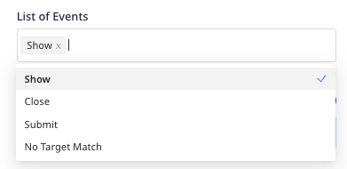
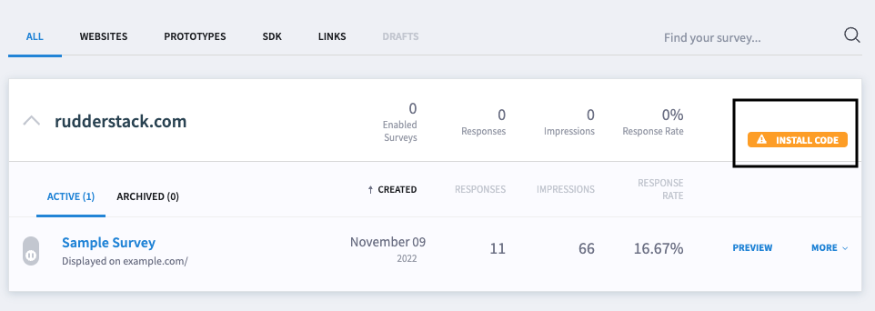
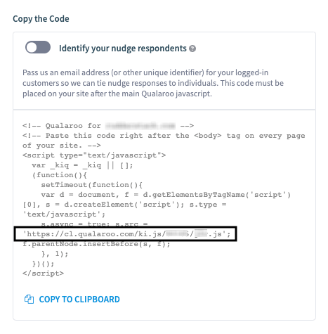

[Qualaroo](https://qualaroo.com/) is a customer survey and user feedback platform. It lets you survey your users to understand how they are using your product and what they think of it.

## Getting started

RudderStack supports sending events to Qualaroo via the following <Link to="/destinations/rudderstack-connection-modes/">connection modes</Link>:

| **Connection Mode** | **Web**       | **Mobile**    | **Server**    |
| :------------------ | :------------ | :------------ | :------------ |
| **Device mode**     |        **Supported**       |               |               |
| **Cloud mode**      |        -       |  -   |   -            |

Once you have confirmed that the source platform supports sending events to Qualaroo, follow these steps:

1. From your [RudderStack dashboard](https://app.rudderstack.com/), add the source. Then, from the list of destinations, select **Qualaroo**.
2. Assign a name to your destination and click **Continue**.

## Connection settings

To successfully configure Qualaroo as a destination, you will need to configure the following settings:

- **Customer ID**: Enter your Qualaroo customer ID which is a part of your Qualaroo JavaScript library URL. For example, if your URL is `https://cl.qualaroo.com/ki.js/92102/j8N.js`, then the customer ID would be `92102`.
- **Site Token**: Enter your Qualaroo site token which is a part of your Qualaroo JavaScript library URL. For example, if your URL is `https://cl.qualaroo.com/ki.js/92102/j8N.js`, then the site token would be `j8N`.

For more information on obtaining your Qualaroo customer ID and site token, refer to the <Link to="#faq">FAQ</Link> section below.

- **Record Qualaroo Events**: Enable this setting to allow RudderStack to automatically record your Qualaroo callback events as `track` events. You can then view and analyze these events using other tools (connected to the same source in RudderStack). 
  - **List of Events**: Select the list of events from dropdown which RudderStack automatically records as `track` events.

- **Update Event Name in track call**: Enable this setting to update the event name in the `track` call.
  - **Mapping to update the Event Name in track call**: Use this setting to map your events with the standard Qualaroo callback events.
- **Client-side Events Filtering**: This setting lets you specify which events should be blocked or allowed to flow through to Qualaroo. For more information on this setting, refer to the <Link to="/sources/sdks/event-filtering/">Client-side Events Filtering</Link> guide.
- **Use device mode to send events**: As this is a <Link to="https://www.rudderstack.com/docs/destinations/rudderstack-connection-modes/#device-mode">web device mode</Link>-only destination, this setting is enabled by default and cannot be disabled.
- **OneTrust Cookie Categories**: This setting lets you associate the <Link to="/sources/sdks/rudderstack-javascript-sdk/consent-managers/onetrust/">OneTrust</Link> cookie consent groups to Qualaroo.

## Identify

## track

## Page

## FAQ

### Where can I find the Qualaroo customer ID and site token?

To get your Qualaroo customer ID and site token, follow these steps:

1. Log into your [Qualaroo dashboard](https://app.qualaroo.com/dashboard).
2. Click the **Install Code** option, as shown:

3. Click **Paste code in website source code or GTM**.
4. In the **Copy the Code** section, look for `s.src` and note the mentioned URL, as shown:

5. Suppose your URL is `https://cl.qualaroo.com/ki.js/12345/j8N.js`, then `12345` is the customer ID and `j8N` is the site token.