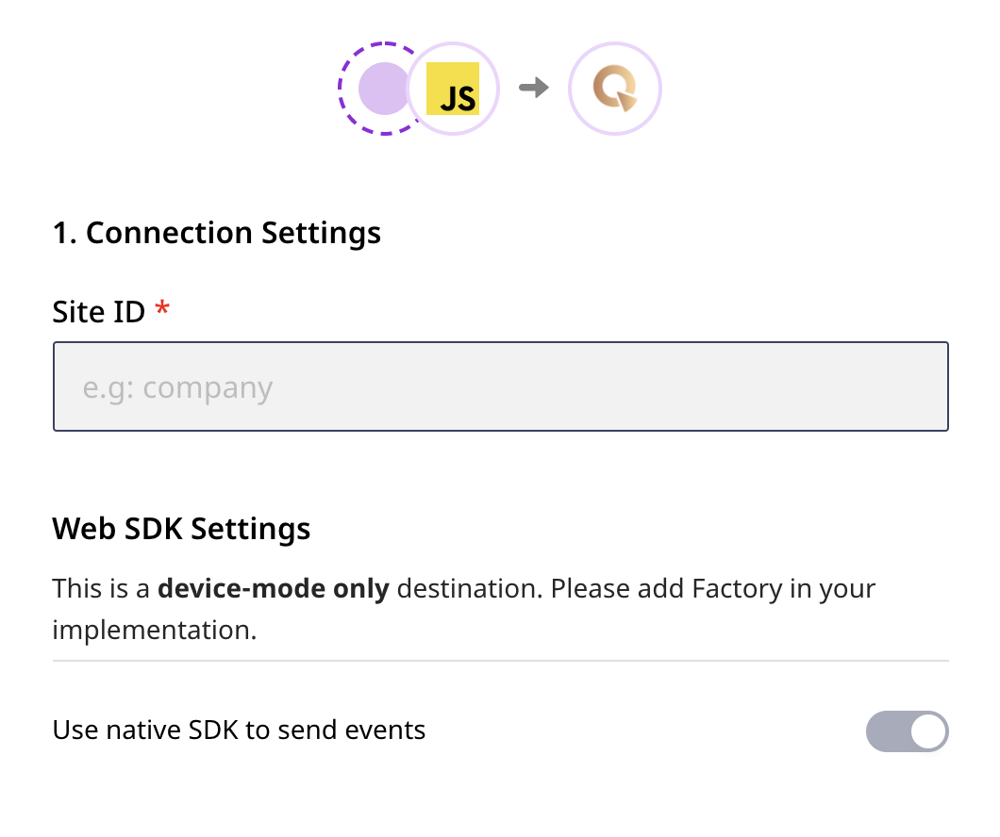

[Quantum Metric](https://www.quantummetric.com/) is a continuous product design platform that lets you leverage real-time digital insights to improve your product. It gives you complete visibility into your customers' product experience and helps you prioritize the most important product features that have the most impact on your brand.

RudderStack helps you integrate your website with Quantum Metric to auto-track all your user data.

## Getting started

RudderStack supports sending event data to Quantum Metric via the following <a href="https://rudderstack.com/docs/rudderstack-cloud/rudderstack-connection-modes/">connection modes</a>:

| **Connection Mode** | **Web** | **Mobile** | **Server** |
| :--- | :--- | :--- | :--- |
| **Device mode** | **Supported** | - | - |
| **Cloud mode** | - | - | - |

<div class="infoBlock">
In the web device mode integration, that is, using <Link to="/sources/event-streams/sdks/rudderstack-javascript-sdk">JavaScript SDK</Link> as a source, the Quantum Metric native SDK is loaded from <code class="inline-code">https://cdn.quantummetric.com/</code> domain. Based on your website's content security policy, you might need to <Link to="/sources/event-streams/sdks/rudderstack-javascript-sdk/load-js-sdk/#allowlist-destination-domain">allowlist this domain</Link> to load the Quantum Metric SDK successfully.
</div>

Once you have confirmed that Quantum Metric supports the source type, follow these steps:

* From your [**RudderStack dashboard**](https://app.rudderlabs.com/), add the source. Then, select **Quantum Metric** from the list of destinations.
* Assign a name to your destination, and then click **Next**. You should then see the following screen:

<!---->



### Connection Settings

The following settings need to be configured to successfully set up Quantum Metric as a destination in RudderStack:

* **Site ID**: Enter your site ID here.

<div class="successBlock">

Your can get the Site ID by logging into your [**IAM Quantum Metric dashboard**](https://iam.quantummetric.com/). There, select the **Account** button in the top-right corner. Then, click **Install** and inspect the installation tag. Your site ID will be found in the following line:

```javascript
qtm.src = 'https://cdn.quantummetric.com/qscripts/quantum-<SITE_ID>.js';
```
</div>

* Finally, click **Next** to complete the configuration. Quantum Metric will now be added and enabled as a device-mode destination in RudderStack.

<div class="infoBlock">
As this is a web device mode-only integration, the <strong>Use native SDK to send events</strong> option cannot be disabled. For more information on the web device mode, refer to the <Link to="/destinations/rudderstack-connection-modes/">RudderStack Connection Modes</Link> guide.
</div>

## Sending events to Quantum Metric

Quantum Metric auto-tracks your user data. There is **no need** to call any of `identify`, `page` or `track` methods explicitly.


