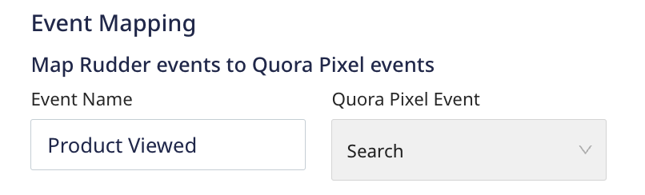
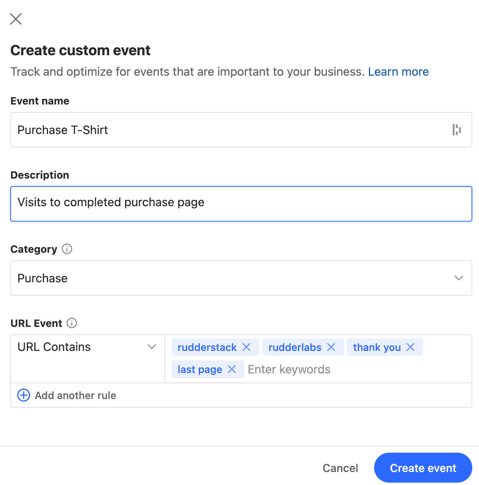
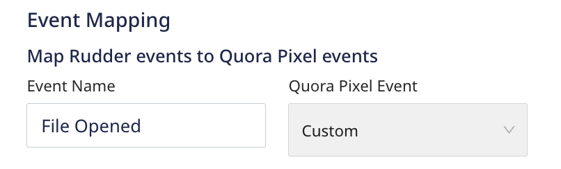

[Quora Conversion Pixel](https://quoraadsupport.zendesk.com/hc/en-us/articles/115010303387-About-the-Quora-Pixel) is a popular advertising and marketing tool to track your website traffic and conversions.  If you are running ad campaigns on [Quora](https://quora.com/), you can attribute the downstream user actions on your website to your Quora impressions.

## Getting started

RudderStack supports sending event data to Quora Pixel via the following <a href="https://rudderstack.com/docs/rudderstack-cloud/rudderstack-connection-modes/">connection modes</a>:

| **Connection Mode** | **Web**       | **Mobile**    | **Server**    |
| :------------------ | :------------ | :------------ | :------------ |
| **Device mode**     |     **Supported**          |        -       |        -       |
| **Cloud mode**      |      -         |        -       |         -      |

Once you have confirmed that the source platform supports sending events to Quora Pixel, follow these steps:

1. From your [RudderStack dashboard](https://app.rudderstack.com/), add the source. Then, from the list of destinations, select **Quora Pixel**.
2. Assign a name to your destination and click **Continue**.

### Connection settings 

To successfully configure Quora Pixel as a destination, you need to configure the following settings:

- **Pixel ID**: Enter the Pixel ID from your Quora Ads Manager Account. For more information on getting your Pixel ID, refer to the <Link to="#how-do-i-retrieve-the-quora-pixel-id">FAQ</Link> section below.
- **Map RudderStack events to Quora Pixel events**: Use this setting to map your events to specific Quora Pixel events.

<div class="infoBlock">
You can map multiple Quora Pixel events to a single RudderStack event and vice versa. If you do not specify a mapping for a particular event, RudderStack maps it to Quora's <strong>Generic</strong> event.
</div>

- **Client-side Events Filtering**: This setting lets you specify which events should be blocked or allowed to flow through to Quora Pixel. For more information on this setting, refer to the <Link to="/sources/sdks/event-filtering/">Client-side Events Filtering</Link> guide.
- **Use device mode to send events**: As this is a <Link to="https://www.rudderstack.com/docs/destinations/rudderstack-connection-modes/#device-mode">web device mode</Link>-only destination, this setting is enabled by default and cannot be disabled.
- **OneTrust Cookie Categories**: This setting lets you associate the <Link to="/sources/sdks/rudderstack-javascript-sdk/consent-managers/onetrust/">OneTrust</Link> cookie consent groups to the Quora Pixel destination.

## Supported calls

Quora Pixel does not accept the standard RudderStack events, that is, <Link to="/event-spec/standard-events/identify/">`identify`</Link>, <Link to="/event-spec/standard-events/page/">`page`</Link>, etc. directly. You need to first map these event names to the corresponding Quora events in the RudderStack dashboard.

Suppose you specify the following mapping in the RudderStack dashboard:



RudderStack then takes the event name `Product Viewed` and maps it to Quora's `Search` event.

A sample `Product Viewed` event is shown below:

```javascript
rudderanalytics.track("Product Viewed", {
  numberOfRatings: "12",
  name: "item 1",
});
```

RudderStack sends any event for which the mapping is not specified in the dashboard as a `Generic` event.

## Event mapping

Quora Ads supports two types of events, [Standard](https://quoraadsupport.zendesk.com/hc/en-us/articles/360029101832-Standard-Events) and [Custom](https://quoraadsupport.zendesk.com/hc/en-us/articles/360029101852).

### Standard events

Quora Pixel **natively supports** the following standard events:

| Standard event | Description |
| :-------| :--------|
| Generic | Used to track generic actions that are not accounted for in the other categories. |
| Purchase | Used to track purchases of digital or physical goods. |
| Generate Lead | Used to track the lead generation process. |
| Complete Registration |  Used to track user signups for a newsletter or service. |
| Add Payment Info | Used to track the linking of payment information to a user's account. |
| Add to Cart | Used to track the addition of items to a cart. |
| Add to Wishlist | Used to track the addition of items to a wishlist. |
| Initiate Checkout | Used to track the checkout process initialization. |
| Search | Used to track different types of searches. |

You can map these events to the RudderStack events via the **Map RudderStack events to Quora Pixel events** dashboard setting.

### Custom events

Before you map your RudderStack events to Quora's [custom events](https://quoraadsupport.zendesk.com/hc/en-us/articles/360029101852), make sure you have first configured the custom event in your Quora Ads Manager account.

To add a new custom event in Quora Ads Manager, follow these steps:

1. Log into your [Quora Ads Manager Account](https://www.quora.com/ads/account).
2. Navigate to the **Pixel & events** tab in your Quora Dashboard.
3. Click the **Create event** button to open the **Create custom event** modal.
4. Custom events require a name and description, and category. They also require **at least** one URL rule in the **URL Event** setting, as shown:



5. Click **Create event** to add a new custom event.

By default, Quora Pixel automatically tracks the custom events based on the <strong>URL Event</strong> setting. You need to include the specific web page URL keywords from which requests will be sent to Quora.

You can also send a specific RudderStack event as a Quora custom event by choosing the **Custom** event option from the dropdown, as shown:



<div class="warningBlock">
If you send a <Link to="#standard-events">standard event</Link> from a URL that is included in the <strong>URL Event</strong> property of your custom event configured in Quora Pixel, the event will be recorded in Quora as <strong>both</strong> a standard and custom event.
</div>

## FAQ

### How do I retrieve the Quora Pixel ID?

To retrieve your Pixel ID from the Quora Ads dashboard, follow these steps:

1. Log into your [Quora Ads Manager Account](https://www.quora.com/ads/account).
2. Navigate to the **Pixel & events** tab in your Quora Ads dashboard.
3. Click the **Setup Pixel** button to open the **Install the Quora Pixel** modal.
4. Select **Install manually** and click the **Next** button.
5. In the **Step 1: Install the base Pixel** modal, copy the installation JavaScript snippet and paste it somewhere safe.
6. Search for `init` in the snippet. The string corresponding to `init` is your Pixel ID. For example, if your snippet contains the following code:

```
qp('init', 'd2bnp3ubi9x6zq1p89h5hyx2hf5q1k3v');
```
In this case, `d2bnp3ubi9x6zq1p89h5hyx2hf5q1k3v` is your Pixel ID.

### Can I use the client-side events filtering feature for the custom events?

The <Link to="/sources/sdks/event-filtering/">client-side events filtering</Link> feature is not applicable for custom events. This is because Quora tracks custom events based on the **URL Event** property.