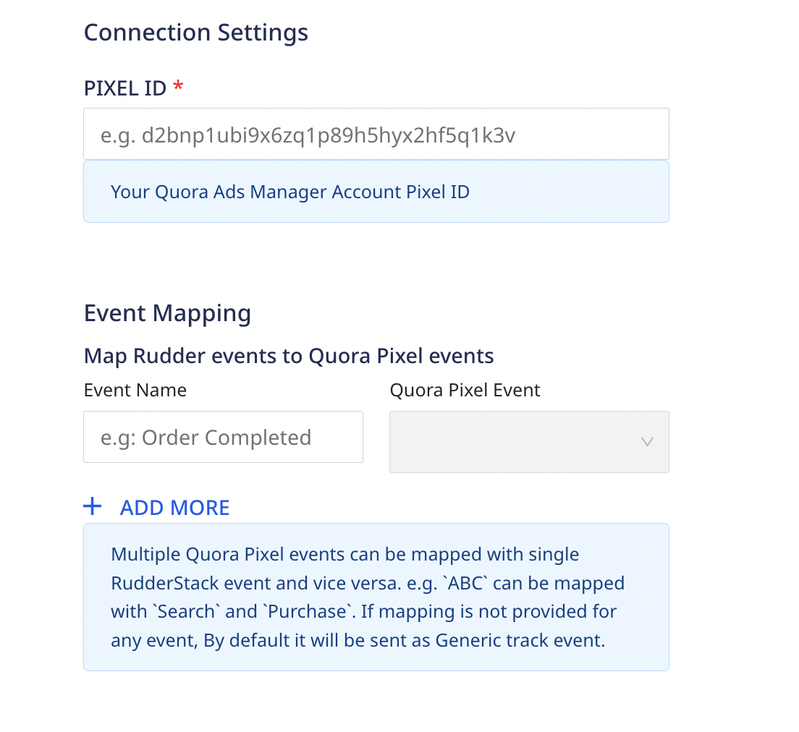
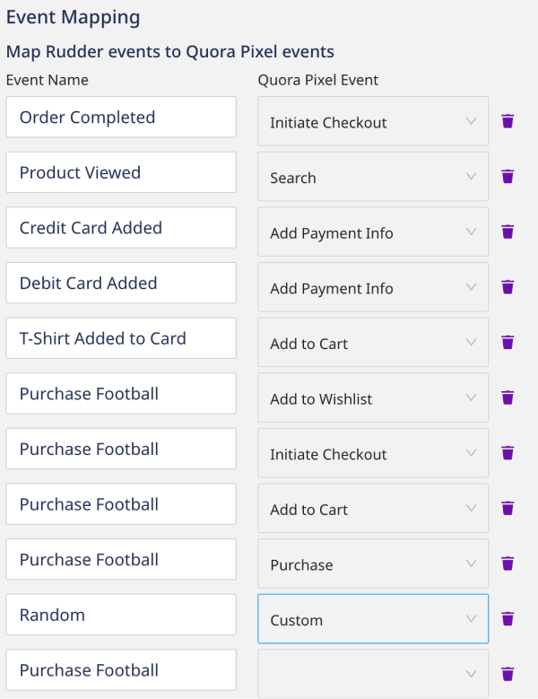

If you are running ad campaigns on quora.com, you can attribute downstream actions on your website to impressions on Quora. This integration will allow you to map RudderStack events to your Quora Ads
instance by setting up the [Quora Pixel](https://quoraadsupport.zendesk.com/hc/en-us/articles/115010303387-About-the-Quora-Pixel) as a destination.


## Retrieve your Pixel ID

To get started, you will need to retrieve your Pixel ID from the Quora Ads dashboard.

1. Log into your [Quora Ads Manager Account](https://www.quora.com/ads/account).
2. Navigate to the `Pixel & events` tab in your Quora Ads Dashboard.
3. Click the `Setup Pixel` button to open the `Install the Quora Pixel` modal.
4. Select `Install manually` and click the *Next* button.
5. In the `Step 1: Install the base Pixel` modal, copy the installation JavaScript and **paste it somewhere** so you can retrieve it in the next step. 
6. Search `init` in the code. The string corresponding to `init` is your Pixel ID, e.g., `qp('init', 'd2bnp3ubi9x6zq1p89h5hyx2hf5q1k3v');` 

## Add Quora Pixel as a Destination

Next, you will create a Quora Pixel destination in RudderStack and connect it to the JavaScript SDK source for your website.

Before configuring Quora Pixel as a destination in RudderStack, verify if the source platform is supported by referring to the table below:

| **Connection Mode** | **Web**       | **Mobile**    | **Server**    |
| :------------------ | :------------ | :------------ | :------------ |
| **Device mode**     | **Supported** | -             | -             |
| **Cloud mode**      | - | - | - |

<div class="infoBlock">
To learn more about the difference between cloud mode and device mode in RudderStack, refer to the <Link to="/destinations/rudderstack-connection-modes/">RudderStack Connection Modes</Link> guide.
</div>


### Create Destination

1. In your RudderStack dashboard, navigate to *Destinations* and click *New Destination*.
2. Search for `Quora Pixel` under Cloud Destinations or by using the search bar.
3. Click the Quora Pixel card, and give your destination a name, e.g., `Quora Pixel dev`.
4. Choose an existing RudderStack JavaScript source to connect to your Quora Pixel destination. If you don't have one, you will need to set that up before continuing. See our <Link to="/sources/event-streams/sdks/rudderstack-javascript-sdk/">JavaScript SDK</Link> guide to set up a JavaScript source.


## Connection Settings

After connecting your JavaScript source, add your Pixel ID and map your RudderStack events to Quora.



### Pixel ID

Paste the Pixel ID that you retrieved in the first step.

### Event Mapping

Quora Ads supports two types of events, [Standard](https://quoraadsupport.zendesk.com/hc/en-us/articles/360029101832-Standard-Events) and [Custom](https://quoraadsupport.zendesk.com/hc/en-us/articles/360029101852).

<div class="infoBlock">
Multiple Quora Pixel events can be mapped with a single RudderStack event and vice versa. For example, <em>ABC</em> can be mapped with <em>Search</em> and <em>Purchase</em>. If a mapping is not provided for an event, it will be sent as <em>Generic</em> track event.
</div>

#### Standard Events

The following standard events are supported natively by Quora Pixel:

- **Generic →** An event used to track generic actions not accounted for in other categories.
- **Purchase →** An event used to track purchases of digital or physical goods.
- **Generate Lead →** An event used to track lead generation.
- **Complete Registration →** An event used to track user signups for a service or newsletter.
- **Add Payment Info →** An event used to track the linking of financial information to a user account.
- **Add to Cart →** An event used to track the addition of items to a digital shopping cart.
- **Add to Wishlist →** An event used to track the addition of items to a digital wishlist.
- **Initiate Checkout →** An event used to track the initialization of a checkout process.
- **Search →** An event used to track all manner of searches.

Map these using the connection settings utility in the RudderStack dashboard:



#### Custom Events

For Quora [Custom](https://quoraadsupport.zendesk.com/hc/en-us/articles/360029101852) events you must first configure them in Quora Ads Manager: 

1. Log into your [Quora Ads Manager Account](https://www.quora.com/ads/account)
2. Navigate to the `Pixel & events` tab in your Quora Dashboard.
3. Click the `Create event` button to open the `Create custom event` modal.

Custom events require a name and description, and category. They also require at least one URL rule.


<div class="infoBlock">
If we send a Standard event from a URL that is included in the URL Event property of a Custom event configured on the Quora Pixel dashboard, the event will be recorded as both a `Standard` and `Custom` event.
</div>

## Supported Calls

This integration doesn't take RudderStack calls, e.g., `identify`, `page` directly. We simply take the event name that you provide in your mapping in the RudderStack dashboard and map it to the corresponding Quora event.

For example, this event:
```js
rudderanalytics.track("Product Viewed");
```
would be mapped to a Quora `Search` event per the example mapping in the previous section.

If for any event a mapping is not provided, we will consider it `Generic` event.


