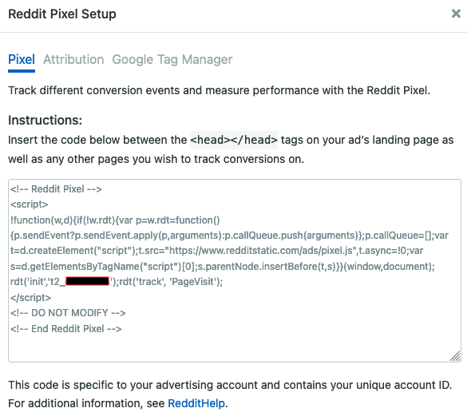

[Reddit Pixel](https://ads.reddit.com/) is a JavaScript snippet that you can add to your website to track user actions on your website after interacting with your ad on Reddit. 

## Getting started

RudderStack supports sending event data to Reddit Pixel via the following <a href="https://rudderstack.com/docs/rudderstack-cloud/rudderstack-connection-modes/">connection modes</a>:

| **Connection Mode** | **Web**       | **Mobile** | **Server** |
| :------------------ | :------------ | :--------- | :--------- |
| **Device mode**     | **Supported** | -          | -          |
| **Cloud mode**      | -             | -          | -          |

<div class="infoBlock">
In the web device mode integration, that is, using <Link to="/sources/event-streams/sdks/rudderstack-javascript-sdk">JavaScript SDK</Link> as a source, the Reddit Pixel native SDK is loaded from <code class="inline-code">https://www.redditstatic.com/</code> domain. Based on your website's content security policy, you might need to <Link to="/sources/event-streams/sdks/rudderstack-javascript-sdk/load-js-sdk/#allowlist-destination-domain">allowlist this domain</Link> to load the Reddit Pixel SDK successfully.
</div>

Once you have confirmed that the source platform supports sending events to Reddit Pixel, follow these steps:

1. From your [RudderStack dashboard](https://app.rudderstack.com/), add the source. Then, from the list of destinations, select **Reddit Pixel**.
2. Assign a name to your destination and click **Continue**.

## Connection settings

To successfully configure Reddit Pixel as a destination, configure the following settings:

- **Advertiser ID**: Enter your Reddit Pixel Advertiser ID. Refer to the <Link to="#faq">FAQ</Link> section for more information on obtaining the Advertiser ID.
- **Mapping to trigger the Reddit Pixel events for the respective events set here**: Use this setting to map custom event names to the standard Reddit Pixel events.
- **Client-side Events Filtering**: This setting lets you specify which events should be blocked or allowed to flow through to Reddit Pixel. Refer to the <Link to="/sources/event-streams/sdks/event-filtering/">Client-side Events Filtering</Link> guide for more information.
- **Use device mode to send events**: As this is a web device mode-only destination, this setting is enabled by default and cannot be disabled.
- **OneTrust Cookie Categories**: This setting lets you associate <Link to="/sources/sdks/rudderstack-javascript-sdk/consent-managers/onetrust/">OneTrust</Link> cookie consent groups to Reddit Pixel.

## Identify

You can use the <Link to="/event-spec/standard-events/identify">`identify`</Link> call to update the user's signup information.

A sample `identify` call is as shown:

```javascript
rudderanalytics.identify()
```

## Page

When you make a <Link to="/event-spec/standard-events/page">`page`</Link> call, the `track` event is sent as `PageVisit` to `rdt('track,'PageVisit')`. RudderStack ignores any parameter sent to `rudderanalytics.page()`.

A sample `page` call is as shown:

```javascript
rudderanalytics.page()
```

## Track

The <Link to="/event-spec/standard-events/track">`track`</Link> call lets you capture user events along with the properties associated with them.

A sample `track` call is shown below:

```javascript
rudderanalytics.track("Product Added")
```

### Property mappings

The following table lists the event mapping from RudderStack to Reddit Pixel's standard events:

| RudderStack event  | Reddit Pixel standard event |
| :-------------------------- | :------------------------------ |
| `Product Added`             | `Add to Cart`                   |
| `Product Added to Wishlist` | `Add to Wishlist`               |
| `Order Completed`           | `Purchase`                      |

The following table lists the custom events mapping from RudderStack to Reddit Pixel's standard events:

| RudderStack event  | Reddit Pixel standard event |
| :------------------------- | :------------------------------ |
| `Lead`                     | `Lead`                          |
| `View Content`             | `ViewContent`                   |
| `Search`                   | `Search`                        |

<div class="warningBlock">
Reddit Pixel does not support any other custom events apart from the ones mentioned above.
</div>

## FAQ

### Where can I find the Reddit Pixel Advertiser ID?

To get your Reddit Pixel Advertiser ID, follow these steps:

1. Login to the [Reddit Ads Manager account](https://accounts.reddit.com/adsregister?dest=https%3A%2F%2Fads.reddit.com%2F&referrer=https%3A%2F%2Fwww.google.com%2F). 
2. Under **Reddit Pixel Setup**, select the Reddit **Pixel** button. Here, you can find the advertiser ID as shown:




