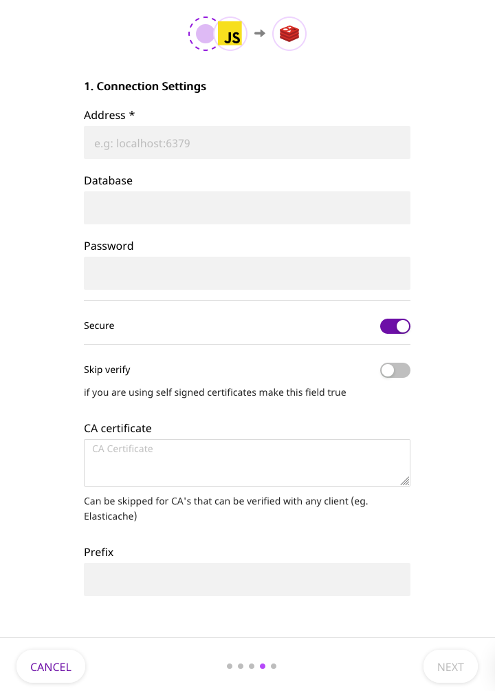

Redis is an open source, in-memory data structure store, which can be used as a database, and a message broker.

RudderStack stores all the traits of your user as a [Redis hash](https://redis.io/commands/hset), allowing you to access user profiles in real-time.

<div class="infoBlock">
Redis destination only processes <Link to="/event-spec/standard-events/identify">Identify</Link> API calls. All the other event types are ignored.
</div>

<div class="warningBlock">
It is highly recommended that you keep your Redis instance inside a private network and make it accessible to RudderStack.
</div>

<div class="infoBlock">
Find the open source transformer code for this destination in the <a href="https://github.com/rudderlabs/rudder-transformer/tree/master/v0/destinations/redis">GitHub repository</a>.
</div>

## Getting started

To set up Redis as a destination in RudderStack, follow these steps:

1. Set up your source in the [RudderStack dashboard](https://app.rudderstack.com/) and select the destination as **Redis**. 
2. Give your destination a name and then click on **Continue**.
3. Next, in the **Connection Settings**, fill all the fields with the relevant information and click on **Next**.



### Connection settings

The settings required to configure Redis as a destination are listed below:

**Prefix**: By default, RudderStack stores user traits with the key `user:<user_id>`. An extra prefix can be added in the destination configuration to distinguish all RudderStack-stored keys with a prefix.

**Database**: RudderStack stores the user traits in the default database of the Redis instance. A different database inside the Redis instance can be configured from the destination configuration.

**Secure**: Enable this setting to secure the TLS communication between RudderStack Redis client and your Redis server.

**Skip Verify**: Enable this option to skip the client's verification of the server's certificate chain and host name. In this mode, TLS is susceptible to man-in-the-middle attacks. This should be used only for testing.

**CA certificate**: Enter the certificate which needs to be verified while establishing a secure connection. Skip setting this if Root CA of your server can be verified with any client, for example, Elasticache.

## Identify

The <Link to="/event-spec/standard-events/identify">Identify</Link> call lets you associate the actions to a user and record their traits like name, email, etc.

RudderStack stores the user traits in the configured Redis instance. You can access the latest user traits by querying Redis for the key `user:<user_id>`.

Here is an example of an `identify` event captured using the <Link to="/sources/sdks/rudderstack-javascript-sdk/">JavaScript SDK</Link> and how it is stored in Redis:

```javascript
// Identify a user with name and title as traits

rudderanalytics.identify("user-1", {
  name: "John Doe",
  title: "CEO",
})
```

```bash
// redis-cli
redis> HGETALL user:user-1
1) "name"
2) "John Doe"
3) "title"
4) "CEO"
```

### Nested properties

If your user traits have nested properties, they will be flattened out with `.` as the separator.

For example, consider the following event:

```javascript
// Identify a user with location as a trait

rudderanalytics.identify("user-2", {
  location: {
    state: "Texas",
    city: "Austin",
  },
})
```

RudderStack flattens the properties as shown below:

```bash
// redis-cli
redis> HGETALL user:user-2
1) "location.state"
2) "Texas"
3) "location.city"
4) "Austin"
```

### Custom prefix

If you configure a Redis destination with a prefix `rudderstack`, then all the keys will be prefixed in the same manner.

Here's an example of how it works:

```javascript
// Identify a user with name and title as traits

rudderanalytics.identify("user-3", {
  age: 23,
})
```

```bash
// redis-cli
redis> HGETALL rudderstack:user:user-3
1) "age"
2) 23
```

## FAQ

### How to setup Redis on Docker with TLS support?

One way to enable a TLS endpoint for accessing redis is to run a `redis-stunnel` container with a link to the `redis` container and exposing the TLS port. More instructions can be found [here](https://hub.docker.com/r/runnable/redis-stunnel/)

<div class="infoBlock">
Set <strong>Common Name</strong> to <code class="inline-code">localhost</code> while generating the CA certificate and server certificates.
</div>

Set the TLS endpoint of the `redis-stunnel` container as the address in the RudderStack Redis destination settings. For example, `127.0.0.1:6380` while running containers locally with defaults. Set the `ca.pem` file generated above as the CA certificate in the settings.


