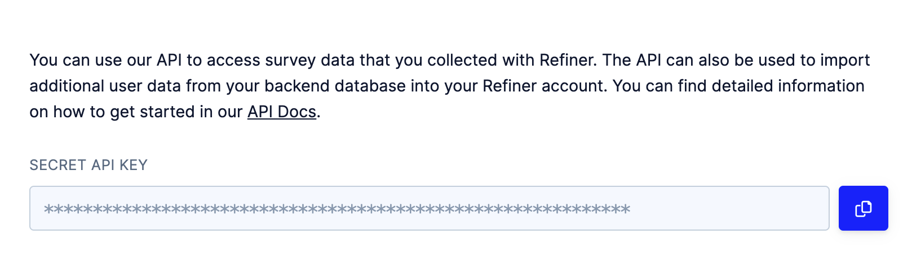
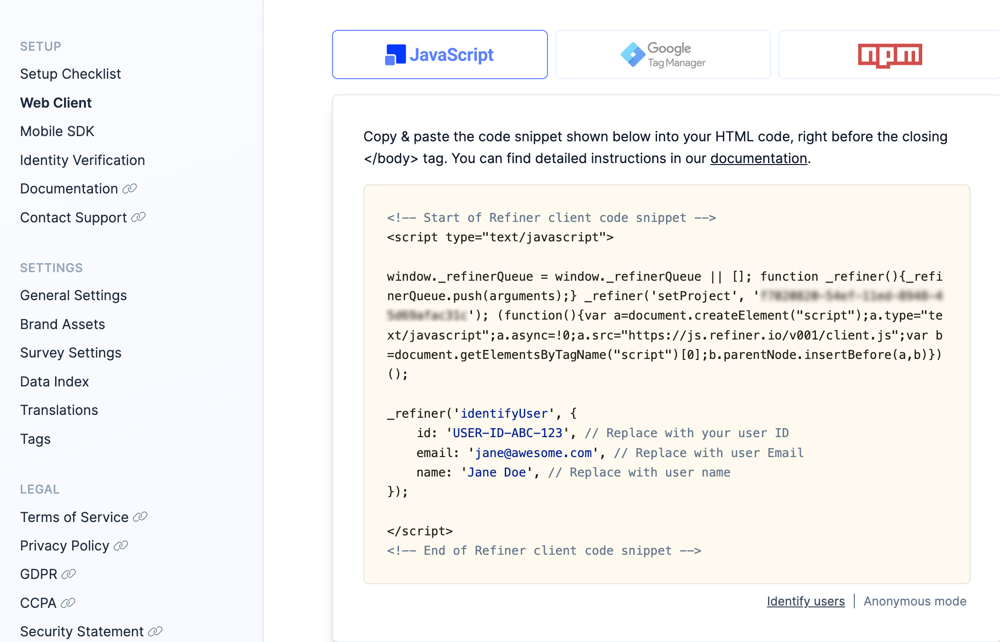

RudderStack supports sending events to Refiner via the following <Link to="/destinations/rudderstack-connection-modes/">connection modes</Link>:

| **Connection Mode** | **Web**       | **Mobile**    | **Server**    |
| :------------------ | :------------ | :------------ | :------------ |
| **Device mode**     |        Supported       |               |               |
| **Cloud mode**      |        Supported       |  Supported   |   Supported            |

Once you have confirmed that the source platform supports sending events to Refiner, follow these steps:

1. From your [RudderStack dashboard](https://app.rudderstack.com/), add the source. Then, from the list of destinations, select **Refiner**.
2. Assign a name to your destination and click **Continue**.

## Connection settings

To successfully set up Refiner as a destination, you need to configure the following settings:

- **Refiner REST API Key**: Enter your Refiner REST API key.
- **Refiner Web Client API Key**: Enter your web client API key.

For more information on obtaining the Refiner REST API key and web client API key, refer to the <Link to="#faq">FAQ</Link> section below.

- **Map Rudder user attributes to Refiner contact traits**: Use this setting to map specific properties from the RudderStack event to Refiner's contact traits.
- **Map Rudder account attributes to Refiner account traits**: Use this setting to map specific properties from the RudderStack event to Refiner's account traits.
- **Client-side Events Filtering**: This setting lets you specify which events should be blocked or allowed to flow through to Refiner. For more information on this setting, refer to the <Link to="/sources/sdks/event-filtering/">Client-side Events Filtering</Link> guide.
- **Use device mode to send events**: Enable this setting to send your events to Refiner via the <Link to="https://www.rudderstack.com/docs/destinations/rudderstack-connection-modes/#device-mode">web device mode</Link>.
- **OneTrust Cookie Categories**: This setting lets you associate <Link to="/sources/sdks/rudderstack-javascript-sdk/consent-managers/onetrust/">OneTrust</Link> cookie consent groups to Refiner.

## FAQ 

### Where can I find the Refiner REST API key and web client API key?

To get your Refiner REST API key and web client API key, follow these steps:

1. Log into your [Refiner dashboard](https://app.refiner.io/).
2. From the left sidebar, click the **Integrations** icon and go to **REST API**. You will find the REST API Key listed here under **Secret API Key**, as shown:

3. To get your Refiner web client API key, click the **Settings** icon from the left sidebar and go to **Web Client**. You will find the API key listed here, as shown:

