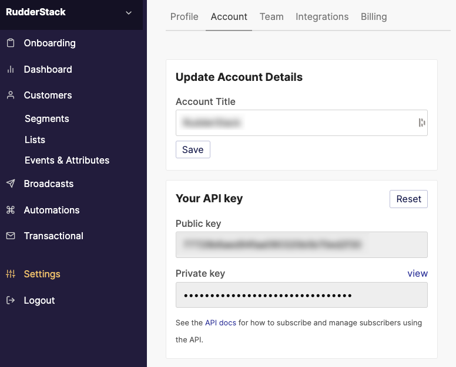

RudderStack supports sending events to Refiner via the following <Link to="/destinations/rudderstack-connection-modes/">connection modes</Link>:

| **Connection Mode** | **Web**       | **Mobile**    | **Server**    |
| :------------------ | :------------ | :------------ | :------------ |
| **Device mode**     |        Supported       |               |               |
| **Cloud mode**      |        Supported       |  Supported   |   Supported            |

Once you have confirmed that the source platform supports sending events to Refiner, follow these steps:

1. From your [RudderStack dashboard](https://app.rudderstack.com/), add the source. Then, from the list of destinations, select **Refiner**.
2. Assign a name to your destination and click **Continue**.

## Connection settings

To successfully set up Refiner as a destination, you need to configure the following settings:

- **Refiner REST API Key**: Enter your Refiner REST API key. You can find it by 
- **Private Key**: Enter your Refiner private key here. This key is required for deleting a user or updating their email in Refiner.
- **List IDs**: Enter your Refiner list ID. You can get it by logging into your Refiner dashboard and going to **Lists** > clicking your list > **Subscription and Settings** > **Your list ID**.
- **Client-side Events Filtering**: This setting lets you specify which events should be blocked or allowed to flow through to Refiner. For more information on this setting, refer to the <Link to="/sources/sdks/event-filtering/">Client-side Events Filtering</Link> guide.
- **Use device mode to send events**: Enable this setting to send your events to Refiner via the <Link to="https://www.rudderstack.com/docs/destinations/rudderstack-connection-modes/#device-mode">web device mode</Link>.

## FAQ 

### Where can I find the Refiner Public Key and Private Key?

To get your Refiner public key and private key, follow these steps:

1. Log into your [Refiner dashboard](https://app.engage.so/auth/login).
2. Navigate to **Settings** > **Account** > **Your API Key**, as shown:

