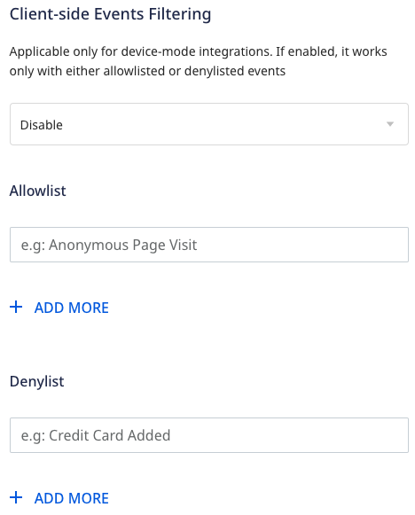

Before configuring Rockerbox as a destination in RudderStack, verify if the source platform is supported by Rockerbox by referring to the table below:

| **Connection Mode** | **Web**      | **Mobile** | **Server** |
| :------------------ | :------------ | :----- | :----- |
| **Device Mode**     | **Supported** | **-**  | **-**  |
| **Cloud Mode**      | **Supported** | **Supported**  | **-**  |

To know more about the difference between cloud mode and device mode in RudderStack, refer to the <Link to="/destinations/rudderstack-connection-modes/">RudderStack Connection Modes</Link> guide.

Once you have confirmed that the source platform supports sending events to Rockerbox, follow these steps:

1. From your [RudderStack dashboard](https://app.rudderstack.com/), add the source. Then, from the list of destinations, select **Rockerbox**.
2. Assign a name to your destination and click **Continue**.

## Connection settings

To successfully configure Rockerbox as a destination, configure the following settings:

- **Advertiser Id**: Enter your Rockerbox Advertiser Id.

Refer to the <Link to="#faq">FAQ</Link> section for more information on how to obtain the Advertiser Id.

- **Map your RockerBox events to RudderStack Events**: Map your RudderStack events to RockerBox events.
    
### Client-side events filtering

This setting lets you specify which events should be blocked or allowed to flow through to Rockerbox.

This option is applicable only if you're sending events to Rockerbox via the web device mode. Refer to the <Link to="/sources/event-streams/sdks/event-filtering/">Client-side Event Filtering</Link> guide for more information on this feature.

### Web SDK settings

These settings are applicable only if you are sending events to Rockerbox via web device mode.

- **Client Auth Id**: Enter your Rockerbox Client Auth Id.
- **Custom Domain**: Enter your Rockerbox Advertiser Id.
- **Enable Cookie Sync**: Enter your Rockerbox Advertiser Id.
- **Use device-mode to send events**: Enter your Rockerbox Advertiser Id.
- **Use device-mode to send track events**: Enter your Rockerbox Advertiser Id.
- **OneTrust Cookie Categories**: This setting lets you map <Link to="/sources/sdks/rudderstack-javascript-sdk/consent-managers/onetrust/">OneTrust</Link> cookie consent groups to RudderStack's consent purposes.

## FAQ

### How do I obtain the Advertiser Id?

### How do I obtain the Client Auth ID?

