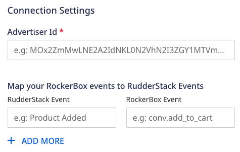
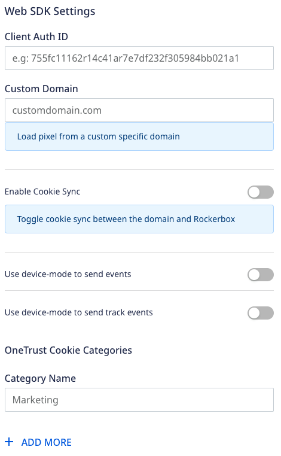

RudderStack supports sending event data to Rockerbox via the following <a href="https://rudderstack.com/docs/rudderstack-cloud/rudderstack-connection-modes/">connection modes</a>:

| **Connection Mode** | **Web**      | **Mobile** | **Server** |
| :------------------ | :------------ | :----- | :----- |
| **Device Mode**     | **Supported** | **-**  | **-**  |
| **Cloud Mode**      | **Supported** | **Supported**  | **Supported**  |

In the web device mode integration, that is, using <Link to="/sources/event-streams/sdks/rudderstack-javascript-sdk">JavaScript SDK</Link> as a source, the Rockerbox native SDK is loaded from <code class="inline-code">https://$&#123;host&#125;/assets/$&#123;library&#125;.js</code> domain. Refer to the <a href="https://github.com/rudderlabs/rudder-sdk-js/blob/production/src/integrations/Rockerbox/browser.js#L20-L21">source code</a> for obtaining the <code class="inline-code">host</code> and <code class="inline-code">library</code> values. Based on your website's content security policy, you might need to <Link to="/sources/event-streams/sdks/rudderstack-javascript-sdk/load-js-sdk/#allowlist-destination-domain">allowlist this domain</Link> to load the Rockerbox SDK successfully.

Once you have confirmed that the source platform supports sending events to Rockerbox, follow these steps:

1. From your [RudderStack dashboard](https://app.rudderstack.com/), add the source. Then, from the list of destinations, select **Rockerbox**.
2. Assign a name to your destination and click **Continue**.

## Connection settings

To successfully configure Rockerbox as a destination, configure the following settings:

- **Advertiser Id**: Enter your Rockerbox Advertiser Id.

Advertiser Id is a required field for sending events to Rockerbox via <Link to="/destinations/rudderstack-connection-modes/#cloud-mode">cloud mode</Link>. To obtain it, contact your <a href="https://help.rockerbox.com/article/5t050dmcxv-webhooks#requirements:~:text=or%20other%20formats-,Server%2Dside%20specs,-You%20will%20need">Rockerbox account manager</a>.

- **Map your Rockerbox events to RudderStack Events**: Enter the corresponding RudderStack and Rockerbox events you want to be mapped.

You can specify multiple <strong>RudderStack events</strong> for one <strong>Rockerbox event</strong> and vice versa.

### Client-side events filtering

This setting lets you specify which events should be blocked or allowed to flow through to Rockerbox and is applicable only if you're sending events via the **web device mode**.

Refer to the <Link to="/sources/event-streams/sdks/event-filtering/">Client-side Event Filtering</Link> guide for more information on this feature.

### Web SDK settings

These settings are applicable only if you are sending events to Rockerbox via the web device mode:

- **Client Auth ID**: Enter your Rockerbox Client Auth ID.

You can obtain the  Client Auth ID from your <strong>Rockerbox All Pages</strong> tag available in the Rockerbox Attribution platform. For more information on obtaining it, refer to the <a href="https://help.rockerbox.com/article/unydvsq7jr-site-direct-all-pages-pixel#:~:text=Your%20pixel%20will%20have%20an%20alphanumeric%20ID%20instead%20of%20the%20CLIENT_AUTH_ID%20placeholder">Rockerbox documentation</a>.

- **Custom Domain**: Enter the custom domain from where you want to load the pixels. 

Rockerbox lets you use a Custom Tracking Domain to load the Rockerbox trackers and pixels from your website's domain (for example, <code class="inline-code">rb.mysite.com</code>) instead of  <code class="inline-code">getrockerbox.com</code>. For more details, refer to the <a href="https://help.rockerbox.com/article/iel8eh361t-cname-integration">Rockerbox documentation</a>.

- **Enable Cookie Sync**: Enable this setting if you are using a custom domain. It ensures that the Custom Tracking Domain functionality works as expected.
- **Use device-mode to send events**: Enable this setting to send all the events from the JavaScript SDK to Rockerbox via the <Link to="/destinations/rudderstack-connection-modes/#device-mode">device mode</Link>.
- **Use device-mode to send track events**: Enable this setting to send **only** `track` events from the JavaScript SDK to Rockerbox via the <Link to="/destinations/rudderstack-connection-modes/#device-mode">device mode</Link>. Refer to the <Link to="#hybrid-mode">Hybrid mode</Link> for more information.
- **OneTrust Cookie Categories**: This setting lets you associate <Link to="/sources/sdks/rudderstack-javascript-sdk/consent-managers/onetrust/">OneTrust</Link> cookie consent groups to the Rockerbox destination.

## Hybrid mode

Hybrid mode lets you use a destination in the <Link to="/destinations/rudderstack-connection-modes/#cloud-mode">cloud</Link> as well as <Link to="/destinations/rudderstack-connection-modes/#device-mode">device mode</Link> simultaneously. It means that you can route some calls through server side (<Link to="/destinations/rudderstack-connection-modes/#cloud-mode">cloud mode</Link>), whereas others through the client side SDK (<Link to="/destinations/rudderstack-connection-modes/#device-mode">device mode</Link>). This is helpful in some specific use-cases and scenarios only possible in a particular connection mode.

In Rockerbox, the <code class="inline-code">identify</code> and <code class="inline-code">page</code> calls are supported in device mode whereas the <code class="inline-code">track</code> calls are supported in both the cloud and device mode.

