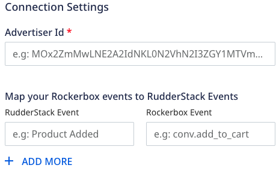

Before configuring Rockerbox as a destination in RudderStack, verify if the source platform is supported by Rockerbox by referring to the table below:

| **Connection Mode** | **Web**      | **Mobile** | **Server** |
| :------------------ | :------------ | :----- | :----- |
| **Device Mode**     | **Supported** | **-**  | **-**  |
| **Cloud Mode**      | **Supported** | **Supported**  | **-**  |

To know more about the difference between cloud mode and device mode in RudderStack, refer to the <Link to="/destinations/rudderstack-connection-modes/">RudderStack Connection Modes</Link> guide.

Once you have confirmed that the source platform supports sending events to Rockerbox, follow these steps:

1. From your [RudderStack dashboard](https://app.rudderstack.com/), add the source. Then, from the list of destinations, select **Rockerbox**.
2. Assign a name to your destination and click on **Continue**.

## Connection settings

To successfully configure Rockerbox as a destination, configure the following settings:

- **Advertiser Id**: Enter your Rockerbox Advertiser Id.

- **Map your RockerBox events to RudderStack Events**: This option lets you map your RudderStack events to RockerBox events.
    

Refer to the <Link to="#faq">FAQ</Link> section for more information on how to obtain the API Secret, Measurement Id and Firebase App ID.

### Client-side events filtering

This option is applicable only if you're sending events to Rockerbox via the web device mode. Refer to the <Link to="/sources/event-streams/sdks/event-filtering/">Client-side Event Filtering</Link> guide for more information on this feature.

### Web SDK settings

These settings are applicable only if you are sending events to Rockerbox via web device mode.

- **Client Auth Id**: Enter your Rockerbox Advertiser Id.
- **Custom Domain**: Enter your Rockerbox Advertiser Id.
- **Enable Cookie Sync**: Enter your Rockerbox Advertiser Id.
- **Use device-mode to send events**: Enter your Rockerbox Advertiser Id.
- **Use device-mode to send track events**: Enter your Rockerbox Advertiser Id.
- **OneTrust Cookie Categories**: This setting lets you map <Link to="/sources/sdks/rudderstack-javascript-sdk/consent-managers/onetrust/">OneTrust</Link> cookie consent groups to RudderStack's consent purposes.

## FAQ

### How do I obtain the Advertiser Id?

1. Login to [Google Analytics](https://analytics.google.com/analytics/web/) dashboard.
2. Go to the **Admin** section in the left sidebar.
3. Select the relevant account and property.
4. Click on **Data Streams** and select the stream to get the Measurement Id as shown:

### How do I obtain Client Auth ID?

