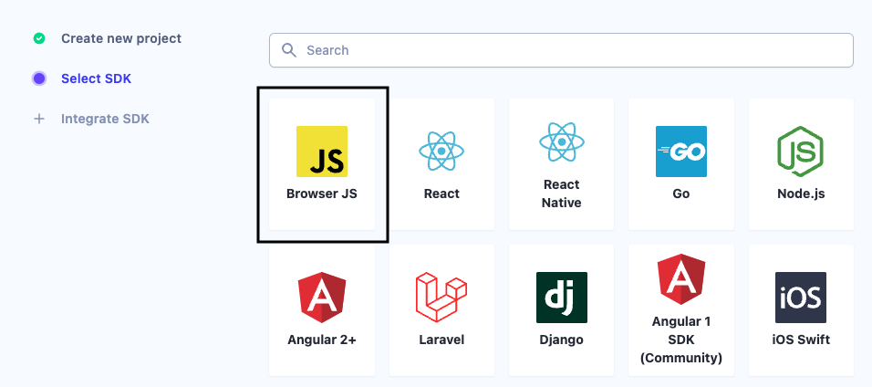
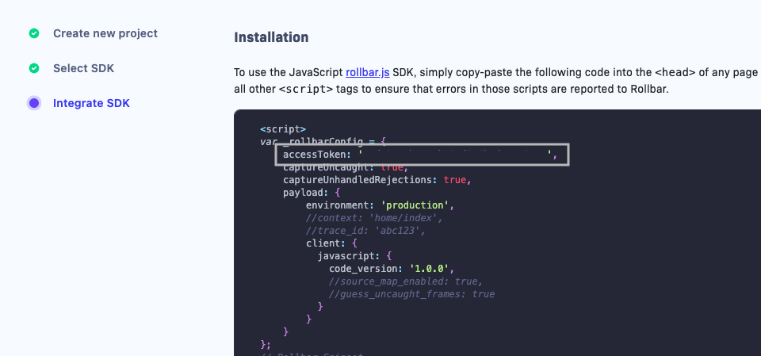

[Rollbar](https://rollbar.com/) is a real-time error tracking and monitoring tool. It helps you find and fix any errors in your code, including unhandled exceptions.

RudderStack supports Rollbar as a destination where you can seamlessly send your event data.

## Getting started

RudderStack supports sending event data to Rollbar via the following <a href="https://rudderstack.com/docs/rudderstack-cloud/rudderstack-connection-modes/">connection modes</a>:

| Connection Mode | Web | Mobile | Server |
| :--- | :--- | :--- | :--- |
| Device mode | Supported | - | - |
| Cloud mode | -  | - | - |

<div class="infoBlock">
In a web device mode integration, that is, using <Link to="/sources/event-streams/sdks/rudderstack-javascript-sdk">JavaScript SDK</Link> as a source, the Rollbar native SDK is loaded from <code class="inline-code">https://cdn.rollbar.com/</code> domain. Based on your website's content security policy, you might need to <Link to="/sources/event-streams/sdks/rudderstack-javascript-sdk/load-js-sdk/#allowlist-destination-domain">allowlist this domain</Link> to load the Rollbar SDK successfully.
</div>


Once you have confirmed that the source platform supports sending events to Rollbar, follow these steps:

1. From your [RudderStack dashboard](https://app.rudderstack.com/), add a source. Then, from the list of destinations, select **Rollbar**.
2. Assign a name to the destination and click **Continue**.

## Connection settings

To successfully configure Rollbar as a destination, you will need to configure the following settings:

- **Access Token**: Enter your Rollbar access token. For more information on obtaining your Rollbar access token, refer to the <Link to="#faq">FAQ</Link> section below.
- **Capture Uncaught Exceptions**: This setting lets you record any uncaught exceptions from the `window.oneerror` toggle.
- **Capture Unhandled Rejections**: Enable this setting to capture and report any unhandled Promise rejections, for example, Promise failures.
- **Guess Uncaught Frames**: When this option is enabled, Rollbar guesses the frames in which an error was thrown. This is helpful in cases where the browser does not provide any line or column numbers.
- **Code Version**: Enter the version string, for example, a version number. This setting is applicable if you have enabled the **Source Maps** setting in Rollbar.

<div class="infoBlock">
Refer to the <a href="https://docs.rollbar.com/docs/source-maps">Rollbar source maps documentation</a> for more information.
</div>

- **Environment**: Specify the environment in which your code is running. If you do not set any environment name, the events will be visible under the **unknown** environment in Rollbar.
- **Ignored Messages**: Rollbar will ignore the exception messages added in this field. For example, you can ignore an exception message for a third-party browser plugin that is throwing errors.
- **Source Map**: Enable this setting for Rollbar to perform efficient stack tracing and error grouping.
- **Client-side Events Filtering**: This setting lets you specify which events should be blocked or allowed to flow through to Rollbar. For more information on this setting, refer to the <Link to="/sources/sdks/event-filtering/">Client-side Events Filtering</Link> guide.


- **Use device mode to send events**: As this is a <Link to="https://www.rudderstack.com/docs/destinations/rudderstack-connection-modes/#device-mode">web device mode</Link>-only destination, this setting is enabled by default and cannot be disabled.

## Identify

You can use the <Link to="/event-spec/standard-events/identify/">`identify`</Link> call to identify a user in Rollbar.

RudderStack sends the `userId` and all the user `traits` present in the event to Rollbar along with all the errors.

A sample `identify` call is shown below:

```javascript
rudderanalytics.identify(
  "1hKOmRA4GRlm", {
    email: "alex@example.com",
    name: "Alex Keener"
  }
);
```

## FAQ

### Where can I find the Rollbar access token?

To obtain the Rollbar access token, follow these steps:

1. Go to your [Rollbar dashboard](https://app.rollbar.com/).
2. Navigate to your project and add the Rollbar SDK to your project. From the list of options, select **Browser JS** and click **Continue**.



3. In the resulting **Installation** window, you can find your project's access token, as shown:

