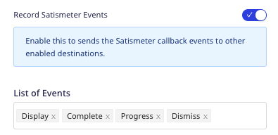
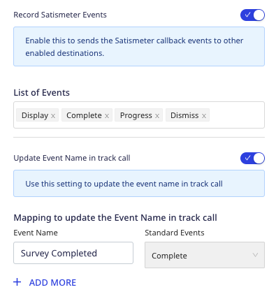
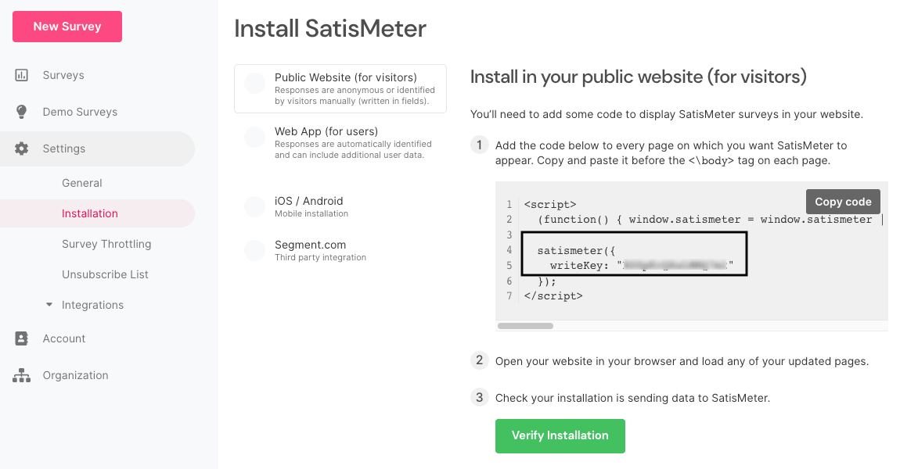

[Satismeter](https://clarity.microsoft.com/) is a customer feedback collection tool. It helps you derive real-time insights on customer satisfaction and monitor your products' performance.

RudderStack supports Satismeter as a destination where you can seamlessly send your event data.

## Getting started

RudderStack supports sending event data to Satismeter via the following <a href="https://rudderstack.com/docs/rudderstack-cloud/rudderstack-connection-modes/">connection modes</a>:

| Connection Mode | Web | Mobile | Server |
| :--- | :--- | :--- | :--- |
| Device mode | Supported | - | - |
| Cloud mode | -  | - | - |

Once you have confirmed that the source platform supports sending events to Satismeter, follow these steps:

1. From your [RudderStack dashboard](https://app.rudderstack.com/), add a source. Then, from the list of destinations, select **Satismeter**.
2. Assign a name to the destination and click **Continue**.

## Connection settings

To successfully configure Satismeter as a destination, you will need to configure the following settings:

- **Write Key**: Enter your Satismeter write key for authentication. For more information on obtaining the write key, refer to the <Link to="#faq">FAQ</Link> section below.
- **Identify Anonymous Users**: Enable this setting to allow RudderStack to identify anonymous users using `anonymousId`.
- **Record Satismeter Events**: Enable this setting to allow RudderStack to automatically record your Satismeter events as <Link to="/event-spec/standard-events/track/">`track`</Link> events events. 
  - **List of Events**: Specify the list of events to be automatically tracked.
  - **Update Event Name in track call**: Enable this setting to update your `track` event names before sending them to other destinations.
    - **Mapping to update the event name in the track call**: Use this setting to map the standard Satismeter events automatically recorded by RudderStack to custom `track` event names.

<div class="infoBlock">
For more information on these settings, refer to the <Link to="#automatically-recording-satismeter-events">Automatically recording Satismeter events</Link> section below.
</div>

- **Client-side Events Filtering**: This setting lets you specify which events should be blocked or allowed to flow through to Satismeter. For more information on this setting, refer to the <Link to="/sources/sdks/event-filtering/">Client-side Events Filtering</Link> guide.
- **Use device mode to send events**: As this is a <Link to="https://www.rudderstack.com/docs/destinations/rudderstack-connection-modes/#device-mode">web device mode</Link>-only destination, this setting is enabled by default and cannot be disabled.
- **OneTrust Cookie Categories**: This setting lets you associate <Link to="/sources/sdks/rudderstack-javascript-sdk/consent-managers/onetrust/">OneTrust</Link> cookie consent groups to Satismeter.

## Identify

You can use the <Link to="/event-spec/standard-events/identify/">`identify`</Link> call to identify a user interacting with the Satismeter survey.

<div class="infoBlock">
It is highly recommended to send the <code class="inline-code">createdAt</code> trait in your <code class="inline-code">identify</code> calls to keep a record of how long the user has interacted with the survey.
</div>

A sample `identify` call is shown below:

```javascript
rudderanalytics.identify("1hKOmRA4GRlm", {
  name: "Alex Keener",
  email: "alex@example.com",
  createdAt: "2022-02-01T19:14:18.381Z"
});
```

### Supported mappings

RudderStack maps the following `identify` traits to the corresponding Satismeter properties:

| RudderStack property | Satismeter property | 
| :-----| :------| 
| `userId` <br/> <span style="color: #4D4DFF;font-size:12px;">Required, if **Identify Anonymous User** setting is disabled in the dashboard.</span> | `userId` |
| `anonymousId` <br/> <span style="color: #4D4DFF;font-size:12px;">If **Identify Anonymous User** setting is enabled in the dashboard.</span> | `userId` |
| `context.traits.createdAt` <br/> <span style="color: #4D4DFF;font-size:12px;">Required</span>  | `traits.createdAt` |
| `context.traits` | `traits` |

## Track

You can use the <Link to="/event-spec/standard-events/track/">`track`</Link> call to the track the user's interactions with the survey like responses and feedback.

A sample `track` call is shown below:

```javascript
rudderanalytics.track("Response Submitted")
```

<div class="warningBlock">
You must send an <code class="inline-code">identify</code> call to identify a user before making a <code class="inline-code">track</code> call that records their survey interaction. Otherwise, Satismeter maps this interaction to an anonymous user.
</div>

### Supporting mappings

RudderStack maps the following event properties to the corresponding Satismeter properties:

| RudderStack event/property | Satismeter event/property | Data type |
| :-----| :------|  :--- |
| `event` <br/> <span style="color: #4D4DFF;font-size:12px;">Required</span> | `event` | String |

<div class="warningBlock">
Satismeter does not accept any <code class="inline-code">track</code> event properties except the event name.
</div>

### Automatically recording Satismeter events

If you enable the **Record Satismeter Events** setting in the dashboard, RudderStack automatically tracks and records the events listed in the **List of Events** fields as `track` events. You can then view and analyze these events using other tools (connected to the same source in RudderStack).



In the above image, RudderStack automatically records the standard Satismeter events `Display`, `Complete`, `Progress`, and `Dismiss` as `track` events.

You can also update the standard Satismeter event names by enabling the **Update Event Name in track call** dashboard setting and specifying the mapping, as shown:



In the above example, RudderStack renames the standard Satismeter event `Complete` to `Survey Completed` before sending it to the other destinations.

## FAQ

### Where can I find the Satismeter write key?

To get your Satismeter write key ID, follow these steps:

1. Log into your <a href="https://app.satismeter.com/">Satismeter dashboard</a>.
2. Select your project and go to **Settings** > **Installation** to find your Satismeter write key, as shown:



<br />