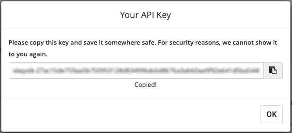
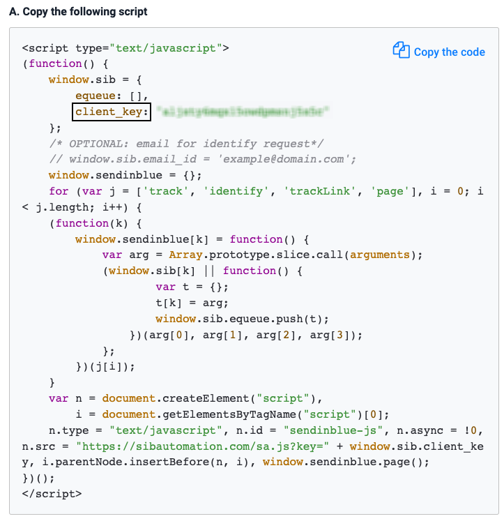
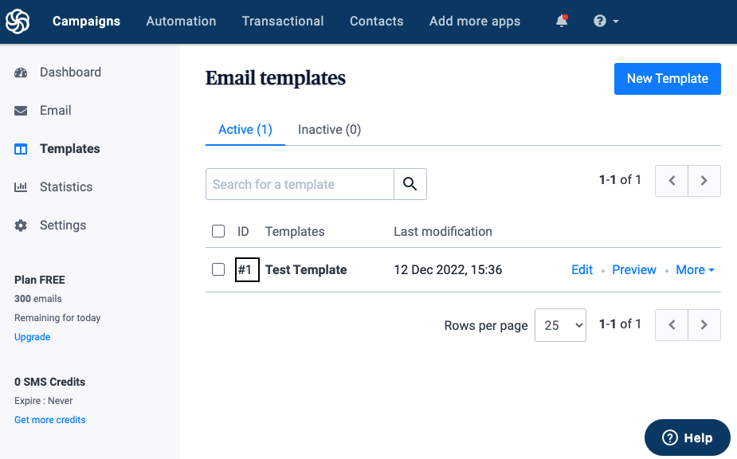

RudderStack supports sending event data to Sendinblue via the following <a href="https://rudderstack.com/docs/rudderstack-cloud/rudderstack-connection-modes/">connection modes</a>:

| **Connection Mode** | **Web** | **Mobile** | **Server** |
| :--- | :--- | :--- | :--- |
| Device mode | Supported | - | - |
| Cloud mode | Supported  | Supported | Supported |

In the web device mode integration, that is, using <Link to="/sources/event-streams/sdks/rudderstack-javascript-sdk">JavaScript SDK</Link> as a source, the Sendinblue native SDK is loaded from <code class="inline-code">https://www.googletagmanager.com/</code> domain. Based on your website's content security policy, you might need to <Link to="/sources/event-streams/sdks/rudderstack-javascript-sdk/load-js-sdk/#allowlist-destination-domain">allowlist this domain</Link> to load the Sendinblue SDK successfully.

Once you have confirmed that the source platform supports sending events to Sendinblue, follow these steps:

1. From your [RudderStack dashboard](https://app.rudderstack.com/), add a source. Then, from the list of destinations, select **Sendinblue**.
2. Assign a name and click **Continue**.

## Connection settings

To successfully configure Sendinblue as a destination, you will need to configure the following settings:

- **API Key:** Enter your Sendinblue API key. Refer to the <Link to="#faq">FAQ</Link> section for more information on obtaining the API key.
- **Client Key:** Enter your Sendinblue client key. Refer to the <Link to="#faq">FAQ</Link> section for more information on obtaining the client key.
- **Send Traits In Track:** Enable this setting to send user traits to Sendinblue via the `track` call. RudderStack updates the attributes of a contact corresponding to their traits in the `track` call.
- **DOI:** Enable this setting to create a contact using the DOI flow. If enabled, enter the following settings:
    - **Template ID:** Id of the Double opt-in (DOI) template.
    - **Redirection URL:** URL of the web page that the user will be redirected to after clicking on the verification email.
- **Rudder to Sendinblue Contacts Attributes Mapping:** Enter the traits in RudderStack's payload to be mapped to the [contact attributes in Sendinblue](https://my.sendinblue.com/lists/add-attributes).

## FAQ

### Where can I find the API key??

1. Log in to the [Sendinblue account](https://account-app.sendinblue.com/account/login).
2. Click on your profile and select **SMTP & API**. Here, you can find your existing API key or create a new one by clicking on **CREATE A NEW API KEY**, as shown:

### Where can I find the Client Key?

1. Log in to the [Sendinblue account](https://account-app.sendinblue.com/account/login).
2. Click **Automation** tab > **Script set up** under the **Help** section in the left navigation bar.
4. Select **JS Tracker** in the **Choose an installation option** step to obtain the **client_key** from the script, as shown:

### Where can I find the DOI templated ID?

1. Log in to the [Sendinblue account](https://account-app.sendinblue.com/account/login).
2. Click Templates in the left navigation bar to obtain your template's ID, as shown:

