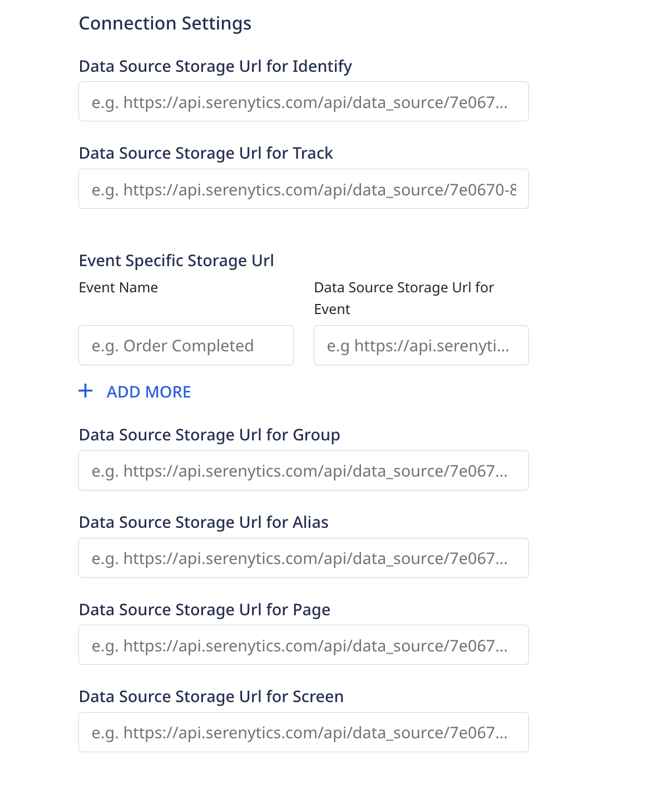

[Serenytics](https://www.serenytics.com/) is an all-in-one collaborative platform for data preparation and visualization. It comes with an embedded Redshift data warehouse, an ETL, a Python scheduler, and a dashboard editor. Serenytics can be used for marketing data such as Adobe Campaign, Selligent and Google Ads, SQL-based databases, for big data projects and more.

When combined with RudderStack, you can manipulate your data (aggregate, filter, create functions) and compute all the KPIs you need, creating live dashboards with your analysis, and sharing them easily.

Serenytics is optimal for small to mid-size companies looking to create dashboards and merge data from many sources with a simple platform.


<div class="infoBlock">
Find the open source transformer code for this destination in this <a href="https://github.com/rudderlabs/rudder-transformer/tree/master/v0/destinations/serenytics">GitHub repository</a>.
</div>

## Getting started

Before configuring Serenytics as a destination in RudderStack, verify if the source platform is supported by Serenytics by referring to the table below:

| **Connection Mode** | **Web**       | **Mobile**    | **Server**    |
| :------------------ | :------------ | :------------ | :------------ |
| **Device mode**     | - | -             | -             |
| **Cloud mode**      | **Supported** | **Supported** | **Supported** |


<div class="infoBlock">
To know more about the difference between cloud mode and device mode in RudderStack, refer to the <a href="https://rudderstack.com/docs/rudderstack-cloud/rudderstack-connection-modes/">RudderStack Connection Modes</a> guide.
</div>

Once you have confirmed that the source platform supports sending events to Serenytics, follow these steps:

- From your [**RudderStack dashboard**](https://app.rudderstack.com/), add the source. Then, from the list of destinations, select **Serenytics**.
- Assign a name to your destination and click **Next**.

### Connection settings

To configure Serenytics as a destination, first retrieve your data storage URL from the Serenytics dashboard. The URL should look something like ```https://api.serenytics.com/api/data_source/058ae0ed-0092-4fc3-83a9-fcc128e1f42d/push/7df2f94141a985582c6c125db8b8e413ae6afec2```

Add the data storage URL to the URL fields in **Connection Settings**:



## Supported Calls

All RudderStack events will be sent to Serenytics and stored in the Serenytics warehouse. The most common events for each RudderStack method will be mapped automatically to the Serenytics naming convention. See the method-specific table below for a reference of the standard mappings.

Properties/fields that are not included in the mapping tables will be passed as `trait_{key_name}` in the Serenytics dashboard.

For example, in this example RudderStack event:

```js
rudderanalytics.identify(
    "newUser",
    {
      email: "user@gmail.com",
      phone: "+919876543210",
      subscription: "youtube",
      channelName: ["b", "d", "e", "f", "g", "h", "i", "j", "k"],
      obj: {
        first: "Bob",
        last: "Smith",
      },
    }
  );
```

The `userId` and `email` properties will map to `user_id` and `email`, and the remaining traits will show up as `trait_phone`, etc.:

```json
{
  user_id: "newUser",
  email: "user@gmail.com",
  trait_phone: "+919876543210",
  trait_subscription: "youtube",
  trait_channelName: ["b", "d", "e", "f", "g", "h", "i", "j", "k"],
  trait_obj: {
    first: "Bob",
    last: "Smith",
  }
}
```

### Identify

The <Link to="/event-spec/standard-events/identify">`identify`</Link> call lets you uniquely identify a user and record any associated traits about them like their name, email, etc.

A sample `identify` call is shown below:

```javascript
rudderanalytics.identify("1hKOmRA4el9Zt1WSfVJIVo4GRlm", {
  likes_movies: true,
  favorite_color: "purple",
  age: 13
});
```

**Event parameter mapping**:

| RudderStack property | Serenytics property | Required? |
| --- | --- | --- |
| messageId | id  | No |
|  userId | user_id | No |
| ["context.ip", "request_ip"] | ["context.ip", "request_ip"] | No |
|  firstName | first_name | No |
|  lastName | last_name | No |
|  ["traits.age", "context.traits.age"] | age | No |
| email | email | No |
| receivedAt | received_at | No |
| sentAt | sent_at | No |
| originalTimestamp | original_timestamp | No |
| timestamp | timestamp | No |

### Track

The <Link to="/event-spec/standard-events/track">`track`</Link> call lets you capture user events along with the properties associated with them.

**Event parameter mapping**:

| RudderStack property | Serenytics property | Required? |
| --- | --- | --- |
| messageId | id | No |
| anonymousId | anonymous_id | No |
| event | event | Yes |
| ["context.ip", "request_ip"] | context_ip | No |
| receivedAt | received_at | No |
| sentAt | sent_at | No |
| originalTimestamp | original_timestamp | No |
| timestamp | timestamp | No |
| properties.price | price | No |
| properties.currency | currency | No |
| properties.product_id | product_id | No |
| properties.product_name | product_name | No |
### Group

The <Link to="/event-spec/standard-events/group">`group`</Link> call lets you link an identified user with a group such as a company, organization, or an account, and record any traits associated with that group, e.g., company name, number of employees, etc.

A sample `group` call is shown below:

```javascript
rudderanalytics.group(
  {
  userId: "1hKOmRA4el9Zt1WSfVJIVo4GRlm",
  likes_movies: true,
  age: 25,
  }
);
```

**Event parameter mapping**:

| RudderStack property | Serenytics property | Required? |
| --- | --- | --- |
| ["previousId", "anonymousId"] | previous_id | No |
| userId | user_id | Yes |
| ["context.ip", "request_ip"] | context_ip | No |
| receivedAt | received_at | No |
| sentAt | sent_at | No |
| originalTimestamp | original_timestamp | No |
| timestamp | timestamp | No |

### Page

The <Link to="/event-spec/standard-events/page/">`page`</Link> call lets you record your website's page views with any additional relevant information about the viewed page.

**Event parameter mapping**:

| RudderStack property | Destination property | Required? |
| --- | --- | --- |
| messageId | id | No |
| anonymousId | anonymous_id | No |
| ["name", "properties.name"] | name | No |
| ["context.ip", "request_ip"] | context_ip | No |
| receivedAt | received_at | No |
| sentAt | sent_at | No |
| originalTimestamp | original_timestamp | No |
| timestamp | timestamp | No |
| properties.category | category | No |
| properties.path | path | No |
| pageUrl |  url | No |
| properties.title | title | No |

### Screen

The <Link to="/event-spec/standard-events/screen/">`screen`</Link> call lets you record whenever your user views their mobile screen with any additional relevant information about the screen. 

<div class="infoBlock">
The <code class="inline-code">screen</code> call is the mobile equivalent of the <code class="inline-code">page</code> call.
</div>

**Event parameter mapping**:

| RudderStack property | Serenytics property | Required? |
| --- | --- | --- |
| messageId | id | No |
| anonymousId | anonymous_id | No |
| ["name", "properties.name"] | name | No |
| ["context.ip", "request_ip"] | context_ip | No |
| receivedAt | received_at | No |
| sentAt | sent_at | No |
| originalTimestamp | original_timestamp | No |
| timestamp | timestamp | No |
| properties.category | category | No |
| properties.path | path | No |
| pageUrl |  url | No |
| properties.title | title | No |

### Alias

The <Link to="/event-spec/standard-events/alias/">`alias`</Link> call lets you merge different identities of a known user.

**Event parameter mapping**:

| RudderStack property | Serenytics property | Required? |
| --- | --- | --- |
| ["previousId", "anonymousId"] | previous_id | No |
| userId | user_id | Yes |
| ["context.ip", "request_ip"] | context_ip | No |
| receivedAt | received_at | No |
| sentAt | sent_at | No |
| originalTimestamp | original_timestamp | No |
| timestamp | timestamp | No |

## FAQ

### How do I get the data storage URL?
    
1. Log in to the Serenytics dashboard and click the , then you see the dashboard click the **Data** tab.
1. From the data tab, click the `New data source` button then a popup appears then select the **Serenytics Datawarehouse** tab and and then **Storage**. 
1. From your newly-create source, retrieve `Url` from the **Configuration** tab. Use this URL to populate your connection settings in RudderStack.

