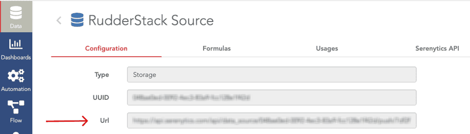

[Serenytics](https://www.serenytics.com/) is a full-featured platform for creating dashboards. Generate charts and track KPIs from multiple sources, and easily share results with management and cross-functional teams.

With this integration you can use the full range of RudderStack tools to create functions, transform and filter your events on their way to the Serenytics warehouse where you can then visualize your data.

<div class="infoBlock">
Find the open source code for this destination in this <a href="https://github.com/rudderlabs/rudder-transformer/tree/master/v0/destinations/serenytics">GitHub repository</a>.
</div>

## Getting started

RudderStack supports sending event data to Serenytics via the following <a href="https://rudderstack.com/docs/rudderstack-cloud/rudderstack-connection-modes/">connection modes</a>:

| **Connection Mode** | **Web**       | **Mobile**    | **Server**    |
| :------------------ | :------------ | :------------ | :------------ |
| **Device mode**     | - | -             | -             |
| **Cloud mode**      | **Supported** | **Supported** | **Supported** |

Once you have confirmed that the source platform supports sending events to Serenytics, follow these steps:

1. From your [RudderStack dashboard](https://app.rudderstack.com/), add the source. Then, from the list of destinations, select **Serenytics**.
2. Assign a name to your destination and click **Continue**.

## Connection settings

To configure Serenytics as a destination, first retrieve your data storage URL from the Serenytics dashboard under the **Data** tab. 

<br/>

Then in the RudderStack dashboard, add the data storage URL to the URL fields in **Connection Settings**.<br/>


## Supported Calls

All RudderStack events are sent to Serenytics and stored in the Serenytics warehouse. The most common events for each RudderStack method are mapped automatically to the Serenytics naming convention. See the method-specific table below for a reference of the standard mappings.

Properties/fields that are not included in the mapping tables are passed as `trait_{key_name}` in the Serenytics dashboard.

For example, in this example RudderStack event:

```js
rudderanalytics.identify(
    "newUser",
    {
      email: "user@gmail.com",
      phone: "+919876543210",
      subscription: "youtube",
      channelName: ["b", "d", "e", "f", "g", "h", "i", "j", "k"],
      obj: {
        first: "Bob",
        last: "Smith",
      },
    }
  );
```

The `userId` and `email` properties are mapped to `user_id` and `email`, and the remaining traits are mapped as `trait_phone`, etc.:

```json
{
  user_id: "newUser",
  email: "user@gmail.com",
  trait_phone: "+919876543210",
  trait_subscription: "youtube",
  trait_channelName: ["b", "d", "e", "f", "g", "h", "i", "j", "k"],
  trait_obj: {
    first: "Bob",
    last: "Smith",
  }
}
```

### Identify

The <Link to="/event-spec/standard-events/identify">`identify`</Link> call lets you uniquely identify a user and record any associated traits about them like their name, email, etc.

A sample `identify` call is shown below:

```javascript
rudderanalytics.identify("1hKOmRA4el9Zt1WSfVJIVo4GRlm", {
  likes_movies: true,
  favorite_color: "purple",
  age: 13
});
```

**Event parameter mapping**:

| RudderStack property | Serenytics property | 
| --- | --- | 
| `messageId` | `id`  | 
| `userId` | `user_id` | 
| `context.ip`<br/> `request_ip` | `context.ip`<br/>`request_ip` | 
| `firstName` | `first_name` | 
| `lastName` | `last_name` | 
| `traits.age`<br/> `context.traits.age` | `age` | 
| `email` | `email` | 
| `receivedAt` | `received_at` |
| `sentAt` | `sent_at` | 
| `originalTimestamp` | `original_timestamp` | 
| `timestamp` | `timestamp` | 

### Track

The <Link to="/event-spec/standard-events/track">`track`</Link> call lets you capture user events along with the properties associated with them.

**Event parameter mapping**:

| RudderStack property | Serenytics property | 
| --- | --- | 
| `event` <br/> <span style="color: #4D4DFF;font-size:12px;">Required</span> | `event` | 
| `messageId` | `id` | 
| `anonymousId` | `anonymous_id` | 
| `context.ip` <br/>`request_ip` | `context_ip` | 
| `receivedAt` | `received_at` |
| `sentAt` | `sent_at` | 
| `originalTimestamp` | `original_timestamp` |
| `timestamp` | `timestamp` | 
| `properties.price` | `price` | 
| `properties.currency` | `currency` | 
| `properties.product_id` | `product_id` | 
| `properties.product_name` | `product_name` | 

### Group

The <Link to="/event-spec/standard-events/group">`group`</Link> call lets you link an identified user with a group such as a company, organization, or an account, and record any traits associated with that group, for example, company name, number of employees, etc.

A sample `group` call is shown below:

```javascript
rudderanalytics.group(
  {
  userId: "1hKOmRA4el9Zt1WSfVJIVo4GRlm",
  likes_movies: true,
  age: 25,
  }
);
```

**Event parameter mapping**:

| RudderStack property | Serenytics property  |
| --- | --- | 
| `groupId` <br/> <span style="color: #4D4DFF;font-size:12px;">Required</span>| `id` |
| `context.ip` <br/>`request_ip` | `context_ip` |
| `receivedAt` | `received_at` |
| `sentAt` | `sent_at` |
| `originalTimestamp` | `original_timestamp` |
| `timestamp` | `timestamp` |

### Page

The <Link to="/event-spec/standard-events/page/">`page`</Link> call lets you record your website's page views with any additional relevant information about the viewed page.

**Event parameter mapping**:

| RudderStack property | Destination property | 
| --- | --- | 
| `messageId` | `id` |
| `anonymousId` | `anonymous_id` |
| `name` <br/>`properties.name` | `name` |
| `context.ip` <br/>`request_ip` | `context_ip` |
| `receivedAt` | `received_at` |
| `sentAt` | `sent_at` |
| `originalTimestamp` | `original_timestamp` |
| `timestamp` | `timestamp` |
| `properties.category` | `category` |
| `properties.path` | `path` |
| `pageUrl` |  `url` |
| `properties.title` | `title` |

### Screen

The <Link to="/event-spec/standard-events/screen/">`screen`</Link> call lets you record whenever your user views their mobile screen with any additional relevant information about the screen. 

**Event parameter mapping**:

| RudderStack property | Serenytics property |
| --- | --- | 
| `messageId` | `id` |
| `anonymousId` | `anonymous_id` |
| `name` <br/>`properties.name` | `name` |
| `context.ip` <br/>`request_ip` | `context_ip` |
| `receivedAt` | `received_at` |
| `sentAt` | `sent_at` |
| `originalTimestamp` | `original_timestamp` |
| `timestamp` | `timestamp` |
| `properties.category` | `category` |
| `properties.path` | `path` |
| `pageUrl` |  `url` |
| `properties.title` | `title` |

### Alias

The <Link to="/event-spec/standard-events/alias/">`alias`</Link> call lets you merge different identities of a known user.

**Event parameter mapping**:

| RudderStack property | Serenytics property | 
| --- | --- | 
| `userId` <br/> <span style="color: #4D4DFF;font-size:12px;">Required</span>| `user_id` | 
| `previousId` <br/>`anonymousId` | `previous_id` |
| `context.ip` <br/>`request_ip` | `context_ip` | 
| `receivedAt` | `received_at` | 
| `sentAt` | `sent_at` | 
| `originalTimestamp` | `original_timestamp` | 
| `timestamp` | `timestamp` | 

## FAQ

### How do I get the data storage URL?
    
1. Log in to the [Serenytics dashboard](https://app.serenytics.com/studio/login) and click the **Data** tab.
2. Click the **New data source** button and select the **Serenytics Datawarehouse** tab > **Storage** from the popup. 
3. From your newly-create source, retrieve the `Url` from the **Configuration** tab. Use this URL to populate your connection settings in RudderStack.