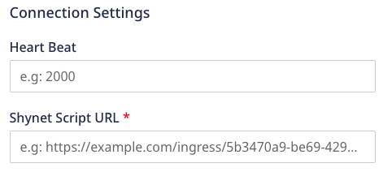

[Shynet](https://github.com/milesmcc/shynet) is an open source web analytics tool which works without cookies and is privacy-friendly.
RudderStack supports Shynet as a destination to which you can seamlessly send your event data.

<div class="infoBlock">
Find the open source transformer code for this destination in the <a href="https://github.com/rudderlabs/rudder-transformer/tree/master/v0/destinations/shynet">GitHub repository</a>.
</div>

## Getting started

Before configuring Shynet as a destination in RudderStack, verify if the source platform is supported by Shynet by referring to the table below:

| **Connection Mode** | **Web** | **Mobile** | **Server** |
| :--- | :--- | :--- | :--- |
| **Device mode** | **Supported**  | - | - |
| **Cloud mode** | **Supported**  | **Supported** | **Supported** |

<div class="infoBlock">
To know more about the difference between cloud mode and device mode in RudderStack, refer to the <Link to="/destinations/rudderstack-connection-modes/">RudderStack Connection Modes</Link> guide.
</div>

Once you have confirmed that the source platform supports sending events to Shynet, follow these steps:

1. From your [RudderStack dashboard](https://app.rudderstack.com/), add a source. Then, from the list of destinations, select **Shynet**.
2. Assign a name to the destination and click on **Continue**.

## Connection settings

To successfully configure Shynet as a destination, you will need to configure the following settings:



- **Heart Beat**: Enter the time (in ms) to send a ping request. The default value is 5000 ms.
- **Shynet Script URL**: Enter the script URL generated by Shynet for your service.

<div class="infoBlock">
For more information on getting your Shynet script URL, refer to the <a href="#faq">FAQ</a> section below.
</div>

### Client-side events filtering


This setting lets you specify which events should be blocked or allowed to flow through to Shynet.

<div class="infoBlock">
This option is applicable only if you're sending events to Shynet via the web device mode. Refer to the <Link to="/sources/event-streams/sdks/event-filtering/">Client-side Event Filtering</Link> guide for more information on this feature.
</div>

### Web SDK settings


These settings are applicable only if you are sending events to Shynet via web device mode.

- **Use device-mode to send events**: Enable this setting to send events from the JavaScript SDK to Shynet via the <Link to="/destinations/rudderstack-connection-modes/#device-mode">device mode</Link>.

- **OneTrust Cookie Categories**: Use this setting to map <Link to="/sources/sdks/rudderstack-javascript-sdk/consent-managers/onetrust/">OneTrust</Link> cookie consent groups to RudderStack's consent purposes.

## Page 

The <Link to="/event-spec/standard-events/page">`page`</Link> call lets you record your website's page views with any additional relevant information about the viewed page.

### Cloud mode

A sample `page` call for <Link to="/destinations/rudderstack-connection-modes/#cloud-mode">cloud mode</Link> is shown below:

```javascript

```

The following table lists the mapping for the **required** property between RudderStack and Shynet:

| RudderStack property | Shynet property | Data type | 
| :----------------- | :--------------- |:--------------- |
| `context.page.loadTime`        | `loadTime`       | Integer |


### Device mode

A sample `page` call for <Link to="/destinations/rudderstack-connection-modes/#device-mode">device mode</Link> is shown below:

```javascript
rudderanalytics.page("Home");
```

## FAQ

### Where can I find the Shynet script URL?

To find the Shynet script URL, follow these steps:
1. Log into your Shynet dashboard.
2. From **Services**, select your service and click **Manage**.
3. Copy the script URL, as shown:

