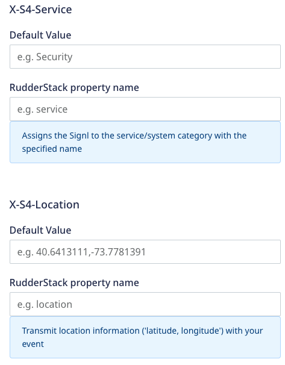
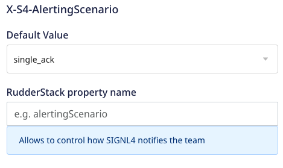

[SIGNL4](https://www.signl4.com/) is a tool for instant mobile alerting which generates real-time alerts to inform teams about any incidents. It automatically delivers critical information to the right people at the right time.

<div class="infoBlock">
Find the open source transformer code for this destination in the <a href="https://github.com/rudderlabs/rudder-transformer/tree/master/v0/destinations/signl4">GitHub repository</a>.
</div>

## Getting started

RudderStack supports sending events to SIGNL4 via the following <a href="https://rudderstack.com/docs/rudderstack-cloud/rudderstack-connection-modes/">connection modes</a>:

| **Connection Mode** | **Web** | **Mobile** | **Server** |
| :--- | :--- | :--- | :--- |
| **Device mode** | -  | - | - |
| **Cloud mode** | **Supported**  | **Supported** | **Supported** |

Once you have confirmed that the source platform supports sending events to SIGNL4, follow these steps:

1. From your [RudderStack dashboard](https://app.rudderstack.com/), add a source. Then, from the list of destinations, select **SIGNL4**.
2. Assign a name to the destination and click **Continue**.

## Connection settings

To successfully configure SIGNL4 as a destination, you will need to configure the following settings:

- **API Key**: Enter the team secret of your SIGNL4 team. Refer to the <a href="#faq">FAQ</a> section to know about how to obtain the team secret.
- **Event to title mapping**: Enter the event name and alert title which you want to be mapped correspondingly.

To understand the following connection settings in detail, refer to the [SIGNL4 documentation](https://connect.signl4.com/webhook/docs/index.html):
- X-S4-Service
- X-S4-Location
- X-S4-AlertingScenario
- X-S4-ExternalID
- X-S4-Status
- X-S4-Filtering





Except for **X-S4-Filtering**, RudderStack dashboard provides the following fields for each of the above-mentioned settings:

- **Default Value**: Enter the actual value for the setting.
- **RudderStack property name**: Enter a property name whose actual value will be taken from the payload and assigned to the setting.

Although these fields are optional, the higher priority is given to the **RudderStack property name** if both are specified,.

For example:
- If you provide `new` in the **Default value** for **X-S4-Status**. The output payload will contain `X-S4-Status: new`.
- If you provide `alert_status` in the **RudderStack property name** field. Then, the value for **X-S4-Status** will be taken from `properties.alert_status`. Susppose the value for `properties.alert_status` is set to `resolved`. Hence, the output payload will contain `X-S4-Status: resolved`.

If you provide values in both the fields, the final output payload will contain `X-S4-Status: resolved`, as the **RudderStack property name** field is given higher priority.

## Track

The <Link to="/event-spec/standard-events/track">`track`</Link> call can be used to push alerts for the events having a particular alert title, alert message, or other additional details.

The category of alert raised in the SIGNL4 dashboard is decided on the basis of keywords in the payload. Reference: [here](https://account.signl4.com/manage/Category). For example, an event payload containing any of the keywords like `ambulance` ,`doctor` ,`hospital` ,`nurse`, `surgery` etc., are categorized as **Healthcare**.

A sample `track` call is shown below:

```javascript
rudderanalytics.track(event, {
  "status": "UP",
  "message": "Agressive passenger",
  "Source": "Gate agent",
  "Type": "Security"
});
```

You can pass any key-value pair in the `track` call which is mapped as it is in the SIGNL4 destination.

### Property mapping

The following table lists the mappings between RudderStack and SIGNL4 properties:

| RudderStack property | SIGNL4 property | Presence | Deescription | 
| :----------------- | :--------------- |:--------------- |:--------------- |
| `event`     | `Title`      | Required | Alert Title |
| `property.message`   | `message`     | Optional  | Alert Message (Text) |

## FAQ

### Where can I find the SIGNL4 API Key?

The team secret of your SIGNL4 team is the API key in RudderStack dashboard. To find the team secret, follow these steps:

1. Log into your [SIGNL4 dashboard](https://connect.signl4.com/)
2. Select **Teams**, as shown:


### How can I create a member in the SIGNL4 team?

To create a member in the SIGNL4 team, follow these steps:

1. Log into your [SIGNL4 dashboard](https://connect.signl4.com/)
2. Select **Users** > **Invite new user**, as shown:

