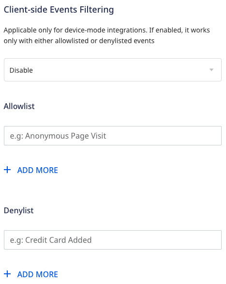
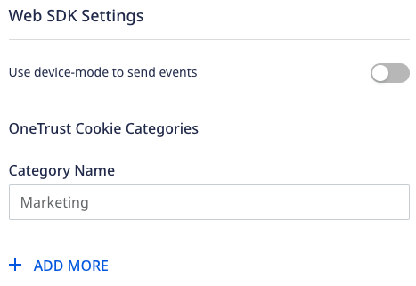
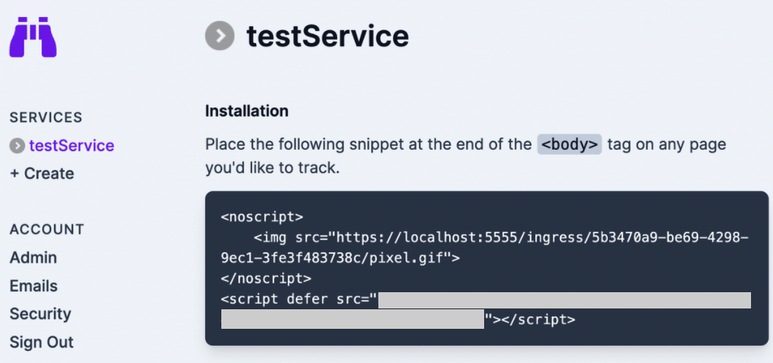

[Signl4](https://www.signl4.com/) is a tool for instant mobile alerting which generates real-time alerts to inform teams about any incidents. It automatically delivers critical information to the right people at the right time.

<div class="infoBlock">
Find the open source transformer code for this destination in the <a href="https://github.com/rudderlabs/rudder-transformer/tree/master/v0/destinations/signl4">GitHub repository</a>.
</div>

## Getting started

RudderStack supports sending events to Signl4 via the following <a href="https://rudderstack.com/docs/rudderstack-cloud/rudderstack-connection-modes/">connection modes</a>

| **Connection Mode** | **Web** | **Mobile** | **Server** |
| :--- | :--- | :--- | :--- |
| **Device mode** | -  | - | - |
| **Cloud mode** | **Supported**  | **Supported** | **Supported** |

Once you have confirmed that the source platform supports sending events to Signl4, follow these steps:

1. From your [RudderStack dashboard](https://app.rudderstack.com/), add a source. Then, from the list of destinations, select **Signl4**.
2. Assign a name to the destination and click **Continue**.

## Connection settings

To successfully configure Signl4 as a destination, you will need to configure the following settings:


- **API Key**: Enter the team secret of your SIGNL4 team.

X-S4-Service
X-S4-Location
X-S4-AlertingScenario
X-S4-ExternalID
X-S4-Status
- **Default Value**: Enter the script URL generated by Signl4 for your service.
- **RudderStack property name**:

X-S4-Filtering

- **Enable to add filter**: 

- **Event to title mapping**:

<div class="infoBlock">
For more information on getting your Signl4 script URL, refer to the <a href="#faq">FAQ</a> section below.
</div>

### Client-side events filtering



This setting lets you specify which events should be blocked or allowed to flow through to Signl4.

<div class="infoBlock">
This option is applicable only if you're sending events to Signl4 via the web device mode. Refer to the <Link to="/sources/event-streams/sdks/event-filtering/">Client-side Event Filtering</Link> guide for more information on this feature.
</div>

### Web SDK settings



These settings are applicable only if you are sending events to Signl4 via web device mode.

- **Use device-mode to send events**: Enable this setting to send events from the JavaScript SDK to Signl4 via the <Link to="/destinations/rudderstack-connection-modes/#device-mode">device mode</Link>.

- **OneTrust Cookie Categories**: Use this setting to map <Link to="/sources/sdks/rudderstack-javascript-sdk/consent-managers/onetrust/">OneTrust</Link> cookie consent groups to RudderStack's consent purposes.

## Page 

The <Link to="/event-spec/standard-events/page">`page`</Link> call lets you record your website's page views with any additional relevant information about the viewed page.

A sample `page` call for <Link to="/destinations/rudderstack-connection-modes/#cloud-mode">cloud mode</Link> is shown below:

```javascript
rudderanalytics.track(event, {
  "status": "UP",
  "message": "Agressive passenger",
  "Source": "Gate agent",
  "Type": "Security"
});
```

The following table lists the mappings between RudderStack and Signl4 properties:

| RudderStack property | Signl4 property | Presence | Deescription | 
| :----------------- | :--------------- |:--------------- |:--------------- |
| `event`<br/> (required)       | `Title`      | Required | Alert Title |
| `property.message`   | `message`     | Optional  | Alert Message (Text) |

<div class="infoBlock">
Although the <code class="inline-code">context.page.url</code> is a required property, it is taken as the URL of the current page automatically by <code class="inline-code">rudderanalytics</code>, if not specified.
</div>

## FAQ

### Where can I find the Signl4 API Key?

To find the Signl4 script URL, follow these steps:
1. Log into your Signl4 dashboard.
2. From **Services**, select your service and click **Manage**.
3. Copy the script URL, as shown:



### How can I create a member in the team in SIGNL4?
