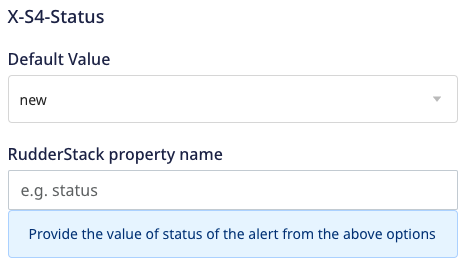
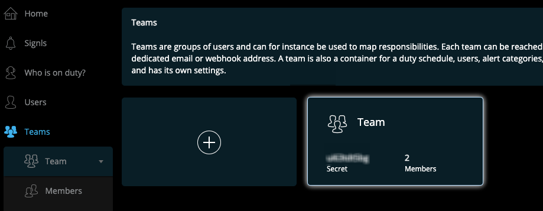

[SIGNL4](https://www.signl4.com/) is a tool for instant mobile alerting. It generates real-time alerts to inform teams about any incidents and automatically delivers critical information to the right people at the right time.

<div class="successBlock">
RudderStack also supports SIGNL4 as a source. Refer to the <Link to="/sources/event-streams/cloud-apps/signl4/">SIGNL4 source</Link> documentation for more information.
</div>

<div class="infoBlock">
Find the open source transformer code for this destination in the <a href="https://github.com/rudderlabs/rudder-transformer/tree/master/v0/destinations/signl4">GitHub repository</a>.
</div>

## Getting started

RudderStack supports sending events to SIGNL4 via the following <a href="https://rudderstack.com/docs/rudderstack-cloud/rudderstack-connection-modes/">connection modes</a>:

| **Connection Mode** | **Web** | **Mobile** | **Server** |
| :--- | :--- | :--- | :--- |
| **Device mode** | -  | - | - |
| **Cloud mode** | **Supported**  | **Supported** | **Supported** |

Once you have confirmed that the source platform supports sending events to SIGNL4, follow these steps:

1. From your [RudderStack dashboard](https://app.rudderstack.com/), add a source. Then, from the list of destinations, select **SIGNL4**.
2. Assign a name to the destination and click **Continue**.

## Connection settings

To successfully configure SIGNL4 as a destination, you will need to configure the following settings:

- **API Key**: Enter the team secret of your SIGNL4 team. Refer to the <a href="#faq">FAQ</a> section to know about how to obtain the team secret.
- **X-S4-Service**: Enter a category for the alert, for example, IT. Refer to the <Link to="#signl-categories">Signl categories</Link> section to know more about these categories.

- **X-S4-Location**: Enter the location in `latitude, longitude` format to display the correct location on the map in the mobile app.

- **X-S4-Status**: Enter the status of the alert by choosing the **new**, **acknowledged**, or **resolved** values.

- **X-S4-AlertingScenario**: Enter a value to control how SIGNL4 notifies the team:
  - single_ack: Only one person needs to acknowledge the alert.
  - multi_ack: All on-duty persons need to acknowledge the alert. 
  - emergency: All persons irrespective of their duty status are notified and need to acknowledge the alert.

- **X-S4-ExternalID**: Use this field to pass the unique ID of a record, if an event originates from that record in a third party system. 


As can be observed, RudderStack dashboard provides the following fields for each of the above-mentioned settings:

- **Default Value**: Enter the actual value for the field.
- **RudderStack property name**: Enter a property name whose actual value will be taken from the payload and assigned to the field.

Although these fields are optional, a higher priority is given to the **RudderStack property name** if both are specified. For example:
- If you provide `new` in the **Default value** field for **X-S4-Status**, the output payload will contain `X-S4-Status: new`.
- If you provide `alert_status` in the **RudderStack property name** field, then the value for **X-S4-Status** will be taken from `properties.alert_status`. Suppose the value for `properties.alert_status` is set to `resolved`, the output payload will contain `X-S4-Status: resolved`.

If you provide values in both fields, the final output payload will contain `X-S4-Status: resolved`, as the **RudderStack property name** is given a higher priority.

- **X-S4-Filtering**: Enable this setting and **Filter events/Signls** setting in the SIGNL4 dashboard to send an alert notification only if the input payload contains any keyword for a category. Refer to the <Link to="#signl-categories">Signl categories</Link> section to know more about keywords and category categories.


<div class="infoBlock">
Refer to the <a href="https://connect.signl4.com/webhook/docs/index.html">SIGNL4 documentation</a> to know more about these connection settings.
</div>

- **Event to title mapping**: Enter the event name and alert title you want to be mapped corresponding to each other.


## Signl categories

In SIGNL4, the categories can be used to mark and tag Signls, for example, based on severity, type or relating IT systems, machines, sensors and services. Refer to the [SIGNL4 documentation](https://account.signl4.com/manage/Category) to know more about different categories.

The keywords present in the payload decide the category of an alert raised in the SIGNL4 dashboard. For example, an event payload containing keywords like `ambulance`, `doctor`, `hospital`, `nurse`, `surgery`, etc., is categorized as **Healthcare**.


## Track

The <Link to="/event-spec/standard-events/track">`track`</Link> call can be used to push alerts for events with a particular alert title, alert message, or other additional details.

A sample `track` call is shown below:

```javascript
rudderanalytics.track(event, {
  "status": "UP",
  "message": "Agressive passenger",
  "Source": "Gate agent",
  "Type": "Security"
});
```

You can pass any key-value pair in the `track` call, which is mapped as it is in the SIGNL4 destination.

### Property mapping

The following table lists the mappings between RudderStack and SIGNL4 properties:

| RudderStack property | SIGNL4 property | Presence | Deescription | 
| :----------------- | :--------------- |:--------------- |:--------------- |
| `event`     | `title`      | Required | Title of the alert. |
| `property.message`   | `message`     | Optional  | Text message of the alert. |

## FAQ

### Where can I find the SIGNL4 API Key?

The team secret of your SIGNL4 team is the SIGNL4 API key in the RudderStack dashboard. To find the team secret, follow these steps:

1. Log into your [SIGNL4 dashboard](https://connect.signl4.com/).
2. Select **Teams** to find the **Secret**, as shown:



### How can I create a member in the SIGNL4 team?

To create a member in the SIGNL4 team, follow these steps:
1. Log into your [SIGNL4 dashboard](https://connect.signl4.com/).
2. Select **Users** > **Invite new user**, as shown:

