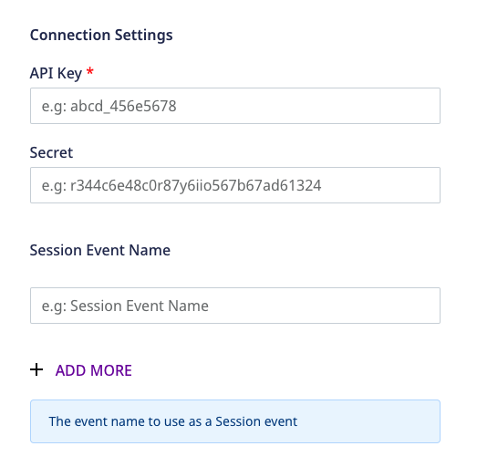
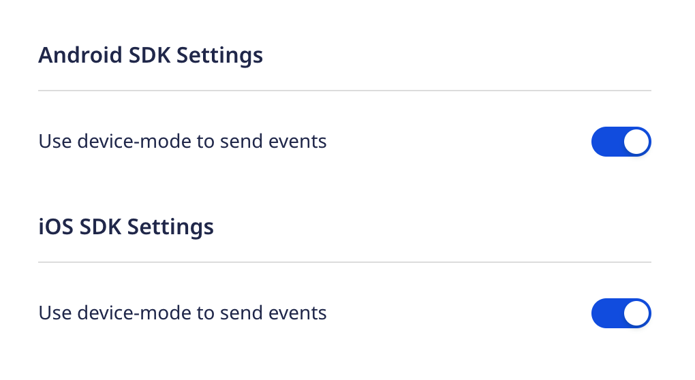
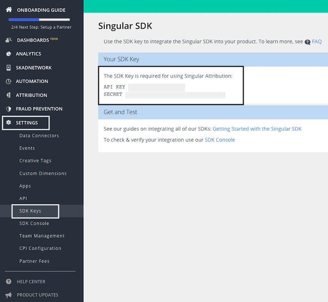

Before configuring Singular as a destination in RudderStack, verify if the source platform is supported by Singular by referring to the table below:

| **Connection Mode** | **Web**       | **Mobile**    | **Server** |
| :------------------ | :------------ | :------------ | :--------- |
| **Device mode**     | -             | **Supported** | -          |
| **Cloud mode**      | **Supported**            | **Supported**             | **Supported**        |

To know more about the difference between cloud mode and device mode in RudderStack, refer to the <Link to="/destinations/rudderstack-connection-modes/">RudderStack Connection Modes</Link> guide.

Once you have confirmed that the source platform supports sending events to Singular, follow these steps:

1. From your [RudderStack dashboard](https://app.rudderstack.com/), add the source. Then, from the list of destinations, select **Singular**.
2. Assign a name to your destination and click on **Continue**.

### Connection settings

To successfully configure Singular as a destination, you need to configure the following settings:

- **API Key**: Enter your Singular API key here. This is a mandatory field. 
- **Secret**: Enter your Singular secret. This is a mandatory field and is required for the device mode integrations with the RudderStack iOS and Android SDKs.

For more information on obtaining the Singular API key and secret, refer to the <a href="#faq">FAQ</a> section below.

- **Session Event Name**: Enter the event names to be used as session events. This setting is applicable only for sending events via the cloud mode.

For more information on sending session events to Singular, refer to the <Link to="/destinations/streaming-destinations/singular/singular-cloud-mode/">Singular Cloud Mode</Link> guide.

- **Use device mode to send events**: When using the Android or iOS platforms, you can enable this setting to send events via the <Link to="/destinations/rudderstack-connection-modes/#device-mode">device mode</Link>. Then, follow the <Link to="/destinations/streaming-destinations/singular/singular-device-mode/">Singular Device Mode</Link> guide for steps on adding Singular to your project.

When sending events via the device mode, RudderStack also lets you specify which events should be discarded or allowed to flow through. For more information, refer to the <Link to="/sources/sdks/event-filtering/">Client-side Event Filtering</Link> guide.

## FAQ

### Where can I find the Singular API key and secret?

To obtain your Singular API key and secret, log into your [Singular dashboard](https://app.singular.net/login?redir=%2F#/) and navigate to **Settings** > **SDK Keys**, as shown:

## Contact us

For queries on any of the sections covered in this guide, you can [contact us](mailto:%20docs@rudderstack.com) or start a conversation in our [Slack](https://rudderstack.com/join-rudderstack-slack-community) community.
