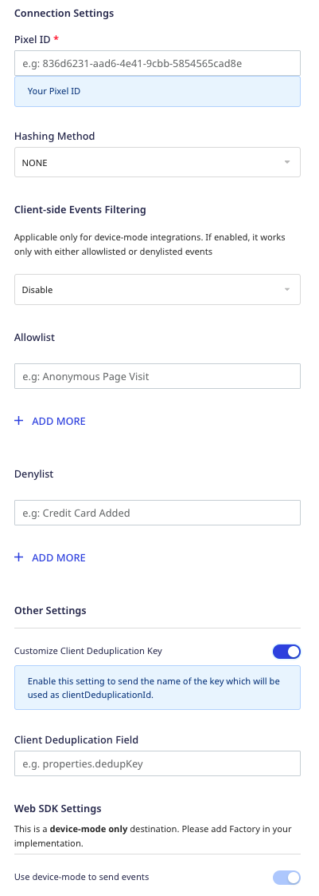
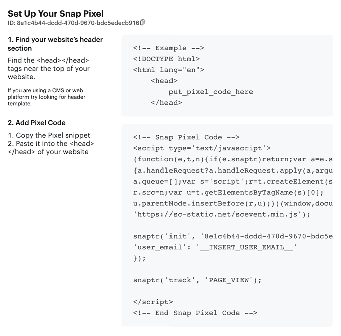

The [Snap Pixel](https://ads.snapchat.com/) is a piece of JavaScript code that lets you measure the cross-device impact of your advertising campaigns. It enables you to understand how many Snapchat users interact with your website after seeing the ads.

RudderStack supports Snap Pixel as a destination where you can seamlessly send your event data.

## Getting started

Before configuring Snap Pixel as a destination in RudderStack, verify if the source platform is supported by Snap Pixel by referring to the table below:

| **Connection Mode** | **Web** | **Mobile** | **Server** |
| :--- | :--- | :--- | :--- |
| **Device mode** | **Supported** | - | - |
| **Cloud mode** | - | - | - |

<div class="infoBlock">
To know more about the difference between cloud mode and device mode in RudderStack, refer to the <Link to="/destinations/rudderstack-connection-modes/">RudderStack Connection Modes</Link> guide.
</div>

Once you have confirmed that the source supports sending events to Snap Pixel, follow these steps:

1. From your [RudderStack dashboard](https://app.rudderstack.com/), add the source. From the list of destinations, select **Snap Pixel**.
2. Assign a name to the destination and click on **Continue**.

## Connection settings

To set up Snap Pixel as a destination, you need to configure the following settings:



- **Pixel ID**: Enter your Snap Pixel ID.

<div class="infoBlock">
For more information on obtaining your Snap Pixel ID, refer to the <Link to="#faq">FAQ</Link> section below.
</div>

- **Hashing Method**: Snap Pixel lets you pass a user parameter (`email` or `phone`) in both hashed and non-hashed format during the snippet's intialization. If you choose **SHA-256**, RudderStack will hash-encode the parameter before passing it to Snap Pixel.
- **Client-side Events Filtering**: This setting lets you specify which events should be blocked or allowed to flow through to Snap Pixel.

<div class="infoBlock">
For more information on this setting, refer to the <Link to="https://www.rudderstack.com/docs/sources/sdks/event-filtering/">Client-side Events Filtering</Link> guide.
</div>

- **Customize Client Deduplication Key**: Enable this setting to set a custom client deduplication ID in Snap Pixel.

<div class="infoBlock">
For more information on this setting, refer to the <Link to="#setting-custom-client-deduplication-key">Setting custom client deduplication key</Link> section below.
</div>

- **Use device mode to send events**: As this destination supports sending events only via the <Link to="/destinations/rudderstack-connection-modes/#device-mode">web device mode</Link>, this setting will be automatically enabled.

## Identify

The <Link to="/event-spec/standard-events/identify/">`identify`</Link> call is used to initialize the Snap Pixel code.

RudderStack checks the cookies for the user parameter (`email` or `phone`) before loading the Snap Pixel snippet. If the parameter is present, RudderStack loads the snippet. Otherwise, it loads the snippet **without passing** the user parameter.

<div class="infoBlock">
Snapchat strongly recommends passing a user parameter (either <code class="inline-code">email</code> or <code class="inline-code">phone</code>) through the Snap Pixel, as it lets you get better insights into your tracked conversions and creates more robust Pixel Custom Audiences. For more information, refer to the <a href="https://businesshelp.snapchat.com/s/article/pixel-website-install?language=en_US">Snap Pixel FAQ</a>.
</div>

A sample `identify` call is as shown:

```javascript
rudderanalytics.identify({
  email: "alex@example.com",
  phone: "+1-202-555-0146"
});   
```

The following table lists the user parameters along with the relative mapping to the Snap Pixel parameters:

| **RudderStack user parameter** | **Snap Pixel user parameter** |
| :--- | :--- |
| `email` | `user_email` |
| `phone` | `user_phone_number` |

## Page

When the <Link to="/event-spec/standard-events/page/">`page`</Link> call is made, RudderStack sends the following call to Snap Pixel:

```
snaptr("track", "PAGE_VIEW")
```

<div class="infoBlock">
You can make the <code class="inline-code">page</code> call with or without the event payload.
</div>

A sample `page` call is as shown:

```javascript
rudderanalytics.page();
```

## Track

The <Link to="/event-spec/standard-events/track/">`track`</Link> call lets you send Snap Pixel events.

A sample `track` call is as shown below:

```javascript
rudderanalytics.track('Order Completed', {
  'currency': 'USD',
  'price': 333.33,
  'order_id': '11111111'
});
```

You can also send the following <Link to="/event-spec/ecommerce-events-spec/">RudderStack e-commerce events</Link>:

| **RudderStack event** | **Snap Pixel event** |
| :--- | :--- |
| `Order Completed` | `PURCHASE` |
| `Checkout Started` | `START_CHECKOUT` |
| `Product Added` | `ADD_CART` |
| `Payment Info Entered` | `ADD_BILLING` |
| `Promotion Clicked` | `AD_CLICK` |
| `Promotion Viewed` | `AD_VIEW` |
| `Product Added To Wishlist` | `ADD_TO_WISHLIST` |
| `Product Viewed` | `VIEW_CONTENT` |
| `Product List Viewed` | `VIEW_CONTENT` |
| `Products Searched` | `SEARCH` |

<div class="warningBlock">
RudderStack maps <code class="inline-code">order_id</code> to Snap Pixel's <code class="inline-code">transaction_id</code> only in case of the <code class="inline-code">Order Completed</code> event.  
</div>

<div class="infoBlock">
For more information on the Snap Pixel events, refer to the <a href="https://businesshelp.snapchat.com/s/article/pixel-website-install?language=en_US">Snapchat documentation</a>.
</div>

Snap Pixel supports up to 5 custom events, as listed below:

- `CUSTOM_EVENT_1`
- `CUSTOM_EVENT_2`
- `CUSTOM_EVENT_3`
- `CUSTOM_EVENT_4`
- `CUSTOM_EVENT_5`

## Setting custom client deduplication key

RudderStack lets you define the client deduplication key for event deduplication.  Enable the **Customize Client Deduplication Key** setting in the dashboard to use this feature.

The following scenarios describe the different ways RudderStack sets the custom deduplication key:

### Scenario 1: Passing the key in the event properties

Suppose you enable the **Customize Client Deduplication Key** setting and set the **Client Deduplication Field** to `properties.dedup`. RudderStack then sets the client deduplication ID with the value associated with `properties.dedup`, as shown in the following snippet:

```javascript
rudderanalytics.track(
  "SHARE", {
    dedup: "mydedupid",
    checkout_id: "12345",
    product_name: "Red T-shirt",
    product_url: "http://www.sampledomain.com/products/myred-t-shirt",
  }, {
    integrations: {},
  }
);
```

In this case, RudderStack sets `mydedupid` as the client deduplication ID.

### Scenario 2: Passing the `messageId` as the deduplication key

Suppose you enable **Customize Client Deduplication Key** and leave the **Client Deduplication Field** empty. In this case, RudderStack sets the event's `messageId` as the client deduplication ID.

### Scenario 3: Passing wrong/missing field in the dashboard settings

Suppose you enable **Customize Client Deduplication Key** and set the **Client Deduplication Field**, but the field is either missing or has a different name in the event. In this case, RudderStack **does not set** the client deduplication ID.

For example, if you set **Client Deduplication Field** to `properties.dedup` and the event contains `properties.deduplication` instead, then RudderStack sends the event to Snap Pixel **without setting** the client deduplication ID.

## FAQ

### Where can I find the Snap Pixel ID?

To get your Snap Pixel ID, follow these steps:

1. Go to your [Snap Ads Manager](https://ads.snapchat.com/) account. 
2. Under **Events Manager**, go to **View Pixel Details** > **Setup Pixel**. 
3. You can find the Pixel ID under **Set Up Your Snap Pixel**, as shown:


