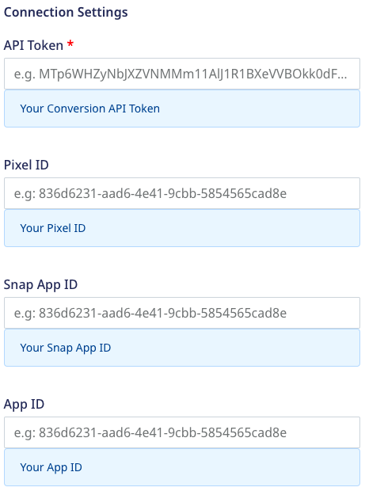
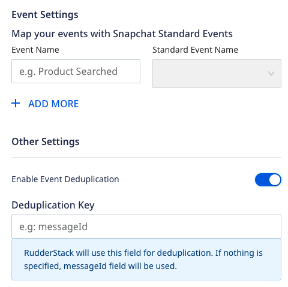
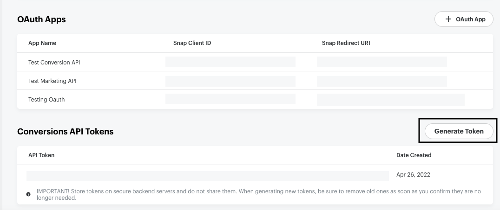
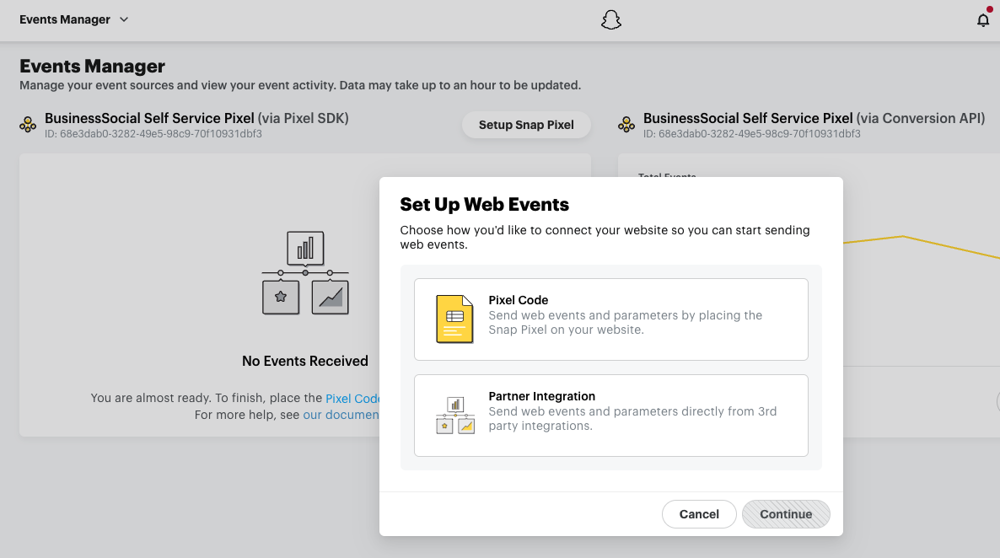
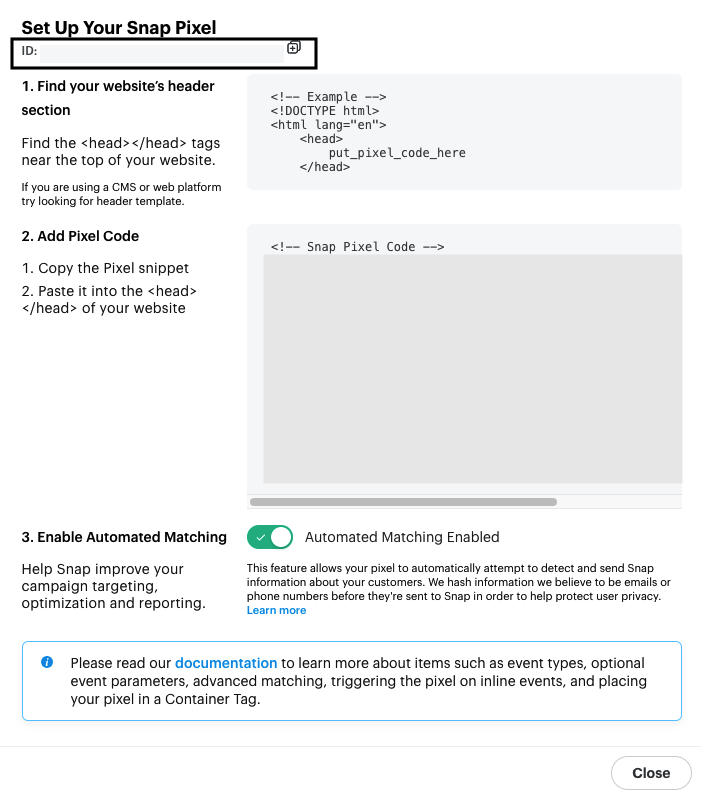
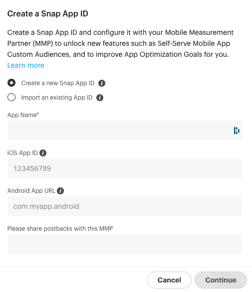

Snapchat's [Conversions API](https://businesshelp.snapchat.com/s/article/conversions-api?language=en_US) lets you send your web, mobile, and offline events to Snapchat via a S2S (server-to-server) integration. You can then leverage this data to optimize your Snapchat ad campaigns and measure user conversions effectively.

RudderStack supports Snapchat Conversion as a destination where you can send your event data seamlessly.

<div class="warningBlock">
The events should be generated at least 28 days before to be eligible for reporting via the Conversions API.
</div>

<div class="infoBlock">
Find the open source transformer code for this destination in the <a href="https://github.com/rudderlabs/rudder-transformer/tree/master/src/v0/destinations/snapchat_conversion">GitHub repository</a>.
</div>

## Getting started

Before configuring Snapchat Conversion as a destination in RudderStack, verify if the source platform is supported by referring to the table below:

| **Connection Mode** | **Web**       | **Mobile**    | **Server**    |
| :------------------ | :------------ | :------------ | :------------ |
| **Device mode**     |  -            | -             | -             |
| **Cloud mode**      | **Supported** | **Supported** | **Supported** |

<div class="infoBlock">
To learn more about the difference between cloud mode and device mode in RudderStack, refer to the <Link to="/destinations/rudderstack-connection-modes/">RudderStack Connection Modes</Link> guide.
</div>

Once you have confirmed that the source platform supports sending events to Snapchat Conversion, follow these steps:

1. From your [RudderStack dashboard](https://app.rudderstack.com/), add the source. Then, from the list of destinations, select **Snapchat Conversion**.
2. Assign a name to your destination and click on **Continue**.

## Connection settings

To successfully configure Snapchat Conversion as a destination, configure the following settings:




- **API Token**: Enter your API token generated from your Snapchat dashboard.
- **Pixel ID**: Enter your Snap Pixel ID. This is required for sending the web and offline events.

<div class="infoBlock">
For more information on getting your API token and Snap Pixel ID, refer to the <a href="#faq">FAQ</a> section below.
</div>

- **Snap App ID**: Enter your Snapchat App ID. This is required for sending the app events.

<div class="infoBlock">
Refer to the <a href="https://ads.tiktok.com/marketing_api/docs?id=1701890914536450">Generate your Snap App ID</a> guide for more information on generating the Snap App ID.
</div>

- **App ID**: Enter the unique ID associated with your application. This is required for sending the app events.

<div class="warningBlock">
The <strong>App ID</strong> is different from <strong>Snap App ID</strong>. It should be numeric for iOS and in the human-interpretable string format in case of Android.

For more information, refer to the <a href="https://marketingapi.snapchat.com/docs/conversion.html#conversion-parameters">Conversions API reference</a>.
</div>

- **Map your events with Snapchat Standard Events**: Enter the event name and select the corresponding <Link to="https://marketingapi.snapchat.com/docs/conversion.html#conversion-parameters:~:text=42ef%2Dba77%2D9dd9a9eb2dc1-,event_type,-Event%20type%20required">Snapchat standard event</Link> from the dropdown to be triggered when that event is called.

<div class="successBlock">
You can specify multiple <strong>standard events</strong> for one <strong>event name</strong> and vice versa.
</div>

- **Enable Event Deduplication**: Enable this setting to deduplicate the events. If enabled, you need to enter the following:
  - **Deduplication key**: Enter the field/property name to be mapped to a standard Snapchat Conversion property `client_dedup_id`, using which Snapchat Conversion deduplicates the events.

## Track

The <Link to="/event-spec/standard-events/track">`track`</Link> event lets you capture user events along with the properties associated with them.

RudderStack tracks and sends the web, mobile, and offline events to Snapchat via the [`conversion`](https://tr.snapchat.com/v2/conversion) endpoint.

<div class="warningBlock">
RudderStack uses Bearer authentication leveraging the Snap API token for authenticating all the requests. OAuth is not supported currently.
</div>

A sample `track` call is shown below:

```javascript
rudderanalytics.track("Order Completed", {
  order_id: "1234",
  currency: "USD",
  products: [{
      product_id: "345676543",
      price: 7.99
    },
  ],
}, {
  context: {
    traits: {
      email: "alex@example.com",
      phone: "+1-202-555-0146"

    }
  }
})
```

<div class="infoBlock">
Make sure to pass at least one of the required fields from the below:
<ul>
  <li><code class="inline-code">email</code></li>
  <li><code class="inline-code">phone</code></li>
  <li><code class="inline-code">idfa</code></li>
  <li><code class="inline-code">ip</code> and <code class="inline-code">userAgent</code></li>
  </ul>
</div>


RudderStack checks the `eventConversionType` event property to determine the type of event to send to Snap Conversion (web, mobile, or offline) as specified below:

```
web -> "WEB",
mobile -> "MOBILE_APP",
mobile_app -> "MOBILE_APP",
offline -> "OFFLINE"
```

<div class="infoBlock">
Make sure you specify the values in the exact format.
</div>

If `eventConversionType` is not found in the event, RudderStack checks if `channel` is present. If `channel` is absent too, RudderStack automatically sets `eventConversionType` to `OFFLINE`.

An example highlighting the use of `eventConversionType` is shown below:

```javascript

rudderanalytics.track("Products Searched", {
query: "HDMI cable",
eventConversionType: "mobile"
});
```

RudderStack tracks the following properties and maps them to the corresponding Snapchat Conversion properties:

| **RudderStack property** | **Snapchat Conversion property** |
|:--------------------------------|:--------------------------|
| `properties.order_id`<br />`properties.checkout_id` | `transaction_id` |
| `context.page.url`<br />`properties.url` | `page_url` |
| `properties.event` | `event_type` |
| `properties.event_tag` | `event_tag` |
| `properties.eventConversionType` | `event_conversion_type` |
| `properties.quantity` | `number_items` |
| `properties.currency` | `currency` |
| `properties.category` | `category` |
| `properties.query` | `search_string` |
| `properties.products.price`<br />`properties.price`<br />`properties.value`<br />`properties.revenue` | `price` |
| `properties.product_id`<br />`properties.products.product_id` | `item_ids` |
| `properties.SignUpMethod`<br />`properties.sign_up_method` | `sign_up_method` |
| `properties.client_dedup_id` | `client_dedup_id` |


### Event mapping

RudderStack maps the following ecommerce events to the corresponding Snapchat Conversion events:

| **RudderStack event** | **Snapchat Conversion event** |
|:--------------------------------|:--------------------------|
| Products Searched | `SEARCH` |
| Product List Viewed | `VIEW_CONTENT` |
| Promotion Viewed | `AD_VIEW` |
| Promotion Clicked | `AD_CLICK` |
| Product Viewed | `VIEW_CONTENT` |
| Product Added | `ADD_CART` |
| Checkout Started | `START_CHECKOUT` |
| Payment Info Entered | `ADD_BILLING` |
| Order Completed | `PURCHASE` |
| Product Added to Wishlist | `ADD_TO_WISHLIST` |

RudderStack **does not map** the following events and passes their properties as is, without any modification:

- `SIGN_UP`
- `APP_OPEN`
- `APP_INSTALL`
- `SAVE`
- `SUBSCRIBE`
- `COMPLETE_TUTORIAL`
- `INVITE`
- `LOGIN`
- `SHARE`
- `RESERVE`
- `ACHIEVEMENT_UNLOCKED`
- `SPENT_CREDITS`
- `RATE`
- `START_TRIAL`
- `LIST_VIEW`
- `PAGE_VIEW`

## FAQ

### Where can I find the Conversions API token?

To get your Snap Conversions API token, follow these steps:

1. Go to your [Snap Ads Manager](https://ads.snapchat.com/) account.
2. Click on **Create Ads** option in the top left section of the dashboard and go to **Business Details** > **Conversions API Tokens**. You will find all the API tokens associated with your account listed here.
3. To generate a new Conversions API token, click on **Generate Token**.



### Where can I find the Pixel ID associated with my account?

To get your Snap Conversions Pixel ID, follow these steps:

1. Go to your [Snap Ads Manager](https://ads.snapchat.com/) account.
2. Click on **Create Ads** option in the top left section of the dashboard and go to **Events Manager**.
3. Then, click on **Setup Snap Pixel**. You will see the following options:



4. Select **Pixel Code** and click on **Continue**.
5. You will see the Snap Pixel ID at the top left of the resulting window, as shown:



### Where can I find the App ID associated with my application?

To get your Snap Conversions Pixel ID, follow these steps:

1. Go to your [Snap Ads Manager](https://ads.snapchat.com/) account.
2. Click on **Create Ads** option in the top left section of the dashboard and go to **Apps**. You will find the **App ID** associated with all your apps listed here.

To add a new app, follow these steps:

1. Click on **Add an App**. 
2. You can either create a new Snap App ID or importing an existing App ID. 
3. Then, enter your **App Name** and the relevant app ID/URL depending on your app's platform.
4. Finally, add any postbacks and click on **Continue** to finish the setup.




