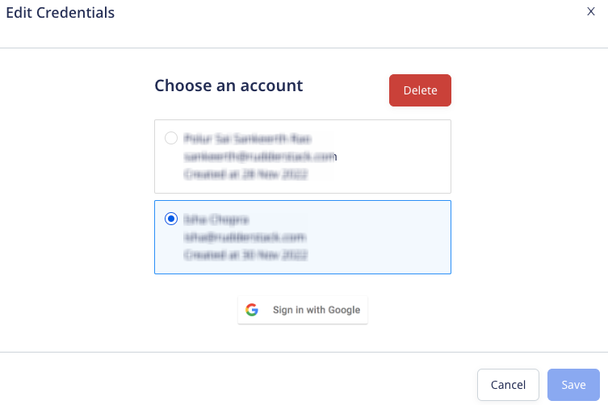

[Snapchat Custom Audience](https://businesshelp.snapchat.com/s/article/create-sam-audience?language=en_US) matches data from your Snapchat customer list (email, phone number, or mobile advertiser ID) with the Snapchat community.

<div class="infoBlock">
Find the open source code for this destination in the <a href="https://github.com/rudderlabs/rudder-transformer/tree/master/src/v0/destinations/snapchat_custom_audience">GitHub repository</a>.
</div>

<YouTube
  videoId={'sORmgyvVvl0'}
/>

## Getting started

RudderStack supports sending events to Snapchat Custom Audience via the following <Link to="/destinations/rudderstack-connection-modes/">connection modes</Link>:

| **Connection Mode** | **Web**       | **Mobile**    | **Server**    |
| :------------------ | :------------ | :------------ | :------------ |
| **Device mode**     |       -        |        -       |        -       |
| **Cloud mode**      |       -        |           -    |    Supported           |

Once you have confirmed that the source platform supports sending events to Snapchat Custom Audience, follow these steps:

1. From your [RudderStack dashboard](https://app.rudderstack.com/), add the source. Then, from the list of destinations, select **Snapchat Custom Audience**.
2. Assign a name to your destination and click **Continue**.

### Connection settings 

To successfully configure Snapchat Custom Audience as a destination, first authenticate your account by following the below steps:

1. Click **Create Account** in the **Account Settings** section.
2. From the modal, click the **Sign in with Google** button.
3. Choose the required account and grant RudderStack the required permissions.
4. Click **Save** to use the specified account, as shown:


<div class="infoBlock">
In case you have authenticated multiple accounts, you can click <strong>Edit Credentials</strong> to select/delete any other authenticated account, as shown:
<br/><br/>



RudderStack <strong>gives an error</strong> if you try to delete an account used by any other connection set up for the same destination.
</div>

Next, configure the following settings:

- **Segment ID**: Enter your Snapchat segment ID. For more information on getting your segment ID, refer to the <Link to="#faq">FAQ</Link> section below.
- **Schema**: Select the schema (**EMAIL**, **MOBILE AD ID**, or **PHONE**) from the dropdown.

<div class="warningBlock">
The corresponding field (<code class="inline-code">email</code>, <code class="inline-code">phone</code>, or <code class="inline-code">mobileAdId</code>/<code class="inline-code">mobile_id</code>) must be present in your events. Otherwise, RudderStack will not send the events to Snapchat Custom Audience.
</div>

- **Disable hashing**:  By default, RudderStack hashes the `email`, `phone`, and `mobileAdId` in the SHA-256 format. If enabled, RudderStack will **not** perform the hashing.

<div class="warningBlock">
If you enable this setting, make sure you <a href="https://marketingapi.snapchat.com/docs/#normalizing-hashing">normalize and SHA-256 hash your identifiers</a> before sending the data to RudderStack.
</div>

## `audienceList` event structure

<div class="infoBlock">
RudderStack supports <a href="https://marketingapi.snapchat.com/docs/#adding-users">additions</a> and <a href="https://marketingapi.snapchat.com/docs/#removing-users">deletions</a> to an audience list.
</div>

The following code snippet shows a sample `audienceList` call:

```json
{
  "type": "audiencelist",
  "event": "Order Created",
  "sentAt": "2022-06-14T12:34:53.514Z",
  "traits": null,
  "userId": "6201002000600",
  "context": {
    "library": {
      "name": "RudderStack Shopify Cloud",
      "version": "1.0.0"
    },
    "integration": {
      "name": "SHOPIFY"
    }
  },
  "rudderId": "b66112d4-a5af-4856-a6e4-2dbad7104c91",
  "messageId": "99a56bfb-45bf-4852-a911-03f73c3fdcdf",
  "timestamp": "2022-06-14T12:34:48.000Z",
  "properties": {
    "listData": {
      "add": [{
        "email": "alex@example",
        "phone": "+1-202-555-0146",
        "country": "USA",
        "lastName": "Keener",
        "firstName": "Alex ",
        "postalCode": "90009"
      },
        {
          "email": "alexis@example.com",
          "phone": "+1-202-555-0145",
          "country": "USA",
          "lastName": "Alexis",
          "firstName": "Keener",
          "postalCode": "90009"
        }
      ],
      "remove": [{
        "email": "jack@hotmail.com",
        "phone": "+1-202-555-0145",
        "country": "USA",
        "lastName": "Jack",
        "firstName": "Jackson ",
        "postalCode": "90009"
      }]
    }
  },
  "receivedAt": "2022-06-14T12:34:53.113Z",
  "request_ip": "35.231.104.198",
  "anonymousId": "760bf220-046f-4c2a-ad2b-3424be593740",
  "integrations": {
    "SHOPIFY": true
  },
  "originalTimestamp": "2022-06-14T12:34:53.514Z"
}
```

## Schema fields mapping

The following table details the mapping of the schema fields (as specified in the RudderStack dashboard) and the <a href="https://marketingapi.snapchat.com/docs/?&_ga=2.64649388.22530882.1663148304-88679508.1663136652#create-an-audience-segment">Snapchat Marketing API</a>.

RudderStack normalizes the raw identifiers by following the <a href="https://marketingapi.snapchat.com/docs/#normalizing-hashing">Snapchat-prescribed rules</a> before SHA-256 hashing and sending them to Custom Audience.

<div class="infoBlock">
RudderStack groups the identifiers in batches with a maximum of 100000 identifiers per request. For more information, refer to the <a href="https://marketingapi.snapchat.com/docs/#adding-users">Snapchat Marketing API</a>.
</div>

| RudderStack schema field |  Custom Audience field | Notes |
| :-----| :--------| :----- |
| `properties.listData.add.email` | `users.data.[sha256(email)]` | RudderStack trims any leading and trailing whitespaces and converts all the characters into the lower case before hashing. |
| `properties.listData.add.phone` <br/><br/> `properties.listData.add.mobile` | `users.data.[sha256(phone)]` <br/><br/> `users.data.[sha256(mobile)]` |  RudderStack includes the country code and removes any double 0s in front of it. It also excludes any non-numeric characters like whitespaces, parentheses, `+`, or `-`. |
| `properties.listData.add.mobileId` <br/><br/> `properties.listData.add.mobileAdId` <br/><br/> `properties.listData.add.mobile_id` | `users.data.[sha256(mobileId)]` <br/><br/> `users.data.[sha256(mobileAdId)]` <br/><br/> `users.data.[sha256(mobile_id)]` | RudderStack converts all the characters into the lower case. It does not remove any hyphens. |

<div class="warningBlock">
<code class="inline-code">email</code>, <code class="inline-code">mobileAdId</code>/<code class="inline-code">mobile_id</code>, or <code class="inline-code">mobile</code> must be present in your events depending on the <strong>Schema</strong> setting configured in the RudderStack dashboard. Otherwise, RudderStack will not send the events to Snapchat Custom Audience.
</div>

## FAQ

### Where can I find my Snapchat Segment ID?

To get your Snapchat Segment ID, follow the steps below:

1. Log into your [Snapchat Ads Manager dashboard](https://ads.snapchat.com/).
2. Go to **Assets** > **Audiences**.
3. Under **Audience Library**, select the required audience.
4. Copy the ID after `/audiences/custom-audience/` in the URL of the resulting page. This is your segment ID. 


For example, consider the following URL:

```
https://ads.snapchat.com/cc9c3e81-8a7e-44c0/audiences/custom-audience/1234567890123456/
```

In the above case, `1234567890123456` is the segment ID.

### How do I create a Customer List Audience in Snapchat?

For detailed steps on creating a Snapchat Customer List Audience, refer to the <a href="https://businesshelp.snapchat.com/s/article/create-sam-audience?language=en_US">Snapchat support page</a>.