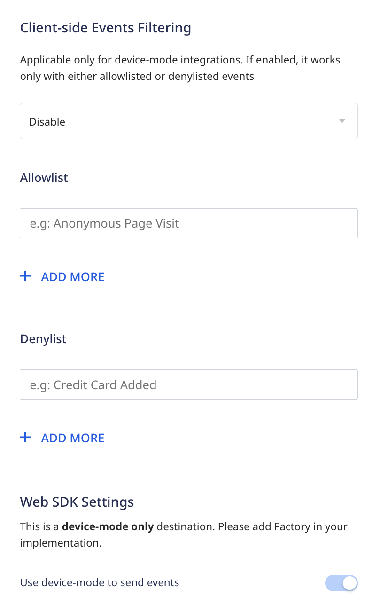
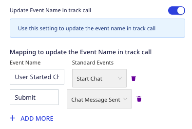
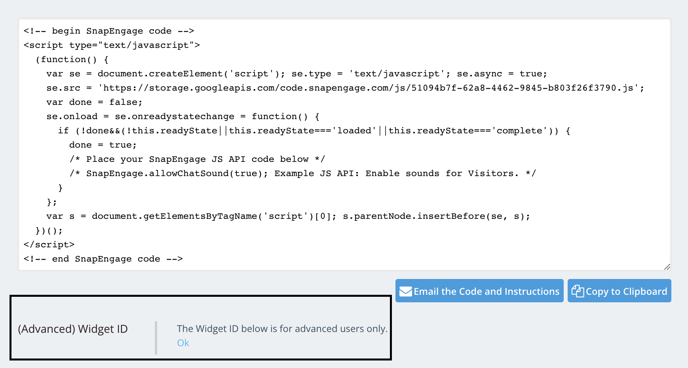

[SnapEngage](https://snapengage.com/) is an enterprise chat platform. If offers chatbots and live chat integrations to drive conversions, reduce response times, and increase customer satisfaction.

RudderStack supports SnapEngage as a destination where you can seamlessly send your event data.

## Getting started

Before configuring SnapEngage as a destination in RudderStack, verify if the source platform is supported by SnapEngage by referring to the table below:

| Connection Mode | Web | Mobile | Server |
| :--- | :--- | :--- | :--- |
| Device mode | Supported | - | - |
| Cloud mode | -  | - | - |

<div class="infoBlock">
To know more about the difference between cloud mode and device mode in RudderStack, refer to the <Link to="/destinations/rudderstack-connection-modes/">RudderStack Connection Modes</Link> guide.
</div>

Once you have confirmed that the source platform supports sending events to SnapEngage, follow these steps:

1. From your [RudderStack dashboard](https://app.rudderstack.com/), add a source. Then, from the list of destinations, select **SnapEngage**.
2. Assign a name to the destination and click on **Continue**.

## Connection settings

To successfully configure SnapEngage as a destination, you will need to configure the following settings:




- **Widget ID**: Enter your SnapEngage widget ID.

<div class="infoBlock">
For more information on obtaining your SnapEngage widget ID, refer to the <Link to="#faq">FAQ</Link> section below.
</div>

- **Record Live Chat Events**: Enable this setting to allow RudderStack to automatically track and send your live chat-related events to SnapEngage.
- **Update Event Name in track call**: If **Record Live Chat Events** is enabled, enable this setting to update the event names in the `track` call.
    - **Mapping to update the Event Name in track call**: Use this setting to map the standard SnapEngage events with your custom event names.
- **Client-side Events Filtering**: This setting lets you specify which events should be blocked or allowed to flow through to SnapEngage.

<div class="infoBlock">
For more information on this setting, refer to the <Link to="/sources/sdks/event-filtering/">Client-side Events Filtering</Link> guide.
</div>

- **Use device mode to send events**: As this is a <Link to="https://www.rudderstack.com/docs/destinations/rudderstack-connection-modes/#device-mode">web device mode</Link>-only destination, this setting is enabled by default and cannot be disabled.

## Identify

You can use the <Link to="/event-spec/standard-events/identify/">`identify`</Link> call to set the user's email, name, and other custom fields in SnapEngage through their <a href="https://developer.snapengage.com/javascript-api/#javascript-api">SDK</a>.

A sample `identify` call is shown below:

```javascript
rudderanalytics.identify(
  "1hKOmRA4GRlm", {
    email: "alex@example.com",
    name: "Alex Keener"
  }
);
```

### Supported mappings

The following table lists the mappings between the RudderStack and SnapEngage properties:

| RudderStack property | SnapEngage property | Data type | Presence
|:---------------------|:-------------|:--------------|:--------------|
| `traits.email` / `context.traits.email` | `email` | String | Required |
| `traits.name` / `context.traits.name` | `name` | String | Optional |

## Track

If the **Record Live Chat Events** dashboard setting is enabled during the destination setup, RudderStack lets you track the Live Chat events and send them as <Link to="/event-spec/standard-events/track/">`track`</Link> events to SnapEngage, based on the user's interactions.

<div class="infoBlock">
RudderStack sends the <code class="inline-code">track</code> events to SnapEngage as <a href="https://developer.snapengage.com/javascript-api/javascript-events/">callback functions</a>.
</div>

### Supported events

RudderStack automatically records and sends the following `track` events to SnapEngage:

- Live Chat Conversation Started

```javascript
SnapEngage.setCallback("StartChat", function() {
  window.rudderanalytics.track(
    "Live Chat Conversation Started", {}, {
      context: {
        integration: {
          name: 'snapengage',
          version: '1.0.0'
        }
      }
    }
  );
});
```

- Live Chat Conversation Ended

```javascript
SnapEngage.setCallback("Close", function() {
  window.rudderanalytics.track(
    "Live Chat Conversation Ended", {}, {
      context: {
        integration: {
          name: 'snapengage',
          version: '1.0.0'
        }
      }
    }
  );
});
```

- Live Chat Message Sent 

```javascript
SnapEngage.setCallback("ChatMessageSent", function() {
  window.rudderanalytics.track(
    "Live Chat Message Sent", {}, {
      context: {
        integration: {
          name: 'snapengage',
          version: '1.0.0'
        }
      }
    }
  );
});
```

- Live Chat Message Received

```javascript
SnapEngage.setCallback("ChatMessageReceived", function(agent) {
  window.rudderanalytics.track(
    "Live Chat Message Received", {
      agentUsername: agent
    }, {
      context: {
        integration: {
          name: 'snapengage',
          version: '1.0.0'
        }
      }
    }
  );
});
```

- Button Clicked

```javascript
SnapEngage.setCallback("InlineButtonClicked", function() {
  window.rudderanalytics.track(
    "Inline Button Clicked", {}, {
      context: {
        integration: {
          name: 'snapengage',
          version: '1.0.0'
        }
      }
    }
  );
});
```

### Mapping events

You can also update the standard SnapEngage Live Chat events with custom event names by enabling the <strong>Update Event Name in track call</strong> setting in the RudderStack dashboard and specifying the required mapping, as shown:



Based on the mappings set in the above image, RudderStack replaces the event names `"Live Chat Conversation Started"` and `"Live Chat Message Sent"`with `"User Started Chat"` and `"Submit"` respectively, before sending the events to SnapEngage.

## FAQ

### Where can I find the SnapEngage widget ID?

To get your SnapEngage widget ID, follow these steps:

1. Log into your <a href="https://www.snapengage.com/app/">SnapEngage dashboard</a>.
2. In the sidebar, select the widget under **Current Widget** for which you want the widget ID.
3. Go to **Settings** > **Get the Code**. You will find the widget ID under **(Advanced) Widget ID**, as shown:

