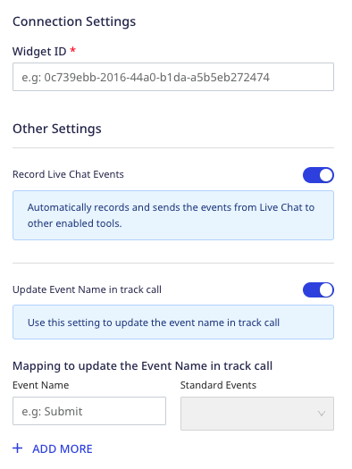

[SnapEngage](https://SnapEngage.io/) .

RudderStack supports SnapEngage as a destination where you can seamlessly send your event data.

## Getting started

Before configuring SnapEngage as a destination in RudderStack, verify if the source platform is supported by SnapEngage by referring to the table below:

| Connection Mode | Web | Mobile | Server |
| :--- | :--- | :--- | :--- |
| Device mode | Supported | - | - |
| Cloud mode | -  | - | - |

<div class="infoBlock">
To know more about the difference between cloud mode and device mode in RudderStack, refer to the <Link to="/destinations/rudderstack-connection-modes/">RudderStack Connection Modes</Link> guide.
</div>

Once you have confirmed that the source platform supports sending events to SnapEngage, follow these steps:

1. From your [RudderStack dashboard](https://app.rudderstack.com/), add a source. Then, from the list of destinations, select **SnapEngage**.
2. Assign a name to the destination and click on **Continue**.

## Connection settings

To successfully configure SnapEngage as a destination, you will need to configure the following settings:




- **Widget ID**: Enter your SnapEngage widget ID here.

<div class="infoBlock">
For more information on obtaining your SnapEngage widget ID, refer to the <Link to="#faq">FAQ</Link> section below.
</div>

- **Record Live Chat Events**: Enable this setting to allow RudderStack to automatically track and send your live chat-related events to SnapEngage.
- **Update Event Name in track call**: If **Record Live Chat Events** is enabled, enable this setting to update the standard `track` call events with custom event names.
    - **Mapping to update the Event Name in track call**: Use this setting to map the event names with standard SnapEngage events.
- **Client-side Events Filtering**: This setting lets you specify which events should be blocked or allowed to flow through to SnapEngage.

<div class="infoBlock">
For more information on this setting, refer to the <Link to="/sources/sdks/event-filtering/">Client-side Events Filtering</Link> guide.
</div>

- **Use device mode to send events**: As this is a <Link to="https://www.rudderstack.com/docs/destinations/rudderstack-connection-modes/#device-mode">web device mode</Link>-only destination, this setting is enabled by default and cannot be disabled.

## Identify

You can use the <Link to="/event-spec/standard-events/identify/">`identify`</Link> call to <Link to="https://developers.SnapEngage.io/api-reference#create_or_update_user">create or update a user</Link> in SnapEngage.

A sample `identify` call is shown below:

```javascript
rudderanalytics.identify("1hKOmRA4el9Zt1WSfVJIVo4GRlm", {
    "name": "Alex Keener",
    "email": "alex@example.com",
    "gender": "Male",
    "profession": "singer-songwriter",
    "companies": [{
        "created": "2020-01-23T04:56:07.890Z",
        "customFields": {
            "field1": "value1",
        },
        "id": "company123",
        "monthlySpend": 500.00,
        "name": "company name"
    }]
});
```

### Property mappings

The following table lists the mappings between RudderStack and SnapEngage properties:

| RudderStack property | SnapEngage property | Presence | Data type | 
|:---------------------|:-------------|:--------------|:--------------|
| `userId`/`traits.userId`/`traits.id`/`context.traits.userId`/`context.traits.id` | `userId` | Required | String |
| `context.traits.name`/`traits.name` | `name` |Required | String |
| `context.traits.email`/`traits.email`/`properties.email` | `email` | Optional | String |
| `context.traits`/`traits` (after removing `email` and `name`) | `customFields` |Optional | Object |
| `originalTimestamp`/`timestamp` | `created` | Optional | ISO 8601 Timestamp |
| `context.traits.avatarURL`/`traits.avatarURL` | `avatarURL` | Optional | String |
| `context.traits.companies`/`traits.companies` | `companies` | Optional | Array of object (in company objects `id` and `name` are the only required fields) |

## Track

You can create the following events using the <Link to="/event-spec/standard-events/track/">`track`</Link> call:

- <Link to="https://developers.SnapEngage.io/api-reference#create_post">Create post</Link>
- <Link to="https://developers.SnapEngage.io/api-reference#create_vote">Create vote</Link>

RudderStack <Link to="https://developers.SnapEngage.io/api-reference#retrieve_user">retrieves the user</Link> data using `userId` or `email` and uses that information to create post or vote.

A sample `track` call is shown below:

```javascript
rudderanalytics.track("Submit", {
    boardId: "62de88676bc28b44eeef25dd",
    details: "Require new feature",
    title: "New Feature",
    eta: "10.08.2022",
    priority: "High"
})
```

### Property mappings for Create post event 

The following table lists the mappings between RudderStack and SnapEngage properties for the **Create post** event:

| RudderStack property | SnapEngage property | Presence | Data type | Notes |
|:---------------------|:-------------|:--------------|:--------------|:--------------|
| `properties.boardID`/`properties.boardId`/`properties.board.id` | `boardID` | Required | String | -|
| Collect from `externalId` or <Link to="https://developers.SnapEngage.io/api-reference#retrieve_user">retrieve user</Link> API call| `authorID` | Required | String |-|
| `properties.details` | `details` | Required | String |-|
| `properties.title` | `title` | Required | String |-|
| `properties.byID`/`properties.byId`/`properties.by.id` | `byID` | Optional | String |-|
| `properties.categoryID`/`properties.categoryId`/`properties.category.id` | `categoryID` |Optional | String |-|
| `properties.customFields` | `customFields` | Optional | Object | Ensure that you <Link to="#how-to-create-custom-fields-in-SnapEngage-dashboard">create the custom fields in SnapEngage dashboard</Link> to send the event successfully.|
| `properties.eta` | `eta` | Required if `etaPublic` is present. | String | Should be in the MM/YYYY format.  |
| `properties.etaPublic` | `etaPublic` | Required if `eta` is present.  | Boolean | - |
| `properties.imageURLs` | `imageURLs` | Optional | Array of strings | -|

### Property mappings for Create vote event 

The following table lists the mappings between RudderStack and SnapEngage properties for the **Create vote** event:

| RudderStack property | SnapEngage property | Presence | Data type | 
|:---------------------|:-------------|:--------------|:--------------|
| `properties.postId`/`properties.postID`/`properties.post.id` | `postID` | Required | String |
| Collect from `externalId` or <Link to="https://developers.SnapEngage.io/api-reference#retrieve_user">retrieve user</Link> API call | `voterID` | Required | String |

<div class="infoBlock">
The key name for <code class="inline-code">externalId</code> is <code class="inline-code">SnapEngageUserId</code>.
</div>

## FAQ

### Where can I find the SnapEngage API Key?

To find the SnapEngage API Key:

1. Log into your [SnapEngage account](https://SnapEngage.io/login).
2. Go to **Settings** > **API & Webhooks** under your profile, as shown: 


### How to create custom fields in the SnapEngage dashboard?

To create custom fields in SnapEngage Dashboard:

1. Log into your [SnapEngage account](https://SnapEngage.io/login).
2. Under your profile, navigate to **Settings** > **Post Fields** > **Create New Field**.
3. Enter the field name and click on **Create**.
4. Navigate to **Boards** and select the desired **Board** from the dropdown.
5. Select **Create Post Form** > **Add Fields** in the **Fields** section.
6. Select the relevant **Post Field** from the dropdown.
7. Enter details and click **Save**.


