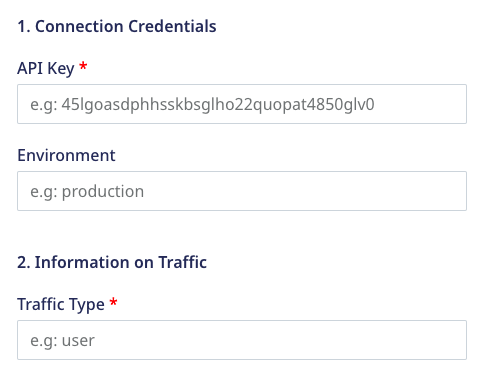
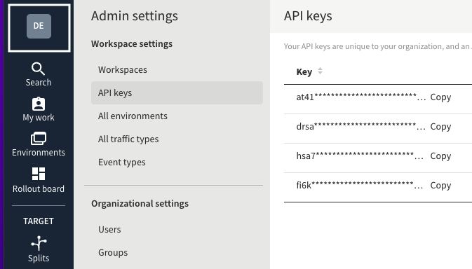
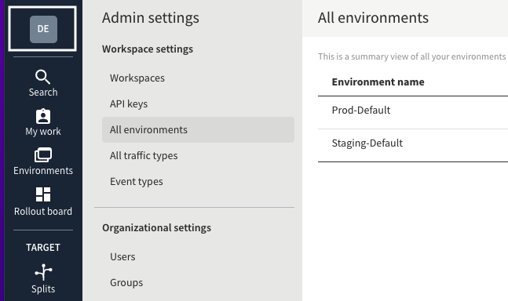

[Split](https://www.split.io/) is a feature experimentation and continuous delivery tool. It enables you to maximize the impact of your product features by combining feature flags and data. With Split, you can test new features through rigorous A/B testing and deploy them seamlessly while ensuring data privacy and maximum performance.

RudderStack supports Split as a destination to which you can seamlessly send your customer data.

<div class="infoBlock">
Find the open source transformer code for this destination in the <a href="https://github.com/rudderlabs/rudder-transformer/tree/master/v0/destinations/splitio">GitHub repository</a>.
</div>

## Getting started

Before configuring Split as a destination in RudderStack, verify if the source platform is supported by Split by referring to the table below:

| **Connection Mode** | **Web**       | **Mobile**    | **Server**    |
| :------------------ | :------------ | :------------ | :------------ |
| **Device mode**     | -             | -             | -             |
| **Cloud mode**      | **Supported** | **Supported** | **Supported** |

<div class="infoBlock">
To learn more about the difference between cloud mode and device mode in RudderStack, refer to the <Link to="/destinations/rudderstack-connection-modes/">RudderStack Connection Modes</Link> guide.
</div>

Once you have confirmed that the source platform supports sending events to Split, follow these steps:

1. From your [RudderStack dashboard](https://app.rudderstack.com/), add a source. Then, from the list of destinations, select **Split**.
2. Assign a name to the destination and click on **Next**.

### Connection settings

To successfully configure Split as a destination, you will need to configure the following settings:



- **API Key**: Enter the API Key for your Split workspace.
- **Environment**: Enter the corresponding environment available in the dashboard.
- **Traffic Type**: Enter the correct traffic type listed in your account.

<div class="infoBlock">
RudderStack sends each call as an event to Split.
</div>

## Identify

The <Link to="/event-spec/standard-events/identify">`identify`</Link> call lets you uniquely identify a user and record any associated traits about them like their name, email, etc.

A sample `identify` call is shown below:

```javascript
rudderanalytics.identify("1hKOmRA4el9Zt1WSfVJIVo4GRlm", {
  name: "Alex Keener",
  email: "alex@example.com",
  plan: "GOLD",
  age: 40,
})
```

## Track

A <Link to="/event-spec/standard-events/track">`track`</Link> call lets you capture user events along with the properties associated with them.

A sample `track` call is shown below:

```javascript
rudderanalytics.track("Clicked button", {
  color: "red",
  buttonText: "Get started",
})
```

RudderStack sends the above `track` call as a `Clicked_button` event to Split along with the additional properties.

The `eventTypeId` argument (**Clicked button** in the above example) in `track` call should meet the following requirements:
- It should start with a letter or number.
- It should contain 80 characters or less.
- It should contain only letters, numbers, hyphen, underscore, or period.

## Page

A <Link to="/event-spec/standard-events/page">`page`</Link> call lets you record your website's page views with any additional relevant information about the viewed page.

A sample `page` call is shown below:

```javascript
rudderanalytics.page("homepage", "home", {
  url: "https://abc.com",
  title: "Test",
  referrer: "https://google.com",
})
```

RudderStack sends the above `page` call as a `Viewed_home_page` event to Split, along with the associated properties.

## Screen

The <Link to="/event-spec/standard-events/screen">`screen`</Link> call lets you record whenever the user views their mobile screen, with any additional relevant information about the screen.

A sample `screen` call is shown below:

```javascript
[[RSClient sharedInstance] screen:@"Main" properties:@{@"prop_key" : @"prop_value"}];
```

The above snippet captures information related to the viewed screen such as its name and category. RudderStack sends this call as a `Viewed_Main_screen` event, along with the associated properties.

## Group

The <Link to="/event-spec/standard-events/group">`group`</Link> call lets you link an identified user with a group such as a company, organization, or an account, and record any traits associated with that group, for example, company name, number of employees, etc.

A sample `group` call is shown below:

```javascript
rudderanalytics.group("groupId", traits, options, callback)
```

## FAQ

### Where can I find my Split API key and environment?

To obtain your Split API key, log into your [Split dashboard](https://app.split.io/) and go to **Admin Settings** > **API Keys**, as shown:



You can also find your Split environment by going **Admin Settings** > **All environments**, as shown:



<br />
