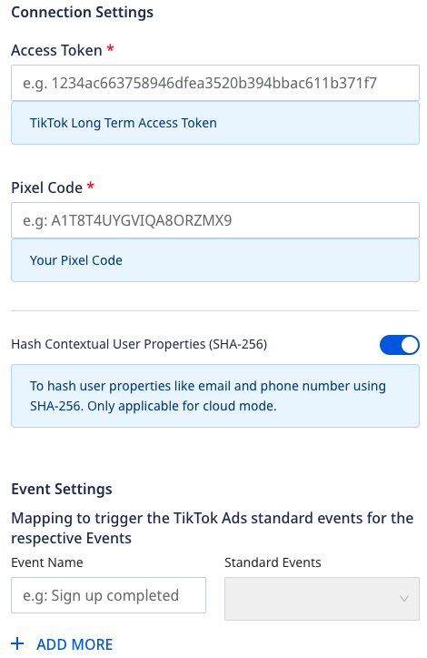

[TikTok Ads](https://www.tiktok.com/business/en/apps/tiktok?tt4b_lang_redirect=1") is TikTok's online advertising platform. It lets marketers run product ads to target custom audiences and optimize their campaigns.

RudderStack supports TikTok Ads as a destination where you can send your event data seamlessly.

<div class="infoBlock">
Find the open source transformer code for this destination in the <a href="https://github.com/rudderlabs/rudder-transformer/tree/master/src/v0/destinations/tiktok_ads">GitHub repository</a>.
</div>

## Getting started

Before configuring TikTok Ads as a destination in RudderStack, verify if the source platform is supported by TikTok Ads by referring to the table below:

| **Connection Mode** | **Web**       | **Mobile**    | **Server**    |
| :------------------ | :------------ | :------------ | :------------ |
| **Device mode**     |  -            | -             | -             |
| **Cloud mode**      | **Supported** | **Supported** | **Supported** |

<div class="infoBlock">
To learn more about the difference between cloud mode and device mode in RudderStack, refer to the <Link to="/destinations/rudderstack-connection-modes/">RudderStack Connection Modes</Link> guide.
</div>

Once you have confirmed that the source platform supports sending events to TikTok Ads, follow these steps:

- From your [**RudderStack dashboard**](https://app.rudderstack.com/), add the source. Then, from the list of destinations, select **TikTok Ads**.

## Connection settings

To successfully configure TikTok Ads as a destination, you need to configure the following settings:


- **Access Token**: You need to generate the Access Token (also known as long-term access token) by following the steps mentioned in <a href="https://ads.tiktok.com/marketing_api/docs?id=1701890912382977">Authorization</a> and <a href="https://ads.tiktok.com/marketing_api/docs?id=1701890914536450">Authentication</a> topics in TikTok documentation.
- **Pixel Code**: You can find the Pixel Code by referring to <a href="https://ads.tiktok.com/gateway/docs/index?identify_key=2b9b4278e47b275f36e7c39a4af4ba067d088e031d5f5fe45d381559ac89ba48&language=ENGLISH&doc_id=1701890979375106#item-link-Where%20to%20Find%20pixel_code">TikTok documentation</a>.
- **Hash Contextual User Properties (SHA-256)**: If this setting is enabled, RudderStack will hash the contextual user properties like `external_id`, `email`, `phone_number` from the raw format to the SHA-256 format.
- **Mapping to trigger the TikTok Ads standard events for the respective Events**: Enter the event name and select the corresponding <Link to="https://ads.tiktok.com/help/article?aid=10028">TikTok Ads standard event</Link> from the dropdown to be triggered when that event is called.

<div class="successBlock">
You can specify multiple <strong>standard events</strong> for one <strong>event name</strong> and vice versa.
</div>

### Track

The <Link to="/event-spec/standard-events/track/">`track`</Link> call lets you capture user events along with the properties associated with them.

A sample `track` call is shown below:

```javascript
rudderanalytics.track("Order Completed", {
  checkout_id: "12345",
  order_id: "1234",
  affiliation: "Apple Store",
  total: 20,
  revenue: 15.0,
  shipping: 22,
  tax: 1,
  discount: 1.5,
  coupon: "ImagePro",
  currency: "USD",
  contentType: "product",
  products: [{
      product_id: "123",
      sku: "G-32",
      name: "Monopoly",
      price: 14,
      quantity: 1,
      category: "Games",
      url: "https://www.website.com/product/path",
      image_url: "https://www.website.com/product/path.jpg",
    },
    {
      product_id: "345",
      sku: "F-32",
      name: "UNO",
      price: 3.45,
      quantity: 2,
      category: "Games",
    },
  ],
})
```

### Event mapping

RudderStack maps the following events to the corresponding TikTok Ads Events:

| RudderStack event | TikTok Ads event |
| :------------------------------- | :--------------------------|
| `ViewContent` | `ViewContent` |
| `ClickButton` | `ClickButton` |
| `Search` | `Search` |
| `Contact` | `Contact` |
| `Download` |  `Download` |
| `SubmitForm`| `SubmitForm` |
| `CompleteRegistration` | `CompleteRegistration` |
| `Subscribe` | `Subscribe` |

RudderStack also maps the following <Link to="/event-spec/ecommerce-events-spec/">ecommerce events</Link>:

| RudderStack event | TikTok Ads event |
| :------------------------------- | :--------------------------|
| `Product Added to Wishlist` | `AddToWishlist` |
| `Product Added` | `AddToCart` |
| `Checkout Started` | `InitiateCheckout` |
| `Payment Info Entered` | `AddPaymentInfo` |
| `Checkout Step Completed` | `CompletePayment` |
| `Order Completed` | `PlaceAnOrder` |

### Property mapping

RudderStack maps the following **optional** event properties to the corresponding TikTok Ads fields:

| RudderStack property | TikTok Ads property |
| :-------------- | :------------------|
| `properties.eventId` | `event_id` |
| `timestamp` | `timestamp` |
| `properties.testEventCode` | `test_event_code` |
| `properties.contents` | `properties.contents` |
| `properties.currency` | `properties.currency` |
| `properties.value` | `properties.value` |
| `properties.description` | `properties.description` |
| `properties.query` | `properties.query` |
| `properties.context.ad` or `context.ad` | `context.ad` |
| `properties.context.page` or `context.page` | `context.page` |
| `properties.context.user` | `context.user` |
| `context.ip` | `context.ip` |
| `context.userAgent` | `context.user_agent` |
| From `externalId` `tiktokExternalId` | `user.external_id` |

## FAQ

### I see a 40002 response code with ‘No permission to operate pixel code’ error message, what can I do?

This error code is related to the authentication of your TikTok account. For more information, refer to the <a href="https://ads.tiktok.com/gateway/docs/index?identify_key=2b9b4278e47b275f36e7c39a4af4ba067d088e031d5f5fe45d381559ac89ba48&language=ENGLISH&doc_id=1701890979375106#item-link-FAQ">TikTok documentation</a>.

### How does RudderStack validate a phone number?

RudderStack accepts any phone number with a correct country code (except `+86`). Also, it does not support any non-numeric values in the phone number. For more information, refer to this [TikTok Documentation](https://ads.tiktok.com/marketing_api/docs?id=1701890979375106).
