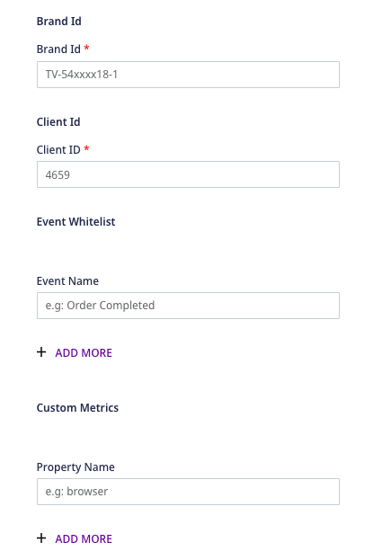

[TVSquared](https://tvsquared.com/) is a television attribution platform that specializes in enterprise-scale cross-screen and multi-touch TV attribution and measurement. They empower the advertising companies to quantify and attribute responses generated across televisions everywhere, and deliver meaningful business insights from the linear and digital TV content.

RudderStack supports TVSquared as a destination to which you can send your event data in real-time.

## Getting started

RudderStack supports sending event data to TVSquared via the following <a href="https://rudderstack.com/docs/rudderstack-cloud/rudderstack-connection-modes/">connection modes</a>:

| **Connection Mode** | **Web**       | **Mobile** | **Server** |
| :------------------ | :------------ | :--------- | :--------- |
| **Device mode**     | **Supported** | **-**      | **-**      |
| **Cloud mode**      | **-**         | **-**      | **-**      |

<div class="infoBlock">
In the web device mode integration, that is, using <Link to="/sources/event-streams/sdks/rudderstack-javascript-sdk">JavaScript SDK</Link> as a source, the TVSquared native SDK is loaded from <code class="inline-code">http://tvsquared.com</code> domain. Based on your website's content security policy, you might need to <Link to="/sources/event-streams/sdks/rudderstack-javascript-sdk/load-js-sdk/#allowlist-destination-domain">allowlist this domain</Link> to load the TVSquared SDK successfully.
</div>

Once you have confirmed that the platform supports sending events to TVSquared, perform the steps below:

- From your [RudderStack dashboard](https://app.rudderlabs.com/), add the source. From the list of destinations, select **TVSquared**.
- Give a name to the destination and click **Next**. You should then see the following screen:



- The above connection settings are explained in more detail below:

  - **Brand Id \(Site ID\)**: This is a unique identifier that indicates the TVSquared client to which the traffic belongs. This parameter will always carry the form of `TV-XXXXXXX-1` with a variable-length numeric value replacing the `X`.
  - **Client Id \(Collector Id\)**: The Client ID allows us to distribute the traffic and manage the load on our servers effectively. It is numeric and can contain one or more values.
  - **Event Allowlist**: You can add the events you want to send to TVSquared in this field. If the list is empty, all the events will be sent. Otherwise, only the events mentioned in this allowlist will be sent.
  - **Custom Metrics**: The **Property Name** values added in this field will be sent to TVSquared for the events containing those event properties, along with the other defined properties of TVSquared. For example, if the property added in the dashboard is `shipping` , then the shipping value will be sent to TVSquared. A sample code snippet for this is as shown:

    ```javascript
    rudderanalytics.track('Order Completed',
    {
      order_id: '5d4c7cb5',
      revenue: 99.9,
      shipping: 13.99,
      tax: 20.99,
      products: [

      ]
    });
    ```

- Configure the above settings according to your requirements, and click **Next** to complete the setup. TVSquared should now be added and enabled as a destination in RudderStack.

## Page

When a <Link to="/event-spec/standard-events/page">`page`</Link> call occurs, RudderStack makes a call to TVSquared to record a page view.

```javascript
rudderanalytics.page('new category',
'page name',
{
  url: 'url',
  path: '/path'
});
```

## Track

Calling the <Link to="/event-spec/standard-events/track">`track`</Link> method causes TVSquared's `Action Tracker` method to be triggered.

By default, TVSquared can take the following parameters:

- `revenue`
- `product type (category)`
- `action id (order_id)`
- `promo (promotion_id)`

<div class="infoBlock">
All the mentioned parameters are optional. There is no requirement to add these to measure the uplift from TV. However, this data can be used for more detailed analysis as required. If there is no value to pass an empty string will be set by RudderStack.
</div>

A sample `track` call is as shown:

```javascript
rudderanalytics.track('Order Completed',
{
  order_id: '5d4c7cb5',
  category: 'category',
  revenue: 99.9,
  shipping: 13.99,
  tax: 20.99,
  products: [

  ],
  promotion_id: 'PROMO_1234'
});
```


