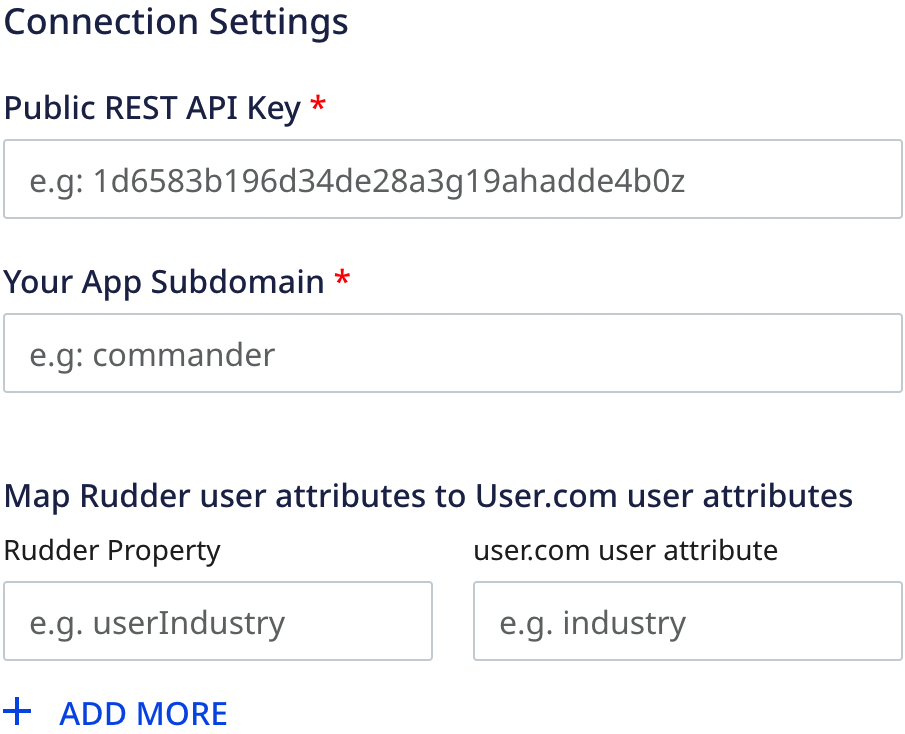
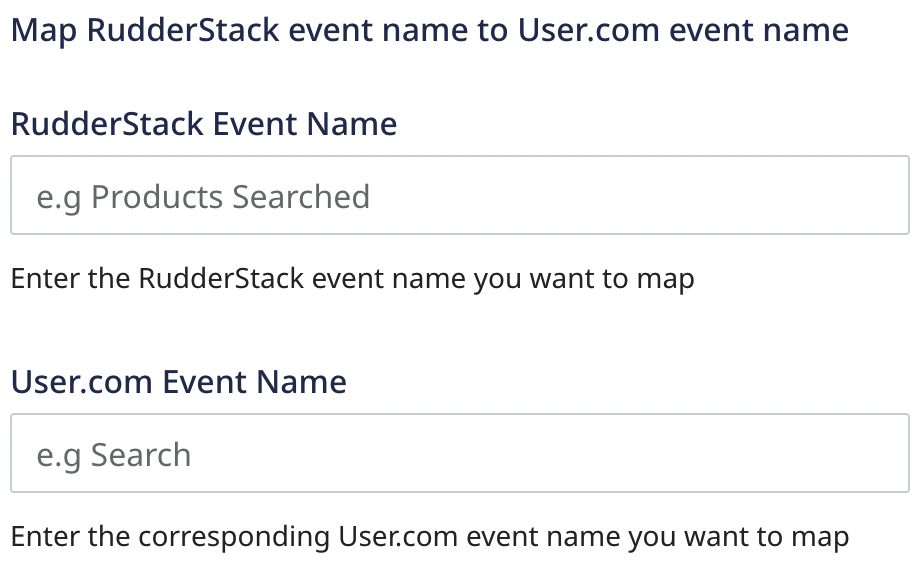
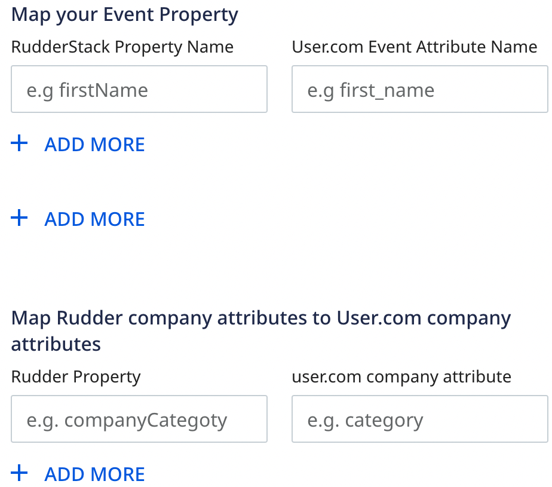
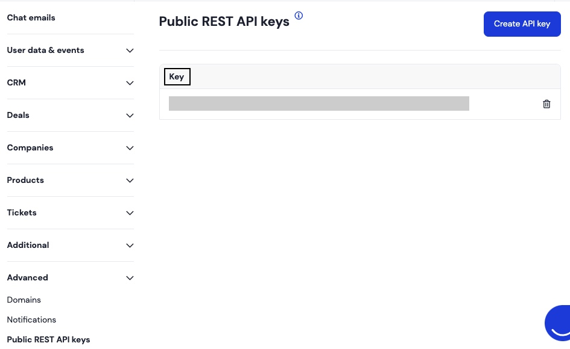
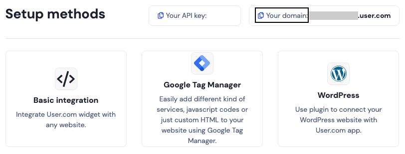

[User.com](https://user.com/en/) is a marketing automation platform that helps boost customer engagement and improve conversion. It provides easy-to-use and robust tools for marketing, sales, management, and support teams.

RudderStack supports User.com as a destination where you can seamlessly send your event data.

## Getting started

Before configuring User.com as a destination in RudderStack, verify if the source platform is supported by User.com by referring to the table below:

| Connection Mode | Web | Mobile | Server |
| :--- | :--- | :--- | :--- |
| Device mode | - | - | - |
| Cloud mode | Supported  | Supported | Supported |

<div class="infoBlock">
To know more about the difference between cloud mode and device mode in RudderStack, refer to the <Link to="/destinations/rudderstack-connection-modes/">RudderStack Connection Modes</Link> guide.
</div>

Once you have confirmed that the source platform supports sending events to User.com, follow these steps:

1. From your [RudderStack dashboard](https://app.rudderstack.com/), add a source. Then, from the list of destinations, select **User.com**.
2. Assign a name to the destination and click **Continue**.

## Connection settings

To successfully configure User.com as a destination, you will need to configure the following settings:





- **Public REST API Key**: Enter your public User.com REST API key. 
- **App Subdomain**: Enter the subdomain of your User.com app.

<div class="infoBlock">
For more information on obtaining the public REST API key and app subdomain, refer to the <Link to="#faq">FAQ</Link> section below.
</div>

- **Map Rudder user attributes to User.com attributes**: Enter the custom user attributes you want to map for RudderStack and User.com correspondingly.
- **Map RudderStack event name to User.com event name**: Enter the event names you want to map for RudderStack and User.com correspondingly. You can map one or more RudderStack events to a single User.com event but not vice-versa.
- **Map your event property**: Enter the RudderStack and User.com event properties you want to map for the above-mentioned event names. You can map a RudderStack property to a single User.com property and vice-versa.
- **Map Rudder company attributes to User.com company attributes**: Enter the custom company attributes you want to map for RudderStack and User.com correspondingly.

## User lookup

<div class="infoBlock">
This lookup algorithm is applicable only for the <code class="inline-code">identify</code>, <code class="inline-code">track</code>, and <code class="inline-code">page</code>calls.
</div>

RudderStack looks up for a user using the `user_key`, `email` or `phone` properties.

- You can pass the `user_key` in the `externalId` array, as shown:

```javascript
"externalId": [{
  "type": "userKey",
  "id": "uehfuuiuednjk"
}],
```
- You can pass the `email` or `phone` in the `integrations` object, as shown:

```javascript
integrations: {
user: {
  lookup: "email/phone"
}
});
```
<div class="warningBlock">
Only one of the above (<code class="inline-code">email</code> or <code class="inline-code">phone</code>) must be passed in a <code class="inline-code">lookup</code>. Also, the <code class="inline-code">email</code> or <code class="inline-code">phone</code> (whichever is passed) must have unique values in the User.com.
</div>

The precedence order for looking up a user based on the above properties is:

- The `userKey` is given the highest priority.
- The `lookup` value is given the second highest priority. If `phone`/`email` (whichever is passed) is not found, RudderStack will throw an error.
- If none of the above is present, RudderStack falls back to the `userId`. If not found, RudderStack will throw an error.

## Identify 

You can use the <Link to="/event-spec/standard-events/identify">`identify`</Link> call to create a new user in User.com. If the user already exists, the user details are updated.

A sample `identify` call is shown below:

```javascript
rudderanalytics.identify('1hKOmRA4el9Zt1WSfVJIVo4GRlm', {
      firstName: 'Alex',
      lastName: 'Keener',
      email: "alex@example.com"
    }, {
      externalId: [{
        type: "userKey",
        id: "Df344sdFgdDsS4"
      }],
      integrations: {
        user: {
          lookup: "email"
        }
      }
    );
```

### Property mapping

The following table lists the mappings between RudderStack and User.com properties for `identify` call:

| RudderStack property | User.com property | Presence | 
| :-------| :--------| :------| 
| `userId` | `custom_id`(same as `userId`) | Required  | 
| `firstName` | `first_name` | Optional | 
| `lastName` | `last_name` | Optional |
| `email` | `email` | Optional | 
| `phone` | `phone_number` | Optional | 
| `traits.tags`/`context.traits.tags`|`tags` | Optional | 
| `city` | `city` | Optional | 
| `region` | `region` | Optional | 
| `country` | `country` | Optional | 
| `gender` | `gender` | Optional | 
| `traits.status`/`context.traits.status` | `status` | Optional | 
| `traits.googleUrl`/`context.traits.googleUrl` | `google_url` | Optional | 
| `traits.linkedinUrl`/`context.traits.linkedinUrl` | `linkedin_url` | Optional | 
| `traits.twitterUrl`/`context.traits.twitterUrl` | `twitter_url` | Optional | 
| `traits.facebookUrl`/`context.traits.facebookUrl` | `facebook_url` | Optional | 
| `avatar` | `gravatar_url` | Optional | 
| `timezone` | `timezone` | Optional | 

## Track

You can use the <Link to="/event-spec/standard-events/track">`track`</Link> call to record a new event, which in turn, can be used to filter and bucket users in User.com.

A sample `track` call is shown below:

```javascript
rudderanalytics.track('Add to cart', {
  purchased_item: "T-Shirt",
  brand: "Zara",
  email: "alex@example.com"
}, {
  integrations: {
    user: {
      lookup: "email"
    }
  }
););
```

### Property mapping

The following table lists the mappings between RudderStack and User.com properties for `track` call:

| RudderStack property | User.com property | Presence | 
| :-------| :--------| :------| 
| `userId`/`traits.userId`/`traits.id`/`context.traits.userId`/`context.traits.id` | `user_id` | Required  | 
| `event` | `name` | Required | 
| `properties` | `data` | Optional |
| `timestamp` | `timestamp` | Optional | 

## Page

The <Link to="/event-spec/standard-events/page">`page`</Link> call lets you record your website's page views with any additional relevant information about the viewed page.

A sample `page` call is shown below:

```javascript
rudderanalytics.page("section-name", {
      path: "path",
      url: "url",
      title: "title",
      search: "search",
      referrer: "referrer",
      phone: "1-202-555-0146",
    }, {
      integrations: {
        user: {
          lookup: "phone"
        }
      });
```

### Property mapping

The following table lists the mappings between RudderStack and User.com properties for `page` call:

| RudderStack property | User.com property | | Presence | 
| :-------| :--------| :------| 
| `userId`/`traits.userId`/`traits.id`/`context.traits.userId`/`context.traits.id` | `client_user` | Required  | 
| `traits.url`/`context.traits.url` | `page_domain` | Required | 
| `traits.path`/`context.traits.path` | `page_path` | Required |
| `timestamp` | `timestamp` | Required | 

## Group

You can use the <Link to="/event-spec/standard-events/group/">`group`</Link> call to create or update a company profile and associate a user with it.

A sample `group` call is shown below:

```javascript
rudderanalytics.group(
  "group01", {
    name: "Alex Keener",
    phone: "1-202-555-0146",
    size: 51,
    zipcode: 90009,
    street: "6649 N Blue Gum Street",
    city: "New Orleans",
    region: "Louisiana",
    country: "USA"
  },
);
```

### Property mapping

The following table lists the mappings between RudderStack and User.com properties for `group` call:

| RudderStack property | User.com property | | Presence | 
| :-------| :--------| :------| 
| `userId` | `custom_id`(same as `userId`) | Required  | 
| `groupId`/`traits.groupId` | `custom_id`(company) | Optional | 
| `traits.name` | `name`(company name) | Optional |
| `email` | `email` | Optional | 
| `address` | `address` | Optional | 
| `city` | `city` | Optional |
| `region` | `region` | Optional | 
| `country` | `country` | Optional | 
| `description` | `description` | Optional | 
| `phone` | `phone_numbers` | Optional | 
| `zipcode`| `postal_code` | Optional | 
| `traits.size` | `size` | Optional | 
| `traits.tags` | `tags` | Optional | 

## FAQ

### Where can I find the User.com public REST API key?

To get your public REST API key, follow these steps:

1. Log into <a href="https://app.user.com/accounts/login/">User.com dashboard</a> and go to your App. 
2. Click **Settings** > **App settings** > **Advanced** > **Public REST API keys**.
3. Click **Create API key**, as shown:



### Where can I find the User.com app subdomain?

To get your app subdomain, follow these steps:

1. Log into <a href="https://app.user.com/accounts/login/">User.com dashboard</a> and go to your App. 
2. Click **Settings** > **Setup && Integrations** to see the app domain. The subdomain is the part of the complete domain excluding `.user.com`, as shown:


