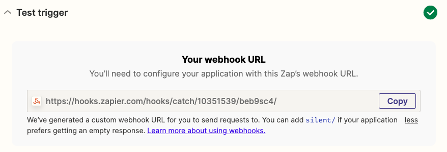

[User.com](https://user.com/en/) is a marketing automation platform which helps in boosting customer engagement and improving conversion.

RudderStack supports User.com as a destination where you can seamlessly send your event data.

## Getting started

Before configuring User.com as a destination in RudderStack, verify if the source platform is supported by User.com by referring to the table below:

| Connection Mode | Web | Mobile | Server |
| :--- | :--- | :--- | :--- |
| Device mode | - | - | - |
| Cloud mode | Supported  | Supported | Supported |

<div class="infoBlock">
To know more about the difference between cloud mode and device mode in RudderStack, refer to the <Link to="/destinations/rudderstack-connection-modes/">RudderStack Connection Modes</Link> guide.
</div>

Once you have confirmed that the source platform supports sending events to User.com, follow these steps:

1. From your [RudderStack dashboard](https://app.rudderstack.com/), add a source. Then, from the list of destinations, select **User.com**.
2. Assign a name to the destination and click **Continue**.

## Connection settings

To successfully configure User.com as a destination, you will need to configure the following settings:


- **Public REST API Key**: Enter your Zap URL. 
- **App Subdomain**: Enter your Zap URL.
- **Map Rudder user attributes to User.com attributes**: Enter your Zap URL.
- **Map RudderStack event name to User.com event name**: Enter your Zap URL.
- **Map your event property**: Enter your Zap URL.
- **Map Rudder company attributes to User.com company attributes**: Enter your Zap URL.

<div class="infoBlock">
For more information on creating a Zap and obtaining the Zap URL, refer to the <Link to="#faq">FAQ</Link> section below.
</div>

## Identify 

You can use the <Link to="/event-spec/standard-events/identify">`identify`</Link> call to create a new user in User.com. However, if the user already exists, the user details are updated.

RudderStack uses the `identify` call to create or update the customer information in WebEngage. It maps `userId` or `anonymousId` (`userId` is prioritized if both are present ) to WebEngage's `userId` before sending the data via the [`users`](https://docs.webengage.com/docs/rest-api-tracking-users#users) API.

A sample `identify` call is shown below:

```javascript
rudderanalytics.identify('1hKOmRA4el9Zt1WSfVJIVo4GRlm', {
      firstName: 'Alex',
      lastName: 'Keener',
      email: "alex@example.com"
    }, {
      externalId: [{
        type: "userKey",
        id: "Df344sdFgdDsS4"
      }],
      integrations: {
        user: {
          lookup: "email/phone"
        }
      }
    );
```

### Property mapping

The following table lists the mappings between RudderStack and User.com properties for `identify` call:

| RudderStack property | User.com property | Presence | 
| :-------| :--------| :------| 
| `userId` | `custom_id`(same as userId) | Required  | 
| `firstName` | `first_name` | Optional | 
| `lastName` | `last_name` | Optional |
| `email` | `email` | Optional | 
| `phone` | `phone_number` | Optional | 
| `traits.tags`/`context.traits.tags`|`tags` | Optional | 
| `city` | `city` | Optional | 
| `region` | `region` | Optional | 
| `country` | `country` | Optional | 
| `gender` | `gender` | Optional | 
| `traits.status`/`context.traits.status` | `status` | Optional | 
| `traits.googleUrl`/`context.traits.googleUrl` | `google_url` | Optional | 
| `traits.linkedinUrl`/`context.traits.linkedinUrl` | `linkedin_url` | Optional | 
| `traits.twitterUrl`/`context.traits.twitterUrl` | `twitter_url` | Optional | 
| `traits.facebookUrl`/`context.traits.facebookUrl` | `facebook_url` | Optional | 
| `avatar` | `gravatar_url` | Optional | 
| `timezone` | `timezone` | Optional | 

## Track

You can use the <Link to="/event-spec/standard-events/track">`track`</Link> call to record a new Event occurrence that can be used to filter and bucket users. 
RudderStack uses the `track` call to send the custom events to WebEngage via the [`events`](https://docs.webengage.com/docs/rest-api-tracking-events#events) API.

A sample `track` call is shown below:

```javascript
rudderanalytics.track('Add to cart', {
  purchased_item: "T-Shirt",
  brand: "Zara",
  email: abc @example.com
}, {
  integrations: {
    user: {
      lookup: "email/phone"
    }
  }
););
```

<div class="warningBlock">
Make sure you call <code class="inline-code">identify</code> before <code class="inline-code">track</code> for RudderStack to include the <code class="inline-code">userId</code> in the <code class="inline-code">track</code> events. Otherwise, RudderStack will send the <code class="inline-code">track</code> calls to WebEngage with an <code class="inline-code">anonymousId</code>.
</div>

### Property mapping

The following table lists the mappings between RudderStack and User.com properties for `track` call:

| RudderStack property | User.com property || Presence | 
| :-------| :--------| :------| 
| `userId`/`traits.userId`/`traits.id`/`context.traits.userId`/`context.traits.id` | `user_id` | Required  | 
| `event` | `name` | Required | 
| `properties` | `data` | Optional |
| `timestamp` | `timestamp` | Optional | 

## Page

The <Link to="/event-spec/standard-events/page">`page`</Link> call lets you record your website's page views with any additional relevant information about the viewed page.

RudderStack internally transforms the `page` call into a `track` call before sending it as a custom event to WebEngage. It sends the event/category name by transforming it in the `Viewed ${category} ${name} page` format.

For example, consider the following `page` call:

```javascript
rudderanalytics.page("section-name", {
      path: "path",
      url: "url",
      title: "title",
      search: "search",
      referrer: "referrer",
    }, {
      integrations: {
        user: {
          lookup: "email/phone"
        }
      });
```

### Property mapping

The following table lists the mappings between RudderStack and User.com properties for `page` call:

| RudderStack property | User.com property | | Presence | 
| :-------| :--------| :------| 
| `userId`/`traits.userId`/`traits.id`/`context.traits.userId`/`context.traits.id` | `client_user` | Required  | 
| `traits.url`/`context.traits.url` | `page_domain` | Required | 
| `traits.path`/`context.traits.path` | `page_path` | Required |
| `timestamp` | `timestamp` | Required | 

## Group

You can use the <Link to="/event-spec/standard-events/group/">`group`</Link> call to create or update an organization in Zendesk. RudderStack uses the `groupId` to do this.

A sample `group` call is shown below:

```javascript
rudderanalytics.group(
  "group01", {
    name: "Alex Keener",
    phone: "1234567890",
    size: 51,
    zipcode: 90009,
    street: "6649 N Blue Gum Street",
    city: "New Orleans",
    region: "Louisiana",
    country: "USA"
  },
);
```

### Property mapping

The following table lists the mappings between RudderStack and User.com properties for `group` call:

| RudderStack property | User.com property | | Presence | 
| :-------| :--------| :------| 
| `userId` | `custom_id`(of the user) | Required  | 
| `groupId`/`traits.groupId` | `custom_id`(of the company) | Optional | 
| `traits.name` | `name`(company name)` | Optional |
| `email` | `email` | Optional | 
| `address` | `address` | Optional | 
| `city` | `city` | Optional |
| `region` | `region` | Optional | 
| `country` | `country` | Optional | 
| `description` | `description` | Optional | 
| `phone` | `phone_numbers` | Optional | 
| `zipcode`| `postal_code` | Optional | 
| `traits.size` | `size` | Optional | 
| `traits.tags` | `tags` | Optional | 

## FAQ

### Where can I find  public rest api keys ?

To get your Zap/User.com URL, you need to first create a Zap by following these steps:

1. Log into your <a href="https://zapier.com/app/dashboard">User.com dashboard</a> and click **Create Zap**.
2. In the **App Events** section, search for webhooks and select **Webhooks by User.com**.
3. Under **Event**, select the **Catch Raw Hook** option and click **Continue**.


4. In the **Test Trigger** section, you will find your Zap URL or the webhook URL where you can send all the requests. Copy and use this URL to set up the User.com destination in RudderStack.



5. **Important**: Complete the setup by connecting the trigger to an application, that is, the downstream tool where all the data will be sent.


 ### where can i find app subdomain?
