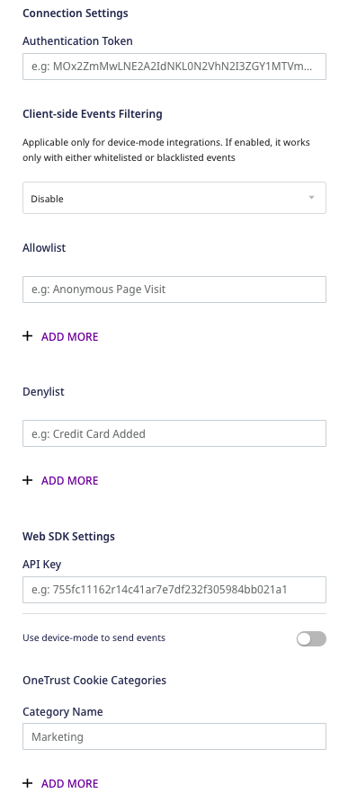
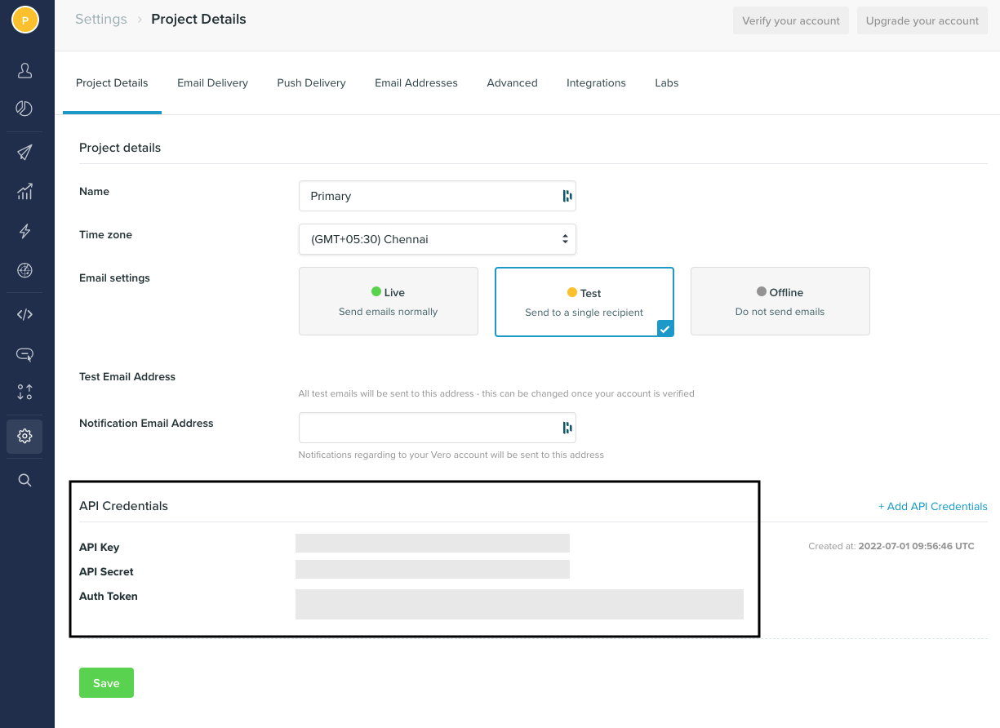

Before configuring Vero as a destination in RudderStack, verify if the source platform is supported by Vero by referring to the table below:

| **Connection Mode** | **Web**       | **Mobile**    | **Server**    |
| :------------------ | :------------ | :------------ | :------------ |
| Device mode     | **Supported** | - | - |
| Cloud mode  | **Supported** | **Supported** | **Supported** |

To know more about the difference between cloud mode and device mode in RudderStack, refer to the <Link to="/destinations/rudderstack-connection-modes/">RudderStack Connection Modes</Link> guide.

Once you have confirmed that the source supports sending events to Vero, follow these steps:

1. From your [RudderStack dashboard](https://app.rudderstack.com/), add the source. Then, from the list of destinations, select **Vero**.
2. Assign a name to your destination and click on **Continue**.

## Connection settings

To successfully set up Vero as a destination in RudderStack, you need to configure the following settings:

- **Authentication Token**: Enter your Vero authentication token.
- **API key**: Enter your Vero API key.

For more information on obtaining your Vero authentication token and API key, refer to the <Link to="#faq">FAQ</Link> section below.

### Web device mode settings

If you are sending events to Vero via the <Link to="/destinations/rudderstack-connection-modes/#device-mode">web device mode</Link>, then you need to configure the following settings:

- **Client-side Events Filtering**: This optional setting lets you specify which events should be blocked or allowed to flow through using the SDK's <Link to="/sources/event-streams/sdks/event-filtering/">client-side event filtering</Link> feature.
- **Use device-mode to send events**: Enable this option to send events via the <Link to="/destinations/rudderstack-connection-modes/#device-mode">web device mode</Link>.
- **OneTrust Cookie Categories**: This setting lets you map <Link to="/sources/event-streams/sdks/rudderstack-javascript-sdk/consent-managers/onetrust/">OneTrust cookie</Link>/consent groups to RudderStack's consent purposes.

## FAQ

### Where can I find the Vero API Key and Authentication Token?

To obtain your Vero API key and authentication token, follow these steps:

1. Log into your [Vero dashboard](https://app.getvero.com/).
2. In the left panel, go to **Settings** and scroll down to find the **API Credentials** section. You will find the **API Key** and **Auth Token** listed here, as shown:

