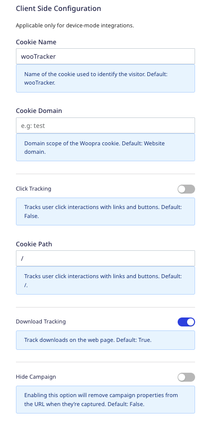

[Woopra](https://www.woopra.com/) is a customer journey and product analytics tool. It lets you track your customers' activities across various product, marketing, and sales touchpoints. You can also leverage built-in triggers to take real-time actions based on user behavior.

RudderStack supports Woopra as a destination where you can send your event data seamlessly.

## Getting started

Before configuring Woopra as a destination in RudderStack, verify if the source platform is supported by Woopra by referring to the table below:

| **Connection Mode** | **Web**       | **Mobile**    | **Server**    |
| :------------------ | :------------ | :------------ | :------------ |
| **Device mode**     |  **Supported**         | -             | -             |
| **Cloud mode**      |  **Supported** | **Supported** |  **Supported** |

<div class="infoBlock">
To know more about the difference between cloud mode and device mode in RudderStack, refer to the <Link to="/destinations/rudderstack-connection-modes/">RudderStack Connection Modes</Link> guide.
</div>

Once you have confirmed that the source platform supports sending events to Woopra, follow these steps:

1. From your [RudderStack dashboard](https://app.rudderstack.com/), add the source. Then, from the list of destinations, select **Woopra**.
2. Assign a name to the destination and click **Continue**.

## Connection settings

To successfully configure Woopra as a destination, you need to configure the following settings:


- **Project Name**: Enter your Woopra project name. This is the domain you entered while setting up your project.

<div class="infoBlock">
For more information on getting your Woopra project name, refer to the <Link to="#faq">FAQ</Link> section below.
</div>

<div class="infoBlock">
RudderStack uses this project name as a fallback value if it not specified in the event's <code class="inline-code">integrations</code> object. For more information, refer to the <Link to="#identify">Identify</Link> section below.
</div>

To send the events to Woopra via the <Link to="https://www.rudderstack.com/docs/destinations/rudderstack-connection-modes/#device-mode">web device mode</Link>, you also need to configure the following settings:




- **Cookie Name**: Enter the name of the cookie used to identify the visitor.
- **Cookie Domain**: Enter the domain scope of the Woopra cookie.
- **Click Tracking**: Enable this setting to track user click interactions via links and buttons.
- **Cookie Path**: Specify the cookie path that stores all the information related to tracking user click interactions via links and buttons.
- **Download Tracking**: If enabled, this setting lets you track the downloads on your web page.
- **Hide Campaign**: Enable this setting to remove the captured campaign properties from the URL.
- **Idle Timeout**: Enter the inactivity time (in ms) after which RudderStack considers the user to be offline. 
- **Ignore Query URL**: If enabled, RudderStack ignores the URL's query component when the standard page view is called.
- **Outgoing Ignore Subdomain**: If enabled, RudderStack does not track the links to the subdomains as outgoing links.
- **Outgoing Tracking**: Enable this setting to track the external link clicks on the web page.
- **Client-side Events Filtering**: This setting lets you specify which events should be blocked or allowed to flow through to Woopra.

<div class="infoBlock">
For more information on this setting, refer to the <Link to="/sources/sdks/event-filtering/">Client-side Events Filtering</Link> guide.
</div>

- **Use device mode to send events**: This setting **must be enabled** to send the events to Woopra via the web device mode.
- **OneTrust Cookie Categories**: If **Use device mode to send events** is enabled, this setting lets you associate <Link to="/sources/sdks/rudderstack-javascript-sdk/consent-managers/onetrust/">OneTrust</Link> cookie consent groups to Woopra.

## Identify

You can use the <Link to="/event-spec/standard-events/identify/">`identify`</Link> call to update the visitor properties in Woopra.

RudderStack uses the [`identify`](https://docs.woopra.com/reference/track-identify) endpoint to send the user information to Woopra.

A sample `identify` call is shown below:

```javascript
rudderanalytics.identify("1hKOmRA4GRlm", {
  state: "Louisiana",
  firstName: "Alex",
  lastName: "Keener",
  country: "USA",
  email: "alex@example.com",
  integrations: {
    "woopra": {
      "projectName": "abc.com"
    }
  }
});
```

You can specify your Woopra project name within the `integrations` object of the `identify` event, as seen in the above snippet. Alternatively, you can specify the project name via the **Project Name** dashboard setting while configuring the destination.

<div class="infoBlock">
If you provide the Woopra project name in both the dashboard settings as well as the <code class="inline-code">integrations</code> object, RudderStack gives precedence to the name specified in the <code class="inline-code">integrations</code> object.
</div>

RudderStack uses the below fields to identify a user in the same order of precedence:

| Precedence order | RudderStack property | Woopra property |
| :----| :---- | :----- |
| 1 | `userId` / `traits.userId` / `traits.id` / `context.traits.userId` / `context.traits.id` |  `cv_id` |
| 2 | `traits.email` / `context.traits.email` / `properties.email` | `cv_email` | 
| 3 | `context.externalId.woodpraId` / `anonymousId` | `cookie` |

<div class="infoBlock">
For a detailed list of the supported property mappings, refer to the <Link to="#standard-property-mappings">Standard property mappings</Link> section below.
</div>

Any user-provided cookie must be mapped to either `email` or `userId` when creating a new user or using the cookie for the first time. Otherwise, Woopra accepts the data but will reflect it **only when** that cookie is mapped to any of these identifiers. For example, Woopra accepts the following event but does not reflect the data in the dashboard:

```javascript
rudderanalytics.identify({
  name: "Alex Keener",
  country: "USA",
} {
  externalId: [{
    id: "some_external_id_1",
    type: "woopraId",
  }, ],
});
```

When you include a user identifier (`email`) in the subsequent events as shown below, Woopra reflects all the user information present in the current and previous event.

```javascript
rudderanalytics.identify({
  name: "Alex Keener",
  email: "alex@example.com",
  country: "USA",
} {
  externalId: [{
    id: "some_external_id_1",
    type: "woopraId",
  }, ],
});
```

## Track

You can use the <Link to="/event-spec/standard-events/track/">`track`</Link> call to track events in Woopra via the [`ce`](https://docs.woopra.com/reference/track-ce) endpoint.

A sample `track` event is as shown below:

```javascript
rudderanalytics.track("Order Completed", {
  orderId: "1234567",
  price: "567",
  currency: "USD",
});
```

### Supported mappings

The following table lists the supported **optional** property mappings between RudderStack and Woopra for the `track` events:

| RudderStack property | Woopra property | Data type |
| :-----| :------| :-----|
| `event` | `event` | String (in lower case) | 
| `originalTimestamp` | `timestamp` | Unix timestamp (in ms) | 
| `properties.{x}` | `ce_{x}` | - |

<div class="infoBlock">
If the event name is empty, RudderStack sends an empty string to Woopra as well, as a default fallback.
</div>

## Page

When you send a <Link to="/event-spec/standard-events/track/">`page`</Link> event, RudderStack converts it to a Woopra [`track`](https://docs.woopra.com/reference/track-ce#pageviews) event and sends all the page-related information and the associated properties.

### Supported mappings

The following table lists the supported **optional** property mappings between RudderStack and Woopra for the `page` events:

| RudderStack property | Woopra property | Data type |
| :-----| :------| :-----|
| `properties.{x}` | `ce_{x}` | - |
| `Viewed <category name> Page` | `event` | String (in lower case) |

## Standard property mappings

The following table lists the supported property mappings between RudderStack and Woopra, **common to all the above events**:

| RudderStack property | Woopra property | Data type | Presence |
| :-----| :------| :-----| :------|
| `integration.woopra.propertyName` | `property` | Domain | Optional |
| `userId` / `traits.userId` / `traits.id` / `context.traits.userId` / `context.traits.id` | `cv_id` | String | Required, if `cv_email` or `cookie` is absent. |
| `traits.email` / `context.traits.email` / `properties.email` | `cv_email` | String | Required, if `cv_id` or `cookie` is absent. |
| `context.externalId.woodpraId` / `anonymousId` | `cookie` | String | Required, if `cv_email` or `cv_id` is absent. |
| `context.ip` | `cv_ip` | IP address | Optional |
| `traits.company` | `cv_company` | String | Optional |
| `traits.name` / `context.traits.name` | `cv_name` | String | Optional |
| `traits.{x}` / `context.traits.{x}` | - | Optional, sent to Woopra as custom fields. |
| `context.device.type` | `device` | String | Optional |
| `context.app.name` | `app` | String | Optional |
| `ua.browser.name` + `ua.browser.version` | `browser` | String | Optional |
| `context.os.name` | `os` | String | Optional |

## FAQ

### Where can I find the Woopra project name?

To get your Woopra project name, follow these steps:

1. Go to your [Woopra dashboard](https://app.woopra.com/).
2. Select your organization and go to **Projects**.
3. You should be able to see all your projects and the associated domain names (Woopra project name), as shown:

