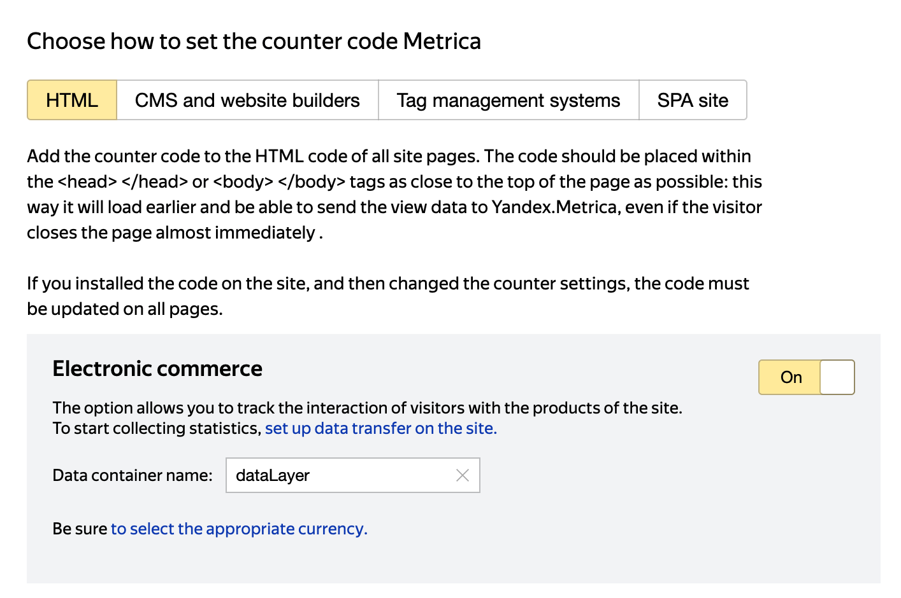

[Yandex.Metrica](https://metrica.yandex.com/) is a web analytics platform that lets you get an in-depth understanding of your audience's behavior and use the insights to drive business growth.

<div class="infoBlock">
Find the open source code for this destination in the <a href="https://github.com/rudderlabs/rudder-sdk-js/tree/production/src/integrations/YandexMetrica">GitHub repository</a>.
</div>

## Getting started

RudderStack supports sending events to Yandex.Metrica via the following <Link to="/destinations/rudderstack-connection-modes/">connection modes</Link>:

| **Connection Mode** | **Web**       | **Mobile**    | **Server**    |
| :------------------ | :------------ | :------------ | :------------ |
| **Device mode**     |       Supported        |        -       |        -       |
| **Cloud mode**      |      -      |     -    |     -    |

Once you have confirmed that the source platform supports sending events to Yandex.Metrica, follow these steps:

1. From your [RudderStack dashboard](https://app.rudderstack.com/), add the source. Then, from the list of destinations, select **Yandex.Metrica**.
2. Assign a name to your destination and click **Continue**.

### Connection settings 

To successfully set up Yandex.Metrica as a destination, you need to configure the following settings:

- **Tag ID**: Enter your Yandex.Metrica tag ID.
- **Enable Clickmap**: Enable this setting to collect data for <a href="https://yandex.com/support/metrica/code/counter-initialize.html#:~:text=a%20child%20window-,clickmap,-true">click mapping</a>.
- **Enable Tracklinks**: Enable this setting to track user clicks on the <a href="https://yandex.com/support/metrica/code/counter-initialize.html#:~:text=browser%27s%20address%20bar-,trackLinks,-true">outbound links</a>.
- **Enable Accurate Track Bounce**: This setting enables the accurate bounce rate with a non-bounce event that is registered after 15 seconds (15000 ms). For more information on this setting, refer to the <a href="https://yandex.com/support/metrica/code/counter-initialize.html#:~:text=Description-,accurateTrackBounce,-true">Yandex.Metrica documentation</a>.
- **Enable WebVisor**: Enable this setting to use Yandex.Metrica's <a href="https://yandex.com/support/metrica/code/counter-initialize.html#:~:text=1%20for%20YAN-,webvisor,-false">sesssion replay feature</a>.
- **Container name**: Enter the name of your Yandex.Metrica e-commerce data container that you set while <a href="https://yandex.ru/support/metrica/general/creating-counter.html">creating a new counter</a>. If not specified, RudderStack sets it to `dataLayer` by default.
- **Map your event name with supported Yandex.Metrica event name**: Use this setting to map the RudderStack event to the Yandex.Metrica event selected from the dropdown.
- **Goal ID**: Enter your Yandex.Metrica goal ID.
- **Client-side Events Filtering**: This setting lets you specify which events should be blocked or allowed to flow through to Yandex.Metrica. For more information on this setting, refer to the <Link to="/sources/sdks/event-filtering/">Client-side Events Filtering</Link> guide.
- **Use device mode to send events**: As this is a <Link to="https://www.rudderstack.com/docs/destinations/rudderstack-connection-modes/#device-mode">web device mode</Link>-only destination, this setting is enabled by default and cannot be disabled.
- **OneTrust Cookie Categories**: This setting lets you associate <Link to="/sources/sdks/rudderstack-javascript-sdk/consent-managers/onetrust/">OneTrust</Link> cookie consent groups to Yandex.Metrica.

<div class="infoBlock">
Refer to the <Link to="#faq">FAQ</Link> section for more information on obtaining the Yandex.Metrica tag ID, container name, and goal ID.
</div>

## Identify

You can use the <Link to="/event-spec/standard-events/identify/">`identify`</Link> call to identify a user in Yandex.Metrica. If a contact already exists, RudderStack updates the contact details.

A sample `identify` call is shown below:

```javascript
rudderanalytics.identify('1hKOmRA4el9Z', {
      firstName: 'Alex',
      lastName: 'Keener',
      email: "alex@example.com"
    }
```

RudderStack uses Yandex.Metrica's [`setUserID`](https://yandex.com/support/metrica/objects/set-user-id.html?lang=en) method to associate the `userId` with the user's client ID during a particular session. To update the information of a user with a specfic `userId`, RudderStack uses the [`userParams`](https://yandex.com/support/zout_metrica-de-2k55914b38f571cgc45c3db06adedbd0/objects/user-params.html?lang=en) method.

### Supported mappings

The following table lists the mappings between the RudderStack attributes and the Yandex.Metrica properties:

| RudderStack property | Yandex.Metrica property |
| :--------------| :---------|
| `userId` <br/> `anonymousId` <br/> <span style="color: #4D4DFF;font-size:12px;">Required</span> | `UserID` |

## Track

You can use the <Link to="/event-spec/standard-events/track/">`track`</Link> call to send your <Link to="/event-spec/ecommerce-events-spec/">e-commerce events</Link> to Yandex.Metrica.

A sample `track` call is shown below:

```javascript
rudderanalytics.track("Order Completed", {
  order_id: "34897497",
  coupon: "BB20",
  currency: "INR",
  products: [{
      product_id: "43521",
      currency: "INR",
      name: "Rudder Bag",
      price: 3700.99,
      brand: "Nice",
      category: "Bags",
      quantity: 3,
    },
    {
      product_id: "37333",
      currency: "INR",
      name: "RudderStack T-shirt",
      price: 1651.55,
      brand: "Adidas",
      category: "Bags",
      quantity: 3,
    },
  ],
});
```

### Event mapping

The following table lists the default mappings between the RudderStack events and the Yandex.Metrica events:

| RudderStack property | Yandex.Metrica property | Description |
| :--------------| :---------| :-----|
| `Product Viewed` | `detail` | View the full description of the product. |
| `Product List Viewed` | `detail` | View the full description of the product list. |
| `Product Added` | `add` | Add an item to the basket. |
| `Product Removed` | `remove` | Remove an item from the basket. |
| `Order Completed` | `purchase` | Complete the product purchase. | 

You can also map any other event to the above Yandex.Metrica events via the dashboard settings.

### Supported property mappings

The following table lists the properties mapping for Yandex.Metrica's `detail`, `add`, and `remove` events:

| RudderStack property | Yandex.Metrica property |
| :--------------| :---------|
| `properties.product_id` <br/> `properties.sku` <br/> `properties.products[index].product_id` <br/> `properties.products[index].sku` <br/> <span style="color: #4D4DFF;font-size:12px;">Required, if name is not present.</span> | `id` |
| `properties.name` <br /> `properties.products[index].name` <br/> <span style="color: #4D4DFF;font-size:12px;">Required, if product_id/sku is not present.</span> | `name` |
| `properties.brand` <br /> `properties.products[index].brand` | `brand` |
| `properties.category` <br /> `properties.products[index].category` | `category` |
| `properties.coupon` <br /> `properties.products[index].coupon` | `coupon` |
| `properties.position` <br /> `properties.products[index].position` | `position` |
| `properties.price` <br /> `properties.products[index].price` | `price` |
| `properties.quantity` <br /> `properties.products[index].quantity` | `quantity` |
| `properties.variant` <br /> `properties.products[index].variant` | `variant` |

The following mappings are applicable only for the `purchase` event:

| RudderStack property | Yandex.Metrica property |
| :--------------| :---------|
| `properties.order_id` <br/> <span style="color: #4D4DFF;font-size:12px;">Required</span> | `id` |
| `properties.revenue` | `revenue` |

## Page

You can use the <Link to="/event-spec/standard-events/page/">`page`</Link> call to send all the page view data to Yandex.Metrica.

A sample `page` call is shown below:

```javascript
rudderanalytics.page(
  "Cart",
  "Cart Viewed", {
    referrer: "https://www.mysite.com/search?q=bestseller",
    title: "The best seller items",
    url: "https://www.mysite.com/bestseller/1"
  });
```

RudderStack uses Yandex.Metrica's [`hit`](https://yandex.com/support/metrica/objects/hit.html) method to send all the page view data.

### Supported mappings

The following table lists the mappings between the RudderStack attributes and the Yandex.Metrica properties:

| RudderStack property | Yandex.Metrica property |
| :--------------| :---------|
| `context.page.url` <br/> <span style="color: #4D4DFF;font-size:12px;">Required</span> | `url` |
| `context.page.title` | `title` |
| `context.page.referrer` | `referer` |

## FAQ

### What is the Yandex.Metrica container name? Where can I find it?

You can set your Yandex.Metrica data container name while setting up your counter for your website, as shown:



### Where can I find my Yandex.Metrica tag ID?

To obtain your Yandex.Metrica tag ID, follow these steps:

1. Log into your [Yandex.Metrica](https://metrica.yandex.com/) dashboard. 
2. From the left sidebar, click **Visitors**. You can see the tag ID listed in the dashboard as well as in the URL, as shown:


### Where can I find my Yandex.Metrica goal ID?

To obtain your Yandex.Metrica tag ID, follow these steps:

1. Log into your [Yandex.Metrica](https://metrica.yandex.com/) dashboard. 
2. From the left sidebar, click **Goals**. You can see the goal ID listed in the dashboard against your created targets/goals, as shown:


