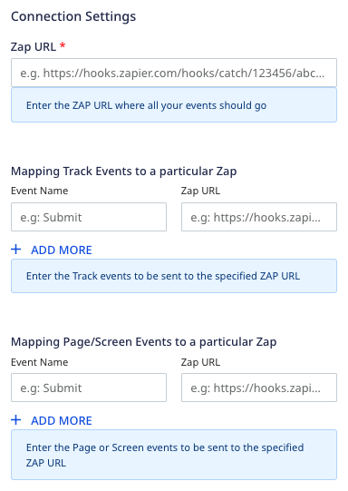
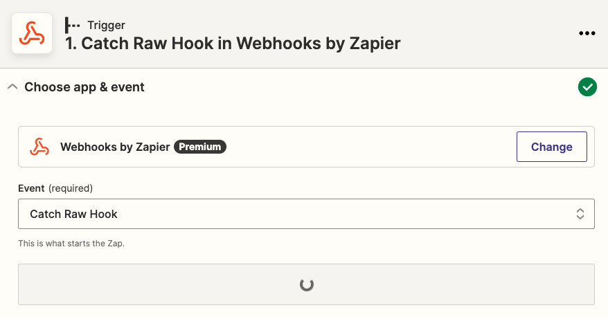

[Zapier](https://zapier.com/) is a powerful automation tool that lets you automate your work across 5000+ applications.

RudderStack supports Zapier as a destination where you can seamlessly send your event data.

## Getting started

Before configuring Zapier as a destination in RudderStack, verify if the source platform is supported by Zapier by referring to the table below:

| Connection Mode | Web | Mobile | Server |
| :--- | :--- | :--- | :--- |
| Device mode | - | - | - |
| Cloud mode | Supported  | Supported | Supported |

to learn more about the difference between cloud mode and device mode in RudderStack, refer to the <Link to="/destinations/rudderstack-connection-modes/">RudderStack Connection Modes</Link> guide.

Once you have confirmed that the source platform supports sending events to Zapier, follow these steps:

1. From your [RudderStack dashboard](https://app.rudderstack.com/), add a source. Then, from the list of destinations, select **Zapier**.
2. Assign a name to the destination and click **Continue**.

## Connection settings

To successfully configure Zapier as a destination, you will need to configure the following settings:

- **Zap URL**: Enter your Zap URL. 

For more information on creating a Zap and obtaining the Zap URL, refer to the <Link to="#faq">FAQ</Link> section below.

- **Mapping Track Events to a particular Zap**: Use this setting to send the `track` events with the specified **Event Name** to the corresponding **Zap URL**.
- **Mapping Page/Screen Events to a particular Zap**: Use this setting to send the `page`/`screen` events with the specified **Event Name** to the corresponding **Zap URL**.

## Sending events to Zapier

RudderStack supports sending only <Link to="/event-spec/standard-events/track/"><code class="inline-code">track</code></Link>, <Link to="/event-spec/standard-events/page/"><code class="inline-code">page</code></Link>, and <Link to="/event-spec/standard-events/screen/"><code class="inline-code">screen</code></Link> events to Zapier.

RudderStack does not transform or map any data before sending it to Zapier. It sends the raw event payloads to the specified **Zap URL** as is, without any modification.

You can also send specific `track`, `page`, or `screen` events to a particular Zap URL as mentioned in the <Link to="#connection-settings">Connection settings</Link> above.

## FAQ

### Where can I find the Zap URL?

To get your Zap/Zapier URL, you need to first create a Zap by following these steps:

1. Log into your <a href="https://zapier.com/app/dashboard">Zapier dashboard</a> and click **Create Zap**.
2. In the **App Events** section, search for webhooks and select **Webhooks by Zapier**.
3. Under **Event**, select the **Catch Raw Hook** option and click **Continue**.

4. In the **Test Trigger** section, you will find your Zap URL or the webhook URL where you can send all the requests. Copy and use this URL to set up the Zapier destination in RudderStack.

5. **Important**: Complete the setup by connecting the trigger to an application, that is, the downstream tool where all the data will be sent.

