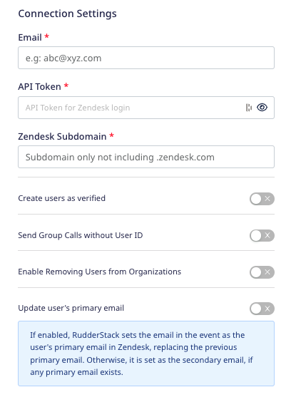

[Zendesk](https://www.zendesk.com/) is a popular CRM and customer support service suite. It offers features like live chat, call center software capabilities, and a smart knowledge base for your executives to help them resolve customers' queries and concerns.

<div class="infoBlock">
Find the open source code for this destination in the <a href="https://github.com/rudderlabs/rudder-transformer/tree/master/src/v0/destinations/zendesk">GitHub repository</a>.
</div>

## Getting started

RudderStack supports sending events to Zendesk via the following <Link to="/destinations/rudderstack-connection-modes/">connection modes</Link>:

| Connection Mode  | Web               | Mobile            | Server    |
| :------------------ | :------------ | :------------ | :------------ |
| **Device mode**     | -             | -             | -             |
| **Cloud mode**      | **Supported** | **Supported** | **Supported** |

Once you have confirmed that the source platform supports sending events to Zendesk, follow these steps:

1. From your [RudderStack dashboard](https://app.rudderstack.com/), add the source. Then, from the list of destinations, select **Zendesk**.
2. Assign a name to your destination and click **Continue**.

### Connection settings

To successfully configure Zendesk as a destination, you need to configure the following settings:



* **Email**: Enter the email address used to log in to your Zendesk account.
* **API Token**: Enter the Zendesk API token used to authenticate the integration. To generate a new API token, refer to this <a href="https://support.zendesk.com/hc/en-us/articles/226022787-Generating-a-new-API-token-">Zendesk support article</a>.
* **Zendesk Subdomain**: Enter your Zendesk subdomain **excluding** `.zendesk.com`.
* **Create users as verified**: Enable this setting to create verified users in Zendesk. When enabled, RudderStack sends `verified` as `true` in the event and Zendesk skips the email verification for these users.
* **Send Group calls without User ID**: Enable this setting if you do not want to associate a particular user with a group. When enabled, RudderStack creates or updates a group only if `userId` is **not** present in the event.
* **Enable Removing Users from Organizations**: Enable this setting to remove users from an organization via the `identify` call. For more information on this setting, refer to the <Link to="#removing-users-from-an-organization">Removing users from an organization</Link> section below.
* **Update user's primary email**: Enable this setting to set the email present in the event as the user's primary email in Zendesk, replacing the previously-set primary email. For more information on this setting, refer to the <Link to="#updating-users-primary-email-in-zendesk">Updating user's primary email in Zendesk</Link> section below.

## Identify

You can use the <Link to="/event-spec/standard-events/identify/">`identify`</Link> call to create or update a user in Zendesk. 

<div class="infoBlock">
It is highly recommended to include the user's <code class="inline-code">email</code> in the <code class="inline-code">identify</code> call as RudderStack uses this field to create or update a user in Zendesk.
</div>

```javascript
rudderanalytics.identify("1hKOmRA4GRlm", {
  name: "Alex Keener",
  email: "alex@example.com",
  country: "USA",
});
```

RudderStack persists the user details from the `identify` call for all the subsequent calls made to Zendesk.

### Supported mapping

RudderStack maps the following event properties to the standard Zendesk user attributes:

| **RudderStack property**  | **Zendesk attribute**       | 
| :--------------- | :---------------- | 
| `name`    <br/> <span style="color: #4D4DFF;font-size:12px;">Required</span>       | `name`            | 
| `email`     <br/> <span style="color: #4D4DFF;font-size:12px;">Optional, but recommended</span>     | `email`           | 
| `organizationId` / `company.id` | `organization_id` | 
| `timezone`       | `time_zone`       |  
| `phone`          | `phone`           | 
| `userId`         | `user_id`         | 
| `userId`         | `external_id`     | 

<div class="infoBlock">
RudderStack creates a new custom field in Zendesk for any other unmapped attributes.
</div>

### Removing users from an organization

Enable the **Enable Removing Users from Organizations** setting in the dashboard to use this feature. 

To remove a user from an organization, the following fields must be present in the `identify` <Link to="/event-spec/standard-events/identify/#sample-payload">`traits`</Link>:

* `company.id`
* `company.remove` (set to `true`)

A sample `identify` call for this action is shown below:

```javascript
rudderanalytics.identify("1hKOmRA4GRlm",{
  name: "Alex Keener",
  email: "alex@example.com",
  country: "USA",
  company:{
    id: 900001329943,
    remove: true
  }
});
```

The above `identify` call updates the user (if they exist) as well as removes them from the organization associated with the ID `900001329943`.

RudderStack assumes a valid Zendesk `organization_id` in the `company.id` field. Then, it finds the organization corresponding to that ID and removes the user.

### Updating user's primary email in Zendesk

To set the email present in the event as the user's primary email in Zendesk, enable the **Update user's primary email** dashboard setting and pass the `email` trait in the `identify` call, as shown:

```javascript
rudderanalytics.identify("1hKOmRA4GRlm", {
  name: "Alex Keener",
  email: "alex@example.com",
  country: "USA",
});
```

When you send the above event, Zendesk sets `alex@example.com` as the user's primary email.

If the **Update user's primary email** dashboard setting is disabled, RudderStack sets the `email` present in the `identify` traits as the user's secondary email in Zendesk, **if** any primary mail already exists.

## Track

The <Link to="/event-spec/standard-events/track/">`track`</Link> call lets you record the user actions along with any associated properties and send this information to Zendesk.

You need to first set the `userId` by calling `identify` before sending any `track` events to Zendesk. 

<div class="infoBlock">
Zendesk expects a <code class="inline-code">userId</code> for every <code class="inline-code">track</code> call.
</div>

A sample `track` call is shown below:

```javascript
rudderanalytics.track("Order Completed", {
  userId: "1hKOmRA4GRlm"
  currency: "USD",
  revenue: 77,
  value: 99.99,
});
```

<div class="infoBlock">
RudderStack uses the <a href="https://developer.zendesk.com/rest_api/docs/sunshine/events_api">Zendesk Events API</a> to send the <code class="inline-code">track</code> calls.
</div>

## Group

You can use the <Link to="/event-spec/standard-events/group/">`group`</Link> call to create or update an organization in Zendesk. RudderStack uses the `groupId` to do this.

A sample `group` call is shown below:

```javascript
rudderanalytics.group("group01", {
  name: "Softworks",
  country: "UK",
  group_plan: "trial",
});
```

### Associating user to an organization

You can also use the `group` call to associate a particular user to an organization. To do so, disable the **Send Group Calls without User ID** dashboard setting in RudderStack and pass the `userId` via the <Link to="#identify">`identify`</Link> call before sending any `group` calls to Zendesk.

<div class="infoBlock">
RudderStack assumes that an <code class="inline-code">identify</code> call (containing the <code class="inline-code">userId</code>) is made before any <code class="inline-code">group</code> call. 
</div>

If you do not want to associate a particular user with a group, enable the **Send Group Calls without User ID** dashboard setting. If this setting is enabled, the group will be created or updated only if `userId` is **not** present in the event.

### Standard mapping

RudderStack maps the following **optional** `group` traits to the standard Zendesk organization attributes: 

| **RudderStack** | **Zendesk**    | 
| :---------------| :------------- | 
| `name`          | `name`         |  
| `domainNames`   | `domain_names` |
| `tags`          | `tags`         |
| `groupId`       | `external_id`  |
| `url`           | `url`          |
| `deleted`       | `deleted`      |

<div class="infoBlock">
RudderStack creates a new custom field in Zendesk for any other unmapped attributes.
</div>

### How RudderStack does the user-organization association

- If both `userId` and `groupId` are present in the `group` event, then RudderStack first finds the user by looking for the `email` field present in the <Link to="/event-spec/standard-events/common-fields/#contextual-fields">`context.traits`</Link> object.

    - If `email` is present, then RudderStack associates the user with the `organizationId` and sends all the user information for this call.
    - If `email` is absent, RudderStack creates the user. It will then find the organization associated with the `groupId` present in the payload.

- If `groupId` is absent in the event payload, RudderStack creates a new organization in Zendesk and then does the association.

The above discussion can be summarized as follows:

| `email` present? | `groupId` present? | Description | Expected behavior |
| :----------| :--------| :-------| :-----------|
| No | No | User and the organization do not exist in Zendesk. | RudderStack creates a new user and organization and associates both. |
| Yes | No |  User already exists in Zendesk but not the organization. | RudderStack creates a new organization and associates the existing user information with it. |
| No | Yes | Organization already exists in Zendesk but not the user. | RudderStack creates a  new user and associates them with the organization. |
| Yes | Yes | Both the user and the organization exist in Zendesk. | RudderStack does the user-organization association. |
